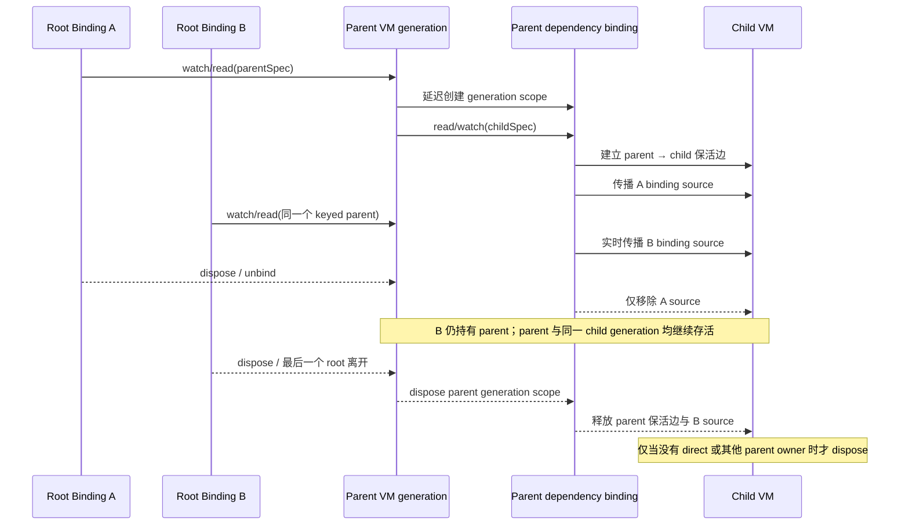

# view_model：状态管理、依赖注入与模块架构

| `view_model` | `view_model_annotation` | `view_model_generator` | 覆盖率 |
| :---: | :---: | :---: | :---: |
| [](https://pub.dev/packages/view_model) | [](https://pub.dev/packages/view_model_annotation) | [](https://pub.dev/packages/view_model_generator) | [](https://app.codecov.io/gh/lwj1994/flutter_view_model) |

[English](./README.md)

**不只是状态管理。view_model 同时是一套面向 Flutter 的依赖注入、功能模块组合与自动生命周期管理架构。**

每个功能单元——页面状态、服务、仓储、协调器或领域能力——都可以是
ViewModel。ViewModel 之间通过 `viewModelBinding` 相互依赖注入与组合，
由 `ViewModelBinding` 在 getter 被实际访问时按需解析对应节点、在作用域内
复用实例，并自动完成回收；无需依赖全局单例。

```yaml
dependencies:
  view_model: ^1.0.0
```

## 🤝 兄弟姊妹 ViewModel

1. [apple_view_model](https://github.com/lwj1994/apple_view_model) — 面向 SwiftUI、UIKit 和 Apple 平台生命周期的实现。
2. [android_view_model](https://github.com/lwj1994/android_view_model) — 面向 Compose、Activity、Fragment、View 和普通 Kotlin 类的实现。
3. [js_view_model](https://github.com/lwj1994/js_view_model) — 面向 React Native、Electron 和普通 TypeScript host 的实现。

## 🤖 Skill 安装

```bash
npx skills add https://github.com/lwj1994/flutter_view_model --skill view_model
```

---

## 📖 核心目录

- [🌟 为什么选择 view_model？](#-为什么选择-view_model)
- [🏗️ 三层架构设计](#️-三层架构设计)
- [🧩 核心武器：两大 Mixin](#-核心武器两大-mixin)
- [🚀 3 分钟快速上手](#-3-分钟快速上手)
- [📖 ViewModel 深度探索](#-viewmodel-深度探索)
- [⚙️ ViewModelSpec：声明式定义](#-viewmodelspec声明式定义)
- [🎨 Widget 集成指北](#-widget-集成指北)
- [🔗 viewModelBinding 核心接口](#-viewmodelbinding-核心接口)
- [🤝 实例共享与共享策略](#-实例共享与共享策略)
- [🏗️ 在任意非 Widget 类中使用](#️-在任意非-widget-类中使用)
- [🔄 ViewModel 间的强力联动](#-viewmodel-间的强力联动)
- [⚡ 细粒度更新（性能优化）](#-细粒度更新性能优化)
- [💤 智能 暂停 / 恢复 机制](#-智能-暂停--恢复-机制)
- [♻️ 生命周期细节与资源回收](#-生命周期细节与资源回收)
- [🛠️ 全局配置与调试](#-全局配置与调试)
- [🧪 测试方案](#-测试方案)
- [🤖 代码自动生成](#-代码自动生成)
- [🔍 DevTools 视觉化窗口](#-devtools-视觉化窗口)
- [view_model vs riverpod](#view_model-vs-riverpod)

---

## 🌟 为什么选择 view_model？

在 Flutter 状态管理的丛林里，你可能被 `Provider` 的 `context` 限制搞晕，或者被 `Riverpod` 复杂的 Provider 依赖图劝退。**view_model 的设计哲学是：直觉化、Dart 原生感、零痛苦。**

*   **真正的自动生命周期**：ViewModel 的存活取决于 root binding、parent dependency binding 等所有 owner source。最后一条路径离开后自动销毁，不要求手写清理。
*   **跨越 BuildContext 的自由**：不仅仅在 Widget 里，在后台服务、启动逻辑、纯 Dart 类中都能享用同样的 ViewModel 管理逻辑。
*   **自带“防卡顿”光环**：当页面进入后台或被上层路由覆盖时，系统会自动暂停通知，仅在页面恢复时触发一次追赶式刷新。
*   **极致的代码生成**：配合 `@GenSpec` 注解，样板代码归零。

---


## 🏗️ 三层架构设计

为了实现极致的灵活性，我们将系统拆分为三层：

1.  **消费者层 (Widget/Consumer)**: 提供 `ViewModelStateMixin`、`ViewModelStatelessMixin` 等工具。
2.  **绑定层 (ViewModelBinding)**: 核心桥梁。它负责记录谁（哪个 BindingID）在使用哪个 ViewModel。它还掌管着 Zone 依赖注入和 暂停/恢复 状态。
3.  **实例管理层 (InstanceManager)**: 一个高效的底盘。它维护实例池，并按 source-aware 引用计数决定实例的死活；同一个 BindingID 的 direct/parent 路径互不覆盖。

---

## 🧩 核心武器：两大 Mixin

这是本库的灵魂。只要能掌握这两个 Mixin，你就掌握了全部。

### 1. `with ViewModel` — 赋予“生命”
将它混入任意类，这个类就变成了**受管实例**。它拥有生命周期钩子（`onCreate`, `onDispose` 等），能够发射通知，还能通过 `viewModelBinding` 直接读取其他依赖项。

```dart
class UserRepository with ViewModel { /* 业务逻辑 */ }
```

### 2. `with ViewModelBinding` — 获取“力量”
将它混入类（不限 Widget），这个类就变成了**管理员**。它拥有了访问注册表的能力。你可以用它来 `watch` 或 `read` 任何 ViewModel。`ViewModelStateMixin` 本质上就是它的一个 Widget 封装版。

```dart
class AppBootstrap with ViewModelBinding {
  Future<void> init() async {
    // 跨越 context 自由读取
    await viewModelBinding.read(configSpec).load();
  }
}
```

---

## 🚀 3 分钟快速上手

```dart
import 'package:view_model/view_model.dart';

// 1. 写逻辑
class CounterViewModel with ViewModel {
  int count = 0;
  void increment() => update(() => count++); // update 会自动帮你触发 UI 刷新
}

// 2. 定规格 (Spec)
final counterSpec = ViewModelSpec<CounterViewModel>(
  builder: () => CounterViewModel(),
);

// 3. 混入 Mixin 即可使用
class CounterPage extends StatefulWidget {
  @override
  State<CounterPage> createState() => _CounterPageState();
}

class _CounterPageState extends State<CounterPage> with ViewModelStateMixin {
  // watch 会建立连接：ViewModel 变了，当前 Widget 自动刷新
  CounterViewModel get vm => viewModelBinding.watch(counterSpec);

  @override
  Widget build(BuildContext context) {
    return ElevatedButton(
      onPressed: vm.increment,
      child: Text('Count: ${vm.count}'),
    );
  }
}
```

`update()` 对同步 block 保持同步通知：调用返回时 listener 已执行。若 block
返回 `Future`，则仅在 Future 成功完成后通知；同步抛错或 Future 失败都会把
错误继续交给调用方，并且不会发送通知。

---

## 📖 ViewModel 深度探索

### StateViewModel（强状态版）
如果你追求不可变状态（配合 `Freezed` 简直完美），它是你的不二之选。它能记录 `previousState`，并支持字段级的差异化监听（`listenStateSelect`）。

做字段级更新时，建议用 `read` 读取 ViewModel，再交给
`listenStateSelect` / `StateViewModelValueWatcher` 驱动更新；不要再对同一
个 ViewModel 额外使用 `watch`，否则会把整份 ViewModel 的宽范围监听也挂上。

```dart
class UserViewModel extends StateViewModel<UserState> {
  UserViewModel() : super(state: const UserState());

  void updateName(String name) {
    setState(state.copyWith(name: name)); // 自动触发 equals 比较
  }
}
```

只有 `setState` 会产生新的 state diff。`notifyListeners()` 只刷新宽范围
ViewModel listener，不会重复发送上一次 diff，也不会再次调用
`listenState` / `listenStateSelect`。完整 state 的判等优先级是：构造器局部
`equals` → 全局 `ViewModelConfig.equals` → `identical`。selector 选中值的
判等优先级是：显式局部 `equals` → 全局 `ViewModelConfig.equals` → `==`。
全局 `equals` 默认为空；需要局部强类型比较时，直接传给
`listenStateSelect`：

```dart
viewModelBinding.listenStateSelect(
  userSpec,
  selector: (UserState state) => state.name,
  equals: (String previous, String current) => previous == current,
  onChanged: (previous, current) => print(current),
);
```

Widget 新代码优先使用单 selector 的强类型
`StateViewModelSelector<T, R>`；多个字段可组成 Dart record，作为一次更新
边界：

```dart
StateViewModelSelector<UserState, ({String name, int age})>(
  viewModel: vm,
  selector: (state) => (name: state.name, age: state.age),
  builder: (context, value) => Text('${value.name}, ${value.age}'),
)
```

### 资源快捷回收
在构造函数里使用 `addDispose()`，确保资源不遗忘：

```dart
StreamViewModel() {
  final sub = stream.listen((_) => notifyListeners());
  addDispose(() => sub.cancel()); // 跟着 VM 一起死，优雅！
}
```

## 🔄 ViewModel 间的强力联动

ViewModel 内部的依赖统一通过解析型 getter 获取，getter 每次访问都调用
`watch`/`read`。每个 parent 对象 generation 拥有一个稳定的内部 dependency
binding；它为 unkeyed child 提供私有 default key，因此 parent 的 root owners
切换时仍复用同一个受管 child：

```dart
class OrderViewModel with ViewModel {
  CartViewModel get cart => viewModelBinding.read(cartSpec);
  UserViewModel get user => viewModelBinding.read(userSpec);

  double get total => cart.items.fold(0, (sum, item) => sum + item.price);
}
```

优先 getter，不要用 `late final`、构造时缓存或 `??=` 持有嵌套 ViewModel，
这样显式 `recycle` 或异步生命周期竞争后仍能解析新的 generation。
getter 声明本身不会创建任何对象。

### 不要让 ViewModel 实例越过 binding 边界

禁止通过构造参数、Widget 或路由参数、service 字段等方式，在不同 owner 之间
直接传递已经解析出的 ViewModel 实例。裸实例引用不会建立 binding ownership
边；接收方可能活得比解析该实例的 binding 更久，继续持有已 dispose 或已
recycle 的旧 generation，并绕过 `watch`/`read` 约定的通知与生命周期语义。
这种做法也会把模块内部实现暴露到 ViewModel 边界之外。

每个生命周期 owner 都应持有稳定的 `ViewModelSpec`，并通过自己的
`viewModelBinding.watch/read` 解析依赖。多个 owner 需要共享同一实例时，把共享
identity 编码进 spec 的 `key`，再让每个 owner 分别解析同一个 keyed spec。
跨越非 ViewModel 边界时，只传普通数据、ID、value object 或职责收窄的回调，
不要传 ViewModel 实例。

> **共享父模块边界：** parent generation 会建立 `parent → child` 生命周期边，
> 因此 child 的生命周期不会短于 parent。带 key 的 parent 被 A/B 多个 root
> 共同持有时，已解析 child 会实时增加或移除 A/B 的 binding；A 退出但 B 仍在
> 时，unkeyed child 的 identity 与状态保持连续。direct 与多个 parent 路径按
> source 分别计数，释放一条路径不会误删其他路径。所有 `aliveForever` spec，
> 无论从 root 还是另一个 ViewModel 解析，都必须显式提供 key；无 key 时会在
> builder 执行前抛出 `ViewModelError`，底层 Store 也会对内部 factory 执行
> 同一条兜底校验。

### 子 ViewModel 生命周期示意图

下面以 A、B 两个 root binding 共享同一个普通（`aliveForever: false`）keyed
parent 为例。图中的
`parent dependency binding` 属于当前 parent 对象 generation，并独立于
某一个具体 root：



因此，child 的生命周期可以长于 parent（例如还有 direct/其他 parent owner），
但不能短于拥有它的 parent generation。A/B 的增删只更新传播 source，不会让
unkeyed child 在存活的 parent 内切换 private key。若 parent 本身是
`aliveForever`，最后一个 root 离开时只移除传播 source；parent generation 的
保活边会继续持有 child，直到 parent 被 `recycle` 或 `ViewModel.reset()`。

---

## 🔗 viewModelBinding 核心接口

当你拥有了 `viewModelBinding` 访问器，你就拥有了以下超能力：

| 方法 | 使用场景 | 特点 |
| :--- | :--- | :--- |
| **`watch(spec)`** | 在 Widget 的 `build` 或逻辑中 | **响应式**：VM 变化会触发 UI 刷新。若 VM 不存在则创建。 |
| **`read(spec)`** | 事件回调、只需调用方法时 | **非响应式**：不监听 VM 自身通知。若 VM 不存在则创建。 |
| **`listenStateSelect(...)`**| 针对性监听某个字段 | 可选局部 `equals` 优先，其次使用全局 `ViewModelConfig.equals`，最后使用 `==`。 |
| **`recycle(vm)`** | 危险的全局强制回收 | 解除所有 owners 并销毁共享实例，`aliveForever` 也不例外；下次 `watch/read` 创建新实例。 |

不提供原位替换实例的 API。需要独立的新实例时应使用新的显式 key；若明确接受
所有共享 owners 都受影响，则先 `recycle(vm)`，再让解析型 getter 通过
`watch(spec)`/`read(spec)` 走正常的 cache miss 创建新 handle 与 dependency tree，
不在两个对象之间迁移 binding 关系。

### 高级缓存查询（通常不推荐）

> [!CAUTION]
> 一般不要绕过 spec，直接按 key/tag 从已有缓存中获取 ViewModel。cached API
> 依赖实例已被其他路径创建，会让调用方耦合缓存 identity、创建顺序和其他
> owner 的生命周期，而且缓存缺失时不能创建依赖。只有明确需要跨 owner 查询
> 已有缓存，并且理解这些影响时才使用。

| API | 缺失时创建 | 命中后 bind | VM 自身通知 | Handle dispose/recycle |
| :--- | :---: | :---: | :---: | :---: |
| `watchCached(key/tag)` | 否 | 是 | 是 | 是 |
| `readCached(key/tag)` | 否 | 是 | 否 | 是 |
| `maybeWatchCached(key/tag)` | 否；返回 `null` | 是 | 是 | 是 |
| `maybeReadCached(key/tag)` | 否；返回 `null` | 是 | 否 | 是 |
| `watchCachesByTag(tag)` | 否；返回全部命中 | 是 | 是 | 是 |
| `readCachesByTag(tag)` | 否；返回全部命中 | 是 | 否 | 是 |

这六个 API 都只查缓存。非 `maybe` 的单实例 API 未命中时抛错；`maybe*`
未命中时返回 `null`；tag 批量 API 返回全部匹配。按 tag 获取单个实例可能有
歧义，并依赖缓存创建顺序；多个实例可能共用 tag 时应使用批量 API。

补充说明：

- `watch*` 和 `read*` 都会建立 binding，都会影响实例生命周期；差别主要在于是否监听 ViewModel 自身的变化。
- 正常业务代码优先使用稳定 spec 的 `watch/read`，不要把 cached API 当作
  spec-based 依赖解析的替代品。
- ViewModel 内的 `watch` 会先调用 `parent.onDependencyNotify(child)`，再通知
  parent；同步传播事务按 binding 去重，diamond graph 或 root 同时直接 watch
  leaf 时也只更新一次。
- selector 自定义比较直接通过 `listenStateSelect` 的可选 `equals` 传入。
- `recycle` 是高级 escape hatch，具有危险的全局影响；只有明确需要解除全部
  owners、销毁共享实例时才使用，不应作为常规清理路径。
- `recycle` 后旧对象已经 dispose。所有使用方，尤其共享实例的其他 owner，
  都必须通过解析型 getter 被动获取 ViewModel（每次访问都调用 `watch`/`read`）；
  owner 收到更新后，getter 下次访问会因缓存未命中而正常创建新实例。长期
  缓存 VM 字段会继续引用 disposed 对象，可能导致泄漏或异常。正确写法如下：

  ```dart
  MyViewModel get vm => viewModelBinding.watch(mySpec);

  // 仅在明确接受全部 owners 都受影响时使用：
  void resetGlobally() => viewModelBinding.recycle(vm);
  ```
- 做字段级更新时，优先用 `read` 拿到 ViewModel，再交给 `listenStateSelect` 或 `StateViewModelValueWatcher` 驱动更新；不要再对同一个 ViewModel 额外 `watch`。
- 实例身份由“解析时使用的泛型 ViewModel 类型 `T` + effective key”共同
  决定；builder 返回对象的运行时具体类型不参与身份，`tag` 也只用于分组
  检索。当 `aliveForever: false` 且 factory 的 `key()` 返回 `null` 时，同一
  binding 内同一 `T` 只会复用一个实例，不同 binding 默认隔离。跨 binding
  共享、同一 binding 内区分多个同 `T` 实例，
  或需要稳定的 keyed cached lookup 时，应显式设置 key。key 本身不负责
  保活；`aliveForever` 只跳过引用归零时的自动回收，但显式 `recycle` 仍会
  解除全部 owners 并强制销毁。所有 `aliveForever` spec 都必须显式设置 key，
  root 与 nested 解析规则一致。
- 同一个 binding 中若两个不同 spec 使用相同的 `T` 与 effective key，第二个
  builder 不会执行；debug 模式会发出提示。逻辑上不同的 spec 应使用不同 key。

---

## 💤 智能 暂停 / 恢复 机制

这是 `view_model` 的独门绝技。
*   **不浪费一分性能**：当你的页面处于“不可见”状态（被覆盖、Tab 被切走、应用退后台），哪怕 ViewModel 疯狂更新，你的 Widget 也**完全不会 rebuild**。
*   **丝滑追赶**：当你重新看到页面的一瞬间，系统会帮你做一次补报刷新，确保数据是最新的。

> **提示**：为了让路由感知生效，别忘了在 `MaterialApp` 里加上 `ViewModel.routeObserver`。

---

## 🧪 测试方案

ViewModel 测试必须单线程、按 runner 顺序执行：

```bash
flutter test --concurrency=1
```

registry、全局配置、生命周期观察器、reset 状态与旧版 spec proxy 都属于
进程级可变状态；本包测试禁止并行文件、测试分片和 concurrent test group。
仓库内的 `dart_test.yaml` 已固定 `concurrency: 1`。

`ViewModelSpec.overrideWith(mockSpec)` 会安装一个作用域 override，并返回
幂等的 restore 回调；嵌套 override 以及乱序 restore 都是安全的。
`runWithOverride` 则会在同步或异步 body 成功、失败后自动恢复；每次调用
使用独立的异步 Zone，因此并发重叠的 body 不会互相读取到对方的 scoped
override 选择；factory 选定后，正常的 key 实例共享规则仍然生效。原有
`setProxy` / `clearProxy` 继续作为全局兼容 fallback：

```dart
await userSpec.runWithOverride(mockUserSpec, () async {
  final vm = binding.read(userSpec);
  expect(vm, isA<MockUserViewModel>());
});
```

需要隔离完整运行时状态时，调用 `ViewModel.reset()`：它会强制
销毁全部缓存（包括
`aliveForever` 实例）、清空配置、生命周期与 DevTools 跟踪数据，并允许
重新初始化。

---

## 🤖 代码自动生成

厌倦了手写 `ViewModelSpec`？没关系，交给 `view_model_generator`。

```dart
@GenSpec(key: 'global_counter', aliveForever: true) // 显式 key 的长期 retained 实例
class CounterViewModel with ViewModel { ... }
```

一行命令，生成的 Spec 自动处理参数注入、key 与 retention 配置。`aliveForever`
仍可被 `recycle`/`ViewModel.reset()` 强制销毁；任何 `aliveForever` spec 都必须
显式设置 key。

---

## 🔍 DevTools 视觉化窗口

我们为你准备了强大的 **DevTools 扩展**。在调试模式下，打开 Flutter DevTools：
*   **可视化依赖图**：一眼看清哪个 Widget 绑定了哪个 ViewModel，谁又依赖了谁。
*   **完整 binding 节点**：显式列出所有已观测的 root/dependency binding；即使
    初始化后的 root 暂时没有关联 ViewModel，也会保留为独立节点，并展示
    active/disposed 状态。
*   **虚拟所有权链**：parent generation 的内部作用域显示为
    `parent VM → virtual binding → child VM`。图协议使用明确区分语义的
    `bindingOwnsViewModel` 与 `viewModelOwnsDependencyBinding`
    relationships，不再兼容旧的无类型 edge 格式。
*   **状态实时监控**：在不需要打印日志的情况下，直接在浏览器里检视所有存活实例的数据。
*   **owner 诊断**：查看有序的活跃 `owners`，以及用于 inbound ownership
    兼容诊断的 `primaryOwner`/交接记录；嵌套解析本身使用 parent generation
    稳定的 dependency binding。

---

## view_model vs riverpod

两者底层都基于“中央注册表 + 依赖注入”的思想，但设计哲学、API 风格、实例管理机制不同。以下对比基于默认配置与常见用法（如单根 `ProviderScope`），仅讨论状态管理核心：状态建模、依赖派生、实例作用域与生命周期，不将 `Mutations` / `Automatic retry` / `Offline persistence` 作为主要评价项。

### 1. 核心设计哲学

* Riverpod：一切皆是全局响应式节点（Functional & Declarative）
> 核心是构建一个全局的有向无环图（DAG）。状态默认是全局单例的（挂载在 ProviderScope 上），强调状态与状态之间的纯函数推导（Derived State）。它非常排斥将状态与特定的 Widget 实例强绑定。
* view_model：经典的组件级视图模型（OOP & Lifecycle-bound）
> 核心是基于 source-aware 引用计数的实例管理。它通过 Mixin 将能力注入任意类；默认实例属于解析它的 binding，子 VM 还受 parent generation 的 dependency binding 保活，而不是只与某个 Widget 一对一共存亡。

### 2. 代码风格与实现方式

| 维度 | Riverpod 3.x | view_model 1.0.0 |
| :--- | :--- | :--- |
| **类实现方式** | 继承/codegen 为主（`Notifier`/`AsyncNotifier`/`@riverpod`） | **纯 mixin 方式**（`class X with ViewModel`） |
| **优点** | Provider 组合与响应式派生能力强 | 零侵入、可多 mixin 叠加、任意类可直接成为 ViewModel |
| **watch/read 位置** | 在 `Consumer` 的 `build` 中常用 `ref.watch(...)`；在 Provider/Notifier 的 `build` 中也可 `ref.watch(...)`；在 Widget 中若需在 `build` 外监听，可用 `WidgetRef.listenManual(...)` | 可通过 getter 暴露（如 `MyViewModel get vm => viewModelBinding.watch(...)`），不强制写在 `build` 内 |

**view_model 示例（getter 声明）**：

```dart
class _MyPageState extends State<MyPage> with ViewModelStateMixin {
  CounterViewModel get counterVM => viewModelBinding.watch(counterSpec);
  UserViewModel get userVM => viewModelBinding.watch(userSpec);

  @override
  Widget build(BuildContext context) {
    return Text('${counterVM.count}'); // 自动响应式
  }
}
```

### 3. 实例获取与作用域（核心差异）

- **Riverpod**：实例按 `ProviderContainer` 隔离。常见项目只有一个根 `ProviderScope`，因此同一 Provider 在整个 App 内通常共享一份状态；需要隔离时通过局部 `ProviderScope`/override/family 控制。
- **view_model**：默认是“每个 binding、每个解析类型参数 `T` 一个实例”。同一 `ViewModelBinding` 内对同一 `T` 多次 `watch/read` 会复用实例，不同页面（不同 binding）默认隔离。跨 binding 共享或在同一 binding 内区分多个同 `T` 实例时显式声明 key：

```dart
final globalAuthSpec = ViewModelSpec<AuthViewModel>(
  builder: () => AuthViewModel(),
  key: 'global-auth',
  aliveForever: true, // 可选：引用归零时仍保留，可显式 recycle
);
```


---
