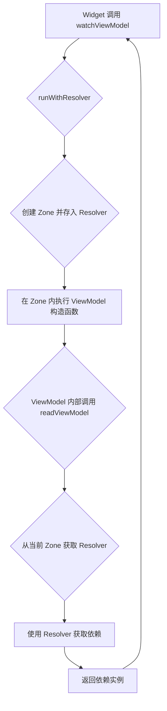

## 📚 第一部分：什么是 Zone？

### Zone 的定义

在 Dart 中，**Zone** 是一种**执行上下文（execution context）**，你可以把它想象成一个"气泡"或"容器"，代码在这个容器里执行时，可以访问到一些特定的环境变量和配置。

用更通俗的比喻：
- 🏠 Zone 就像一个"房间"
- 📦 房间里有一些"储物柜"（zoneValues）
- 🚪 进入房间的代码可以访问这些储物柜
- 🔑 每个储物柜有一个键（key），用来存取数据

### 最简单的 Zone 示例

```dart
import 'dart:async';

void main() {
  // 普通执行环境
  print('外部: ${Zone.current[#userId]}');  // null
  
  // 创建一个 Zone，并在其中存储数据
  runZoned(() {
    print('Zone 内部: ${Zone.current[#userId]}');  // "user123" ✅
    someFunction();
  }, zoneValues: {
    #userId: 'user123',  // 👈 存储数据到 Zone
  });
}

void someFunction() {
  // 这个函数在 Zone 内部执行，可以读取 Zone 中的数据
  final userId = Zone.current[#userId] as String?;
  print('someFunction 获取到的 userId: $userId');  // "user123" ✅
}
```

**输出**：
```
外部: null
Zone 内部: user123
someFunction 获取到的 userId: user123
```

### Zone 的核心特性

#### 1. 数据隔离

每个 Zone 都有自己的数据空间，互不干扰：

```dart
runZoned(() {
  print('Zone A: ${Zone.current[#name]}');  // "Alice"
}, zoneValues: {#name: 'Alice'});

runZoned(() {
  print('Zone B: ${Zone.current[#name]}');  // "Bob"
}, zoneValues: {#name: 'Bob'});

print('外部: ${Zone.current[#name]}');  // null
```

#### 2. 继承性

Zone 可以嵌套，内层 Zone 可以访问外层 Zone 的数据：

```dart
runZoned(() {
  print('外层 Zone: ${Zone.current[#outer]}');  // "outer-value"
  
  runZoned(() {
    print('内层 Zone - 外层数据: ${Zone.current[#outer]}');  // "outer-value" ✅
    print('内层 Zone - 内层数据: ${Zone.current[#inner]}');  // "inner-value" ✅
  }, zoneValues: {
    #inner: 'inner-value',
  });
}, zoneValues: {
  #outer: 'outer-value',
});
```

#### 3. 作用域限制

Zone 中存储的数据只在这个 Zone 的执行范围内有效：

```dart
void main() {
  runZoned(() {
    scheduleMicrotask(() {
      // 异步任务仍在同一个 Zone 中 ✅
      print('异步任务: ${Zone.current[#data]}');  // "hello"
    });
  }, zoneValues: {#data: 'hello'});
  
  // 这里已经退出 Zone
  print('外部: ${Zone.current[#data]}');  // null
}
```

---

## 🎯 第二部分：Zone 的常见用途

### 1. 全局错误捕获

Zone 最常见的用途之一是捕获所有未处理的异常：

```dart
void main() {
  runZonedGuarded(() {
    runApp(MyApp());
  }, (error, stackTrace) {
    // 👇 捕获所有未处理的异常
    print('捕获到错误: $error');
    reportErrorToServer(error, stackTrace);
  });
}
```

**用途**：在生产环境中收集所有崩溃信息，发送到错误追踪服务。

### 2. 自定义 print 输出

可以拦截和修改 `print` 的行为：

```dart
void main() {
  runZoned(() {
    print('这条日志会被拦截');
    print('并添加前缀');
  }, zoneSpecification: ZoneSpecification(
    print: (self, parent, zone, message) {
      // 👇 拦截 print，添加自定义前缀
      parent.print(zone, '[MyApp] $message');
    },
  ));
}
```

**输出**：
```
[MyApp] 这条日志会被拦截
[MyApp] 并添加前缀
```

### 3. 异步操作追踪

Zone 可以追踪和管理异步操作：

```dart
runZoned(() async {
  await Future.delayed(Duration(seconds: 1));
  print('异步操作完成');
  // 👆 这个异步操作仍在 Zone 内执行
}, zoneValues: {
  #requestId: 'req-12345',
});
```

Flutter 框架内部就是用 Zone 来追踪异步操作的来源，这就是为什么你在 async 方法中抛出的异常能被正确捕获。

### 4. 上下文传递（最重要！）

**这是 view_model 使用 Zone 的核心用途**：在不显式传参的情况下，将数据传递给深层的函数调用。

```dart
void main() {
  runZoned(() {
    processRequest();
  }, zoneValues: {
    #currentUser: User(id: '123', name: 'Alice'),
  });
}

void processRequest() {
  // 不需要传参，直接从 Zone 中获取
  validatePermission();
}

void validatePermission() {
  // 深层调用，仍然可以访问 Zone 数据
  final user = Zone.current[#currentUser] as User;
  print('验证用户权限: ${user.name}');
}
```

**优势**：
- ✅ 不需要层层传递参数
- ✅ 保持函数签名简洁
- ✅ 数据在整个调用链中都可访问

---

## 🚀 第三部分：ViewModel 如何借助 Zone 实现依赖注入

### 核心挑战：构造函数中的依赖注入

在 `ViewModel` 的设计中，我们希望能在构造函数中直接获取其他 `ViewModel` 依赖，以确保 `ViewModel` 在创建时就处于一致和完整的状态。

然而，传统的依赖注入（如 `Provider`）通常依赖于 `BuildContext`，但在 `ViewModel` 的构造函数中，`BuildContext` 是不可用的。

```dart
class UserProfileViewModel extends ViewModel {
  UserProfileViewModel() {
    // 构造函数中没有 BuildContext
    // 如何在这里获取 AuthViewModel 的实例？
    final authVM = readViewModel<AuthViewModel>(); // ❓
    if (authVM.isLoggedIn) {
      loadUserProfile();
    }
  }
}
```

### 解决方案：用 Zone 搭建依赖传递的“桥梁”

`view_model` 的解决方案是利用 `Zone` 作为“隐式”的参数传递通道，将一个具备依赖解析能力的 `DependencyResolver` 对象，从 `ViewModel` 的调用方（如 Widget）传递到 `ViewModel` 的构造函数内部。

整个过程可以分解为以下三个步骤：

#### 步骤 1：在 Widget/State 中发起调用

当你在 Widget 中调用 `watchViewModel()` 或 `readViewModel()` 时，系统会提供一个 `DependencyResolver`。

```dart
// 在你的 Widget State 中
final userProfileVM = watchViewModel<UserProfileViewModel>(
  factory: () => UserProfileViewModel(),
);
```

#### 步骤 2：创建 Zone 并执行构造函数

`watchViewModel` 内部会调用一个名为 `runWithResolver` 的函数。这个函数是整个魔法的核心：

1.  它创建一个新的 `Zone`。
2.  它将 `DependencyResolver` 存储到这个 `Zone` 的 `zoneValues` 中，使用一个私有的 `_resolverKey` 作为键。
3.  然后，它在这个 `Zone` 内部执行 `ViewModel` 的构造函数（即 `factory.build()`）。

```dart
// ViewModelAttacher.dart (简化后)
final vm = runWithResolver(
  () => factory.build(),      // 👈 在 Zone 内部执行构造函数
  onChildDependencyResolver,  // 👈 要存入 Zone 的解析器
);
```

#### 步骤 3：在 ViewModel 构造函数中读取依赖

现在，当 `UserProfileViewModel` 的构造函数执行时，它正处于那个包含了 `DependencyResolver` 的 `Zone` 内部。

此时，构造函数内部调用的 `readViewModel<AuthViewModel>()` 方法就可以：

1.  通过 `Zone.current[#_resolverKey]` 从当前 `Zone` 中获取到 `DependencyResolver`。
2.  使用这个 `resolver` 来查找并返回 `AuthViewModel` 的实例。

```dart
// dependency_handler.dart (简化后)
T getViewModel<T>() {
  // 从当前 Zone 中取出“桥梁”——解析器
  final resolver = Zone.current[#_resolverKey] as DependencyResolver?;
  
  // 使用解析器获取依赖实例
  return resolver!.get<T>(); 
}
```

### 完整调用流程图




## 📦 总结

Zone 让 view_model 在不破坏架构的前提下，实现了 ViewModel 构造函数中的依赖注入。简洁、优雅、类型安全！🚀

**来试试**：[pub.dev/packages/view_model](https://pub.dev/packages/view_model)