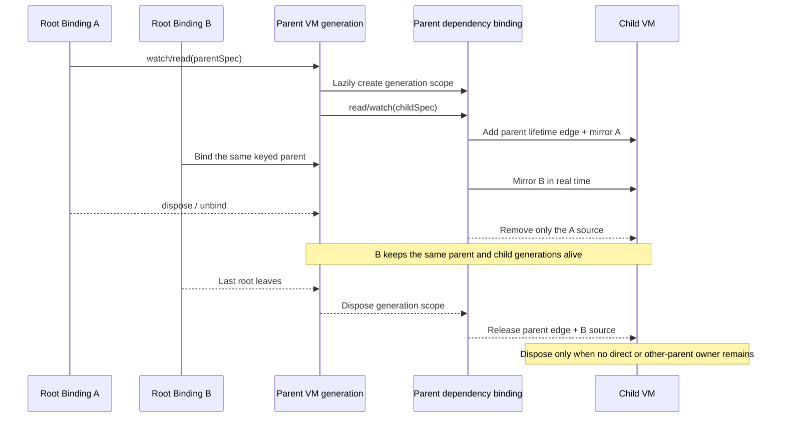

# ViewModel Architecture Guide

> **Core philosophy:** a feature, service, repository, coordinator, or domain
> capability can be a managed ViewModel. Compose modules through
> `viewModelBinding` instead of global singletons or a service locator.

## 1. Define managed feature modules

Declare every managed instance through a `ViewModelSpec`, then expose
dependencies with resolver getters:

```dart
final authSpec = ViewModelSpec<AuthViewModel>(
  builder: AuthViewModel.new,
);

final userRepositorySpec = ViewModelSpec<UserRepository>(
  builder: UserRepository.new,
);

class UserRepository with ViewModel {
  AuthViewModel get auth => viewModelBinding.read(authSpec);

  Future<User> fetchUser() => api.get(auth.token);
}
```

Prefer a getter over `late final`, a constructor-cached field, or `??=`. Each
access can then resolve a replacement after explicit `recycle`, successful
parent recreation, or an asynchronous lifecycle race.

## 2. Parent-owned child lifecycle

Every successfully created parent object generation lazily owns one stable
internal dependency binding. Resolving a child through that binding creates a
`parent → child` lifetime edge, so the child cannot be disposed before that
parent generation.

The parent dependency binding also mirrors the parent's current root bindings
to already-resolved children in real time. Owner paths are source-aware: a
direct root path and paths through one or more parents can coexist without one
path accidentally releasing another.

DevTools registers initialized or resolving bindings as explicit nodes,
including root bindings that do not yet have a ViewModel edge. Internal
dependency bindings are marked virtual and rendered as
`parent VM → virtual binding → child VM`. The DevTools protocol exposes typed
`bindingOwnsViewModel` and `viewModelOwnsDependencyBinding` relationships and
does not retain the legacy untyped edge schema.

The sequence below assumes an ordinary parent with `aliveForever: false`:



This gives the child a **lifetime lower bound**, not an exact lifetime. A child
can outlive one parent when another direct or parent owner still exists. For an
`aliveForever` parent, the final root removal does not dispose the generation
scope or its children; they remain until `recycle` or `ViewModel.reset()`.

### Identity rules

- Instance identity is resolved generic ViewModel type `T` plus effective
  `key`; `tag` is only a grouping label.
- An unkeyed root uses that root binding's private default key.
- An unkeyed child uses its parent generation's private default key. The key is
  stable while that parent object is alive, even when roots A/B join or leave.
- A successfully recreated parent is a new generation with a new private child
  scope. Its old unkeyed dependency tree is not migrated.
- Use an explicit key to share a child across independent parent generations or
  to resolve several children of the same type in one binding.
- Every `aliveForever` ViewModel must have an explicit key. The same validation
  applies to root and nested resolution before the builder runs, with a second
  invariant check at the Store boundary for lower-level factories.

## 3. Prefer spec-based read and watch

Normal module dependencies should use a stable spec. Both APIs create the
instance when absent and establish lifecycle ownership. `read` means “do not
listen to the ViewModel's own `notifyListeners()`”; it does **not** mean
“unbound”. Handle recreation/disposal is still observed.

| API | Creates | Binds | VM notifications | Recreate/dispose |
| --- | --- | --- | --- | --- |
| `watch(spec)` | Yes | Yes | Yes | Yes |
| `read(spec)` | Yes | Yes | No | Yes |

Use `watch` inside a parent only when child updates should bubble through
`parent.onDependencyNotify(child)` and then notify the parent. Synchronous
propagation uses one transaction and updates each binding at most once, even in
a diamond graph. Use `read` for imperative calls that should not bubble child
state notifications.

Register `listen*` explicitly once for side effects. Do not put a `listen*`
call in a repeatedly evaluated getter.

### Cached lookup is an advanced escape hatch

> [!CAUTION]
> Do not bypass a spec merely to fetch whatever happens to be cached. Cached
> lookup depends on another owner having created the instance, couples the
> caller to cache identity/order, and cannot create a missing dependency. Use
> it only for an intentional cross-owner cache query whose lifecycle you fully
> understand.

| API | Creates | Binds when found | VM notifications | Recreate/dispose |
| --- | --- | --- | --- | --- |
| `watchCached(key/tag)` | No | Yes | Yes | Yes |
| `readCached(key/tag)` | No | Yes | No | Yes |
| `maybeWatchCached(key/tag)` | No; returns `null` | Yes | Yes | Yes |
| `maybeReadCached(key/tag)` | No; returns `null` | Yes | No | Yes |
| `watchCachesByTag(tag)` | No; returns all matches | Yes | Yes | Yes |
| `readCachesByTag(tag)` | No; returns all matches | Yes | No | Yes |

Single-result tag lookup can be ambiguous and follows cache creation order;
use a tag-batch method when several instances may share the same tag.

## 4. Construction, cycles, and recreation

The managed dependency graph must remain acyclic:

- During synchronous construction, repeated unkeyed ViewModel types in the
  active lineage fail fast; repeated explicit `T + key` identities also fail.
- When a dependency edge is added later, a self or indirect owner cycle is
  rejected before the edge is committed.
- A diamond is valid and is not treated as a cycle.

Builder or constructor failure is atomic: tentative dependency scopes,
children, listeners, and owner paths are rolled back. If `recreate` fails, the
old object and its old dependency scope remain unchanged. An `onCreate`
exception keeps the existing lifecycle policy: it is reported through
`ViewModelConfig.onError`, and creation continues.

## 5. Lifetime controls

- Normal instances auto-dispose when their last binding source is removed.
- An `aliveForever` parent keeps its resolved dependency graph alive after its
  external roots reach zero, until explicit `recycle` or `ViewModel.reset()`.
- `recycle(vm)` is a global force-dispose escape hatch. It removes every owner,
  including owners in other roots or parents, and also disposes
  `aliveForever` instances.
- `recreate(vm)` preserves incoming bindings on success. Recreating a parent
  starts a new generation-scoped dependency binding; recreating a child keeps
  the parent edge attached to the child handle.
- Do not resolve new dependencies from `dispose()`.

## 6. Standalone binding hosts

Use `with ViewModelBinding` for bootstrap logic, services, and tests that need
to own ViewModels without becoming a ViewModel themselves:

```dart
class AppInitializer with ViewModelBinding {
  Future<void> init() async {
    await viewModelBinding.read(configSpec).fetch();
    await viewModelBinding.read(authSpec).check();
  }
}
```

Keep the host alive for as long as it should own those instances, and always
call `dispose()` when that ownership ends.
