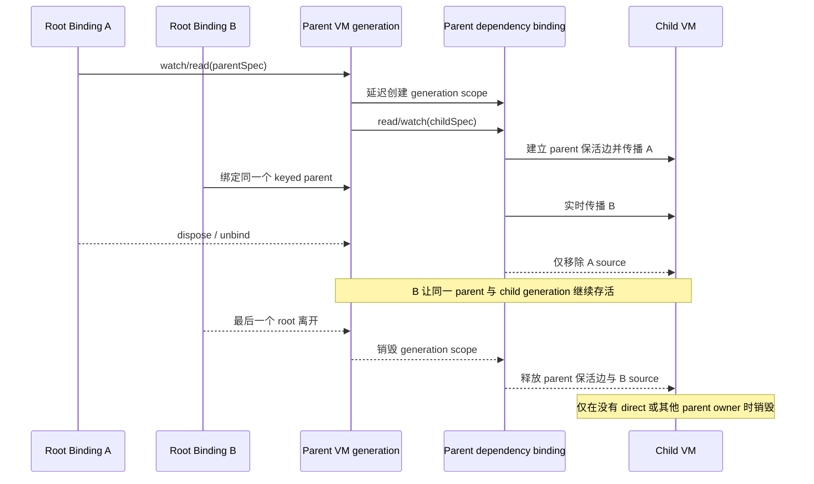

# ViewModel 架构指南

> **核心哲学：**功能、服务、仓库、协调器或领域能力都可以成为受管理的
> ViewModel。模块之间通过 `viewModelBinding` 组合，不默认引入全局单例或
> service locator。

## 1. 定义受管理的功能模块

每个受管理实例都通过 `ViewModelSpec` 声明，模块依赖则通过解析型 getter
暴露：

```dart
final authSpec = ViewModelSpec<AuthViewModel>(
  builder: AuthViewModel.new,
);

final userRepositorySpec = ViewModelSpec<UserRepository>(
  builder: UserRepository.new,
);

class UserRepository with ViewModel {
  AuthViewModel get auth => viewModelBinding.read(authSpec);

  Future<User> fetchUser() => api.get(auth.token);
}
```

优先使用 getter，不要通过 `late final`、构造函数字段或 `??=` 长期缓存子
ViewModel。这样显式 `recycle`、child disposal 或异步生命周期竞争后，下一次
访问仍能解析新的 generation。

## 2. Parent 持有的子 ViewModel 生命周期

每个成功创建的 parent 对象 generation 都会按需拥有一个稳定的内部 dependency
binding。通过它解析 child 会建立 `parent → child` 生命周期边，因此 child 不会
早于该 parent generation 被销毁。

parent dependency binding 还会把 parent 当前的 root bindings 实时传播到所有
已解析 child。owner path 按 source 区分：同一个 root 的直接路径，以及经过一个
或多个 parent 的路径可以同时存在，释放一条路径不会误删其他路径。

DevTools 会把已初始化/参与解析的 binding 作为显式节点登记，包括尚未连接 VM
的 root binding。内部 dependency binding 标记为 virtual，并通过
`parent VM → virtual binding → child VM` 展示 generation 所有权；root 实时传播
到 child 的实际 owner path 使用 `bindingOwnsViewModel` relationship 表达。
新协议不再保留旧的无类型 edge 格式。

下面的时序假设 parent 是普通实例（`aliveForever: false`）：



这为 child 提供的是**生命周期下限**，不是完全相同的生命周期。若还有 direct
或其他 parent owner，child 可以比其中一个 parent 活得更久。若 parent 是
`aliveForever`，最后一个 root 离开也不会销毁 generation scope 或 child；它们会
保留到 `recycle` 或 `ViewModel.reset()`。

### Identity 规则

- 实例 identity 是解析泛型 ViewModel 类型 `T` 加 effective `key`；`tag` 只用于
  分组。
- root 内的 unkeyed VM 使用该 root binding 的私有 default key。
- unkeyed child 使用 parent generation 的私有 default key。只要 parent 对象仍
  存活，即使 A/B root 加入或离开，该 key 也保持稳定。
- parent 被 `recycle` 后，下一次按 spec 解析会创建新的 generation，并获得新的
  child 私有作用域；旧的 unkeyed dependency tree 不迁移。
- 跨独立 parent generation 共享 child，或同一 binding 内需要多个同类型 child
  时，应显式提供 key。
- 所有 `aliveForever` ViewModel 都必须显式提供 key；root 与 nested 解析会在
  builder 执行前应用同一条校验，底层 Store 还会为内部 factory 再做一次兜底。

## 3. 优先使用带 spec 的 read 与 watch

正常模块依赖应使用稳定 spec。两个 API 都能在缺失时创建实例并建立生命周期
所有权。`read` 的含义是“不监听 ViewModel 自身的 `notifyListeners()`”，不是
“不 bind”；它仍会感知 handle 的 dispose/recycle。

| API | 创建实例 | bind | VM 自身通知 | Handle dispose/recycle |
| --- | --- | --- | --- | --- |
| `watch(spec)` | 是 | 是 | 是 | 是 |
| `read(spec)` | 是 | 是 | 否 | 是 |

child 更新需要通知 parent 时，在 parent 内使用 `watch`。依赖通知逐条向上
传播，同步事务只合并 root binding 的刷新请求。只需命令式调用且不希望 child
状态通知冒泡时，使用 `read`。

业务响应使用 `listen*`，不再覆写已移除的 `onDependencyNotify`。在初始化时
注册一次，不放进会重复求值的 getter。业务监听不参与 root 刷新去重，多个
依赖更新时可能观察到中间值。状态监听中再次设置状态时，新状态立即生效，
新的事件等待当前事件交付给所有剩余监听者后再派发。

### Cached lookup 是高级 escape hatch

> [!CAUTION]
> 一般不要绕过 spec，去获取“恰好已经存在”的缓存。cached lookup 依赖其他
> owner 先创建实例，会让调用方耦合缓存 identity/顺序，而且不能创建缺失的
> 依赖。只有明确需要跨 owner 查询缓存，并完全理解其生命周期时才使用。

| API | 缺失时创建 | 命中后 bind | VM 自身通知 | Handle dispose/recycle |
| --- | --- | --- | --- | --- |
| `watchCached(key/tag)` | 否 | 是 | 是 | 是 |
| `readCached(key/tag)` | 否 | 是 | 否 | 是 |
| `maybeWatchCached(key/tag)` | 否；返回 `null` | 是 | 是 | 是 |
| `maybeReadCached(key/tag)` | 否；返回 `null` | 是 | 否 | 是 |
| `watchCachesByTag(tag)` | 否；返回全部命中 | 是 | 是 | 是 |
| `readCachesByTag(tag)` | 否；返回全部命中 | 是 | 否 | 是 |

按 tag 获取单个实例可能有歧义，并依赖缓存创建顺序；多个实例可能共用 tag 时，
应使用 tag 批量 API。

## 4. 构造与判环

受管理的依赖图必须保持无环：

- 同步构造期间，construction lineage 内重复出现的 unkeyed ViewModel 类型会快速
  失败；重复的显式 `T + key` identity 也会失败。
- 运行期新增依赖边时，self 或间接 owner cycle 会在提交边之前被拒绝。
- diamond graph 合法，不会被误判为环。

builder 或 constructor 失败具有原子性：期间暂存的 dependency scope、children、
listeners、owner paths 与 `addDispose` 注册的资源清理回调都会回滚。`onCreate` 异常继续沿用现有策略：交给
`ViewModelConfig.onError`，实例继续完成创建。

## 5. 生命周期控制

- 普通实例在最后一个 binding source 离开时自动销毁。
- `aliveForever` parent 的外部 roots 归零后，已经解析的依赖图仍被传递性保活，
  直到显式 `recycle` 或 `ViewModel.reset()`。
- `recycle(vm)` 是全局强制销毁 escape hatch。它会移除所有 root/parent owner，
  其他使用方和 `aliveForever` 实例也会受影响。
- 不提供原位替换 API。独立的新实例应使用新的显式 key；若明确要全局替换，先
  `recycle(vm)`，再让解析型 getter 在下次访问时通过 `watch(spec)`/`read(spec)`
  创建新的 handle 与 dependency tree。
- 不要在 `dispose()` 中重新解析依赖。

## 6. 独立 Binding Host

启动逻辑、服务或测试需要持有 ViewModel，但自身不需要成为 ViewModel 时，使用
`with ViewModelBinding`：

```dart
class AppInitializer with ViewModelBinding {
  Future<void> init() async {
    await viewModelBinding.read(configSpec).fetch();
    await viewModelBinding.read(authSpec).check();
  }
}
```

host 应存活到其所有权结束，并在结束时始终调用 `dispose()`。
