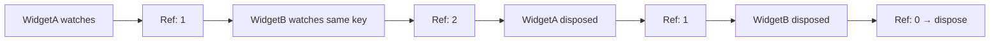
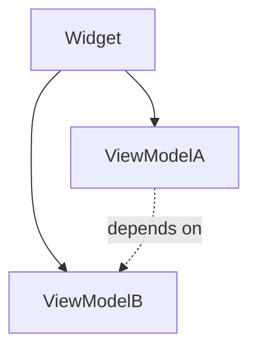

<p align="center">
  
</p>

# view_model

> The missing ViewModel in Flutter — Everything is ViewModel.

[](https://pub.dev/packages/view_model) [](https://app.codecov.io/gh/lwj1994/flutter_view_model/tree/main)

[ChangeLog](https://github.com/lwj1994/flutter_view_model/blob/main/packages/view_model/CHANGELOG.md) | [English Doc](https://github.com/lwj1994/flutter_view_model/blob/main/packages/view_model/README.md) | [中文文档](https://github.com/lwj1994/flutter_view_model/blob/main/packages/view_model/README_ZH.md)

> Special thanks to [Miolin](https://github.com/Miolin) for transferring the `view_model` package ownership.

---

## Why This Library Exists

Coming from an Android background, I wanted Flutter's state and dependency management to be **simple** and **minimally intrusive**. After extensive use of Riverpod, I identified several friction points:

- **No built-in sharing mechanism**: Reusing the same ViewModel instance across pages requires manually threading arguments everywhere
- **Intrusive APIs**: Constantly inheriting `ConsumerWidget` or wrapping components in `Consumer` breaks the natural Flutter widget pattern
- **Complex dependency graphs**: Provider chains create hard-to-trace timing issues and topology complexity that grows with project size
- **Feature bloat**: Many built-in features (multiple provider types, `AsyncValue`, mutations, persistence, retries) add unnecessary complexity when all I need is automatic ViewModel lifecycle management

This library solves these problems with a pragmatic, Android-inspired approach.

---

## Table of Contents

- [Philosophy: Everything is ViewModel](#philosophy-everything-is-viewmodel)
- [Quick Start](#quick-start)
- [Instance Sharing](#instance-sharing)
- [Basic Usage](#basic-usage)
- [ViewModel Lifecycle](#viewmodel-lifecycle)
- [Initialization & Configuration](#initialization--configuration)
- [Stateful ViewModels](#stateful-viewmodels-stateviewmodels)
- [ViewModel Dependencies](#viewmodel-dependencies)
- [Advanced Features](#advanced-features)
- [Testing](#testing)

---

## Philosophy: Everything is ViewModel

We redefine "ViewModel" not as a traditional MVVM component, but as a **lifecycle-aware manager container** that can host any business logic.

### 1. Widget-Centric Architecture

In Flutter, everything revolves around widgets. No matter how complex your logic, the ultimate consumer is always a widget. By tying manager lifecycles directly to the widget tree, we achieve the most natural and maintainable architecture.

### 2. One Concept, Flexible Scopes

Forget distinguishing between "Services," "Controllers," or "Stores." It's all just ViewModels. The only difference is **where you attach them**:

- **Global**: Attach to your app's root → Singleton for the entire app lifetime
- **Local**: Attach to a page → Automatically follows page lifecycle
- **Shared**: Use a unique `key` (e.g., `user:$id`) → Same instance across multiple widgets

### 3. Seamless Composition & Decoupling

ViewModels can depend on other ViewModels (e.g., `UserViewModel` reading from `NetworkViewModel`) while remaining **widget-agnostic** — they never hold a `BuildContext` or know about the UI layer.

### 4. Zero Boilerplate

Compared to **GetIt** (manual registration) or **Riverpod** (complex provider graphs), this library is strictly pragmatic: automatic lifecycle management and dependency injection with minimal code.

### 5. Beyond Widgets: Custom Vef

Through custom `Vef` (ViewModel Execution Framework), ViewModels can exist **independently of widgets**:

- **Background services**: Run logic in isolates or background tasks
- **Pure Dart tests**: Test ViewModel interactions without `testWidgets`
- **Startup tasks**: Execute initialization before any widget renders

See [Custom Vef](#custom-vef) for details.

---

## Quick Start

```dart
// 1. Define a ViewModel
class CounterViewModel extends ViewModel {
  int count = 0;
  void increment() => update(() => count++);
}

// 2. Create a Provider
final counterProvider = ViewModelProvider<CounterViewModel>(
  builder: () => CounterViewModel(),
);

// 3. Use in a Widget
class CounterPage extends StatelessWidget with ViewModelStatelessMixin {
  @override
  Widget build(BuildContext context) {
    final vm = vef.watch(counterProvider);
    return ElevatedButton(
      onPressed: vm.increment,
      child: Text('Count: ${vm.count}'),
    );
  }
}
```

**Key APIs**:
- `vef.watch(provider)` — Watch ViewModel and rebuild on changes
- `vef.read(provider)` — Read ViewModel without triggering rebuilds  
- `vef.watchCached<T>(key: ...)` — Access existing instance by key (advanced)
- `vef.readCached<T>(key: ...)` — Read existing instance by key (advanced)
- `vef.listen(provider, onChanged: ...)` — Side-effects without UI updates (auto-disposed)

---

## Instance Sharing

There are two ways to share ViewModel instances across widgets:

### Method 1: Using Provider with Key (Recommended)

The safest way - the provider ensures the instance exists:

```dart
// Define provider with a unique key
final userProvider = ViewModelProvider<UserViewModel>(
  builder: () => UserViewModel(userId: id),
  key: 'user:$id',
);

// Widget A - Creates or reuses the instance
class WidgetA extends StatefulWidget {
  @override
  State createState() => _WidgetAState();
}

class _WidgetAState extends State<WidgetA> with ViewModelStateMixin {
  UserViewModel get vm => vef.watch(userProvider);
  
  @override
  Widget build(BuildContext context) => Text(vm.userName);
}

// Widget B - Reuses the same instance (same key in provider)
class WidgetB extends StatefulWidget {
  @override
  State createState() => _WidgetBState();
}

class _WidgetBState extends State<WidgetB> with ViewModelStateMixin {
  UserViewModel get vm => vef.watch(userProvider);  // Same instance
  
  @override
  Widget build(BuildContext context) => Text(vm.userEmail);
}
```

### Method 2: Direct Key Lookup (Advanced)

When you only know the key but don't have access to the provider (e.g., in deeply nested widgets or across module boundaries):

```dart
// Somewhere else created the instance with key 'user:$id'
final userProvider = ViewModelProvider<UserViewModel>(
  builder: () => UserViewModel(userId: id),
  key: 'user:123',
);

// In another widget/module, access by key directly
class DeepNestedWidget extends StatefulWidget {
  @override
  State createState() => _DeepNestedWidgetState();
}

class _DeepNestedWidgetState extends State<DeepNestedWidget> 
    with ViewModelStateMixin {
  
  UserViewModel get vm => vef.watchCached<UserViewModel>(key: 'user:123');
  
  @override
  Widget build(BuildContext context) => Text(vm.userName);
}
```

> **Important**: 
> - `watchCached` will **throw an error** if no instance with the given key exists
> - Use this method only when you're certain the instance has been created elsewhere
> - Prefer Method 1 when possible for better type safety and error prevention

**Use cases for direct key lookup**:
- Cross-module communication where importing the provider creates circular dependencies
- Plugin architectures where modules don't know about each other's providers
- Dynamic scenarios where keys are generated at runtime

> **Important**: When using custom objects as keys, implement `==` and `hashCode`. Libraries like [equatable](https://pub.dev/packages/equatable) or [freezed](https://pub.dev/packages/freezed) can help.
>
> **Caution**: Dart collections (`List`, `Set`, `Map`) use identity equality by default. Two lists with identical content are considered different keys. Convert to strings or use deep-equality wrappers.

---

## Basic Usage

### Adding Dependencies

```yaml
dependencies:
  flutter:
    sdk: flutter
  view_model:   # Use latest version

dev_dependencies:
  build_runner: ^latest
  view_model_generator: ^latest
```

### Creating a ViewModel

Inherit from `ViewModel` and use `update(() => ...)` to trigger UI updates:

```dart
import 'package:view_model/view_model.dart';

class CounterViewModel extends ViewModel {
  int _count = 0;
  
  int get count => _count;
  
  void increment() {
    update(() => _count++);
  }
  
  @override
  void dispose() {
    // Clean up resources (streams, timers, etc.)
    super.dispose();
  }
}
```

### ViewModelProvider with Code Generation

Use `@genProvider` annotation to automatically generate provider boilerplate:

```dart
import 'package:view_model/view_model.dart';
import 'package:view_model_annotation/view_model_annotation.dart';

part 'counter_view_model.vm.dart';

@genProvider
class CounterViewModel extends ViewModel {
  int count = 0;
  void increment() => update(() => count++);
}
```

Run code generation:

```bash
dart run build_runner build
```

**With constructor arguments**:

```dart
@genProvider
class UserViewModel extends ViewModel {
  final String userId;
  UserViewModel(this.userId);
}

// Generated provider
final userProvider = ViewModelProvider.arg<UserViewModel, String>(
  builder: (userId) => UserViewModel(userId),
);
```

**With cache keys**:

```dart
@GenProvider(key: r'user-$id', tag: r'user-$id')
class UserViewModel extends ViewModel {
  final String id;
  UserViewModel(this.id);
}

// Automatically generates key/tag closures
```

See [generator docs](https://github.com/lwj1994/flutter_view_model/blob/main/packages/view_model_generator/README.md) for more advanced patterns.

### Using ViewModel in Widgets

#### StatefulWidget Pattern (Recommended)

```dart
class MyPage extends StatefulWidget {
  @override
  State<MyPage> createState() => _MyPageState();
}

class _MyPageState extends State<MyPage> with ViewModelStateMixin<MyPage> {
  CounterViewModel get vm => vef.watch(counterProvider);
  
  @override
  Widget build(BuildContext context) {
    return Scaffold(
      body: Text('Count: ${vm.count}'),
      floatingActionButton: FloatingActionButton(
        onPressed: vm.increment,
        child: Icon(Icons.add),
      ),
    );
  }
}
```

#### StatelessWidget Pattern (Not Recommended)

> **Warning**: `ViewModelStatelessMixin` intercepts Element lifecycle and can conflict with other mixins. Use `StatefulWidget` pattern when possible.

```dart
class CounterWidget extends StatelessWidget with ViewModelStatelessMixin {
  CounterViewModel get vm => vef.watch(counterProvider);
  
  @override
  Widget build(BuildContext context) {
    return Text('Count: ${vm.count}');
  }
}
```

#### Builder Pattern (Alternative)

No mixin required:

```dart
ViewModelBuilder<CounterViewModel>(
  provider: counterProvider,
  builder: (vm) {
    return Text('Count: ${vm.count}');
  },
)
```

Bind to existing cached instance:

```dart
CachedViewModelBuilder<CounterViewModel>(
  shareKey: 'counter-key',  // or tag: 'counter-tag'
  builder: (vm) => Text('${vm.count}'),
)
```

### Side-Effects with Listeners

React to changes without rebuilding the widget. Using `vef.listen` automatically manages disposal:

```dart
@override
void initState() {
  super.initState();
  
  // vef.listen auto-disposes when the widget is disposed
  vef.listen(counterProvider, onChanged: (vm) {
    print('Counter changed: ${vm.count}');
    // Show snackbar, navigate, etc.
  });
}
```

---

## ViewModel Lifecycle

Lifecycle is managed automatically via **reference counting**:

1. **First bind**: Widget calls `vef.watch(provider)` → Reference count = 1
2. **Additional binds**: Another widget shares via key → Reference count = 2
3. **Unbind**: First widget disposes → Reference count = 1 (ViewModel stays alive)
4. **Final disposal**: Last widget disposes → Reference count = 0 → `dispose()` called



> **Important**: Both `vef.watch()` and `vef.read()` increment the reference count. Use `vef.read()` when you don't need automatic rebuilds.

---

## Initialization & Configuration

Configure global settings in your `main()` function:

```dart
void main() {
  ViewModel.initialize(
    config: ViewModelConfig(
      // Enable debug logging
      isLoggingEnabled: true,
      
      // Custom state equality check
      equals: (prev, curr) => identical(prev, curr),
    ),
    // Global lifecycle observers
    lifecycles: [
      MyLifecycleObserver(),
    ],
  );
  
  runApp(MyApp());
}
```

**Lifecycle observer example**:

```dart
class MyLifecycleObserver extends ViewModelLifecycle {
  @override
  void onCreate(ViewModel vm, InstanceArg arg) {
    print('ViewModel created: ${vm.runtimeType}');
  }
  
  @override
  void onDispose(ViewModel vm, InstanceArg arg) {
    print('ViewModel disposed: ${vm.runtimeType}');
  }
}
```

---

## Stateful ViewModels (`StateViewModel<S>`)

For immutable state patterns, use `StateViewModel`:

### Defining State

```dart
@immutable
class CounterState {
  final int count;
  final String message;
  
  const CounterState({this.count = 0, this.message = 'Ready'});
  
  CounterState copyWith({int? count, String? message}) {
    return CounterState(
      count: count ?? this.count,
      message: message ?? this.message,
    );
  }
}
```

### Creating Stateful ViewModel

```dart
class CounterViewModel extends StateViewModel<CounterState> {
  CounterViewModel() : super(state: CounterState());
  
  void increment() {
    setState(state.copyWith(
      count: state.count + 1,
      message: 'Incremented',
    ));
  }
}
```

### Using Stateful ViewModel

```dart
class CounterPage extends StatefulWidget {
  @override
  State createState() => _CounterPageState();
}

class _CounterPageState extends State<CounterPage> 
    with ViewModelStateMixin<CounterPage> {
  
  CounterViewModel get vm => vef.watch(counterProvider);
  
  @override
  Widget build(BuildContext context) {
    return Column(
      children: [
        Text('Count: ${vm.state.count}'),
        Text('Status: ${vm.state.message}'),
        ElevatedButton(
          onPressed: vm.increment,
          child: Text('Increment'),
        ),
      ],
    );
  }
}
```

### State Change Listeners

Using `vef.listenState` automatically manages disposal:

```dart
// Listen to entire state (auto-disposed)
vef.listenState(counterProvider, (prev, curr) {
  if (prev.count != curr.count) {
    print('Count changed: ${prev.count} → ${curr.count}');
  }
});

// Listen to specific field (auto-disposed)
vef.listenStateSelect(
  counterProvider,
  (state) => state.message,
  (prev, curr) {
    ScaffoldMessenger.of(context).showSnackBar(
      SnackBar(content: Text(curr)),
    );
  },
);
```

### Fine-Grained Rebuilds

Rebuild only when specific state fields change:

```dart
StateViewModelValueWatcher<CounterState>(
  viewModel: vm,
  selectors: [
    (state) => state.count,
    (state) => state.message,
  ],
  builder: (state) {
    return Text('${state.count}: ${state.message}');
  },
)
```

> **Note**: By default, `StateViewModel` uses `identical()` for state comparison (reference equality). This means `setState()` only triggers a rebuild when you provide a new state instance. Customize this behavior via `ViewModel.initialize(config: ViewModelConfig(equals: ...))` if you need deep equality checks.

## ViewModel Dependencies

ViewModels can depend on other ViewModels:

```dart
class NetworkViewModel extends ViewModel {
  Future<Response> fetch(String url) async { /* ... */ }
}

class UserViewModel extends ViewModel {
  late final NetworkViewModel network;
  
  UserViewModel() {
    network = vef.read<NetworkViewModel>(networkProvider);
  }
  
  Future<void> loadUser() async {
    final response = await network.fetch('/user');
    // ...
  }
}
```

**Key points**:
- Dependencies are **flat**, not nested
- All ViewModels are managed by the widget's state
- Calling `vef.read()` inside a ViewModel is identical to calling it from the widget



---

## Advanced Features

### Pause/Resume Lifecycle

ViewModels automatically pause when widgets are hidden (e.g., navigated away) and resume when visible again. See [docs](https://github.com/lwj1994/flutter_view_model/blob/main/docs/PAUSE_RESUME_LIFECYCLE.md).

### Fine-Grained Rebuilds

Three approaches for optimized rebuilds:

1. **ValueNotifier + ValueListenableBuilder**:
```dart
final title = ValueNotifier('Hello');
ValueListenableBuilder(
  valueListenable: title,
  builder: (_, v, __) => Text(v),
)
```

2. **ObservableValue + ObserverBuilder** ([docs](https://github.com/lwj1994/flutter_view_model/blob/main/docs/value_observer_doc.md)):
```dart
final observable = ObservableValue<int>(0, shareKey: 'counter');
ObserverBuilder<int>(
  observable: observable,
  builder: (v) => Text('$v'),
)
```

3. **StateViewModelValueWatcher** (see [Fine-Grained Rebuilds](#fine-grained-rebuilds))

### Custom Vef

Use ViewModels outside widgets:

```dart
class StartTaskVef with Vef {
  AppInitViewModel get initVM => vef.watch(initProvider);
  
  Future<void> run() async {
    await initVM.runStartupTasks();
  }
  
  @override
  void onUpdate() {
    print('Init status: ${initVM.status}');
  }
}

// In main()
final starter = StartTaskVef();
await starter.run();
starter.dispose();
```

---

## Testing

Mock ViewModels using `setProxy`:

```dart
// Define real ViewModel
class AuthViewModel extends ViewModel {
  bool get isLoggedIn => true;
}

final authProvider = ViewModelProvider<AuthViewModel>(
  builder: () => AuthViewModel(),
);

// Define mock
class MockAuthViewModel extends AuthViewModel {
  @override
  bool get isLoggedIn => false;
}

// In test
void main() {
  testWidgets('Login page', (tester) async {
    // Override provider
    authProvider.setProxy(
      ViewModelProvider(builder: () => MockAuthViewModel()),
    );
    
    await tester.pumpWidget(MyApp());
    
    // Verify UI with mocked state
    expect(find.text('Please log in'), findsOneWidget);
    
    // Cleanup
    authProvider.clearProxy();
  });
}
```

Works with argument-based providers too:

```dart
final userProvider = ViewModelProvider.arg<UserViewModel, String>(
  builder: (id) => UserViewModel(id),
);

// In test
userProvider.setProxy(
  ViewModelProvider.arg<UserViewModel, String>(
    builder: (id) => MockUserViewModel(id),
  ),
);
```

---

## License

MIT License - see [LICENSE](https://github.com/lwj1994/flutter_view_model/blob/main/LICENSE) file for details.
