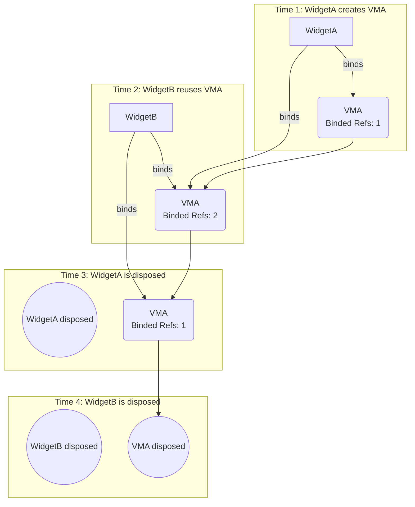
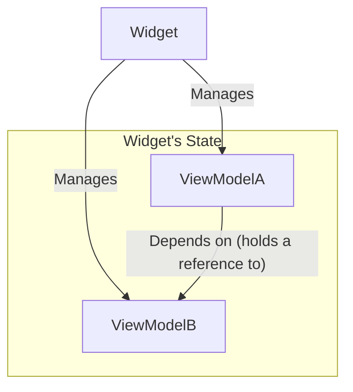

<p align="center">
  
</p>


# view_model

> The missing ViewModel in Flutter and Everything is ViewModel.

[](https://pub.dev/packages/view_model) [](https://app.codecov.io/gh/lwj1994/flutter_view_model/tree/main)

[ChangeLog](https://github.com/lwj1994/flutter_view_model/blob/main/packages/view_model/CHANGELOG.md)

[English Doc](https://github.com/lwj1994/flutter_view_model/blob/main/packages/view_model/README.md) | [中文文档](https://github.com/lwj1994/flutter_view_model/blob/main/packages/view_model/README_ZH.md) | [AI Guide](https://github.com/lwj1994/flutter_view_model/blob/main/packages/view_model/AI_GUIDE.md)

> Thank [Miolin](https://github.com/Miolin) for transferring the permission of
> the [view_model](https://pub.dev/packages/view_model) package to me.


## why I built this project
I want state and dependency management in Flutter to be simple and minimally
intrusive. I come from an Android background and prefer the ViewModel pattern.
After using Riverpod for a long time, I found a few mismatches for my use
cases:

- No built‑in `key/tag`: sharing the same instance across pages/widgets often
  means threading arguments everywhere;
- Too intrusive: frequently requires inheriting `ConsumerWidget` or wrapping
  with `Consumer`
- Graph‑style dependencies become hard to trace and maintain as projects grow;
  providers depending on each other create timing/topology chains I prefer to
  avoid. Many features (multiple provider kinds, `AsyncValue`, mutations,
  persistence, retries) aren’t essential for me. I just need a simple tool that
  automatically manages ViewModel instances

That’s why I built this project.

---

- [view\_model](#view_model)
  - [why I built this project](#why-i-built-this-project)
  - [Everything is ViewModel](#everything-is-viewmodel)
  - [Quick Start](#quick-start)
  - [Reuse One Instance](#reuse-one-instance)
  - [Basic Usage](#basic-usage)
    - [Adding Dependencies](#adding-dependencies)
    - [Creating a ViewModel](#creating-a-viewmodel)
      - [ViewModelProvider](#viewmodelprovider)
    - [Using ViewModel in Widgets](#using-viewmodel-in-widgets)
      - [ViewModelStatelessMixin](#viewmodelstatelessmixin)
      - [ViewModelStateMixin](#viewmodelstatemixin)
      - [Alternative: ViewModelBuilder (no mixin required)](#alternative-viewmodelbuilder-no-mixin-required)
    - [Side‑effects with listeners](#sideeffects-with-listeners)
  - [ViewModel Lifecycle](#viewmodel-lifecycle)
      - [How It Works: Vef Counting](#how-it-works-vef-counting)
  - [Initialization](#initialization)
    - [Global ViewModel Lifecycle](#global-viewmodel-lifecycle)
  - [Stateful ViewModel (`StateViewModel<S>`)](#stateful-viewmodel-stateviewmodels)
    - [Defining the State Class](#defining-the-state-class)
    - [Creating a Stateful ViewModel](#creating-a-stateful-viewmodel)
    - [Using Stateful ViewModel in Widgets](#using-stateful-viewmodel-in-widgets)
    - [Side-effect Listeners](#side-effect-listeners)
    - [Fine-Grained Rebuilds with `StateViewModelValueWatcher`](#fine-grained-rebuilds-with-stateviewmodelvaluewatcher)
  - [ViewModel → ViewModel dependencies](#viewmodel--viewmodel-dependencies)
      - [Dependency Mechanism](#dependency-mechanism)
      - [Example](#example)
  - [Pause/Resume Lifecycle](#pauseresume-lifecycle)
  - [ValueLevel Rebuilds](#valuelevel-rebuilds)
    - [ValueListenableBuilder](#valuelistenablebuilder)
    - [ObserverBuilder](#observerbuilder)
    - [StateViewModelValueWatcher](#stateviewmodelvaluewatcher)
  - [Custom Vef](#custom-vef)
    - [Core Concepts](#core-concepts)
    - [Example: StartTaskVef](#example-starttaskvef)

---

## Everything is ViewModel

We redefine the "ViewModel" not as a Providerific MVVM component, but as a **Providerialized Manager Container** equipped with lifecycle awareness.

**1. Widget-Centric Architecture**
In a Flutter App, every action revolves around Pages and Widgets. No matter how complex the logic is, the ultimate consumer is always a Widget. Therefore, binding the Manager's lifecycle directly to the Widget tree is the most logical and natural approach.

**2. One Concept, Flexible Scopes**
You don't need to distinguish between "Services", "Controllers", or "Stores". It's all just a ViewModel. The difference is only **where** you attach it:
*   **Global:** Attach to the top-level **`AppMain`**. It lives as long as the App (Singleton).
*   **Local:** Attach to a **Page**. It follows the page's lifecycle automatically.
*   **Shared:** Use a unique **`key`** (e.g., ProductID) to share the exact same instance across different Widgets.

**3. Seamless Composition & Decoupling**
ViewModels can directly depend on and read other ViewModels internally (e.g., a `UserVM` reading a `NetworkVM`). However, the ViewModel itself remains **Widget-Agnostic**—it holds state and logic but does not know about the Widget's existence or hold a `BuildContext`.

**4. Out-of-the-Box Simplicity**
Compared to **GetIt** (which requires manual binding glue code) or **Riverpod** (which involves complex graph concepts), this approach is strictly pragmatic. It provides automated lifecycle management and dependency injection immediately, with zero boilerplate.

**5. Beyond Widgets: Custom Vef**
Through custom `Vef`, ViewModels can exist **independently of Widgets**. Any Dart class can `with Vef` to become a ViewModel host, enabling use cases like:
*   **Background Services:** Run ViewModel logic in background tasks (e.g., downloads, sync).
*   **Pure Dart Tests:** Test ViewModel interactions without `testWidgets`.
*   **Startup Tasks:** Execute initialization logic before any Widget is rendered.

This makes ViewModel truly universal—**Everything can be a ViewModel**, not just UI components. See [Custom Vef](#custom-vef) for details.


---

## Quick Start

- Watch: `vef.watch<T>()` / `vef.watchCached<T>()`
- Read: `vef.read<T>()` / `vef.readCached<T>()`
- Recycle: `recycle(vm)`
- Effects: `listen(onChanged)` / `listenState` / `listenStateSelect`


```dart
// 1. Define a ViewModel
class CounterViewModel extends ViewModel {
  int count = 0;
  void increment() => update(() => count++);
}

// 2. Define a Provider
final counterProvider = ViewModelProvider(
  builder: () => CounterViewModel(),
);

// 3. Use it in a Widget
class CounterPage extends StatelessWidget with ViewModelStatelessMixin {
  @override
  Widget build(BuildContext context) {
    final vm = vef.watch(counterProvider);
    return ElevatedButton(
      onPressed: vm.increment,
      child: Text('${vm.count}'),
    );
  }
}
```

## Reuse One Instance

- Key: set `key()` in factory → all widgets share the same instance
- Tag: set `tag()` → bind newest instance via `vef.watchCached(tag)`
- Any param: pass any `Object` as key/tag (e.g. `'user:$id'`)

> [!IMPORTANT]
> When using custom objects as `key` or `tag`, ensure they properly implement 
> `==` operator and `hashCode` for correct cache lookup. You can use 
> third-party libraries like [equatable](https://pub.dev/packages/equatable) 
> or [freezed](https://pub.dev/packages/freezed) to simplify this implementation.

```dart
final Provider = ViewModelProvider<UserViewModel>(
  builder: () => UserViewModel(userId: id),
  key: 'user:$id',
);
final vm1 = vef.watch(Provider);
final vm2 = vef.watchCached<UserViewModel>(key: 'user:$id'); // same
```


## Basic Usage

### Adding Dependencies

First, add `view_model` to your project's `pubProvider.yaml` file:

```yaml
dependencies:
  flutter:
    sdk: flutter
  view_model: ^0.8.1 # Please use the latest version

dev_dependencies:
  build_runner: ^latest_version
  view_model_generator: ^latest_version
```

### Creating a ViewModel

Inherit or mixin `ViewModel` to define business logic. Treat fields as state and call `notifyListeners()` or `update(block)` to trigger UI updates. The `update(block)` is recommended to avoid forgetting to call `notifyListeners()`.

```dart
import 'package:view_model/view_model.dart';
import 'package:flutter/foundation.dart'; // For debugPrint

class MySimpleViewModel extends ViewModel {
  String _message = "Initial Message";
  int _counter = 0;

  String get message => _message;

  int get counter => _counter;

  void updateMessage(String newMessage) {
    update(() {
      _message = newMessage;
    });
  }

  void incrementCounter() {
    update(() {
      _counter++;
    });
  }

  @override
  void dispose() {
    // Clean up resources here, such as closing StreamControllers, etc.
    debugPrint('MySimpleViewModel disposed');
    super.dispose();
  }
}
```

#### ViewModelProvider

`ViewModelProvider` defines how a `ViewModel` is created and cached.
Prefer using `view_model_generator` to cut boilerplate and keep consistency.
See docs for details:
- Generator: https://github.com/lwj1994/flutter_view_model/blob/main/packages/view_model_generator/README.md
- Migration: https://github.com/lwj1994/flutter_view_model/blob/main/packages/view_model/docs/VIEWMODEL_Provider_MIGRATION.md

1) Annotate your `ViewModel` with `@genProvider` (or `@GenProvider(...)`).

```dart
import 'package:view_model/view_model.dart';
import 'package:view_model_annotation/view_model_annotation.dart';

part 'counter_view_model.vm.dart';

@genProvider
class CounterViewModel extends ViewModel {
  int count = 0;
  void increment() => update(() => count++);
}
```

2) Run codegen (Flutter):

```bash
dart run build_runner build
```

3) Use the generated provider (no-args case):

```dart
final counterProvider = ViewModelProvider<CounterViewModel>(
  builder: () => CounterViewModel(),
);
```

For constructor arguments, the generator emits `arg`, `arg2`, `arg3`, `arg4`
variants based on required parameters (up to 4), excluding `super`-forwarded
params.

Notes on argument sources:

- Provider arguments are derived from the class's main (unnamed) constructor
  required parameters. Super forwarded parameters (e.g. `required super.xxx`)
  are excluded from the generated provider signature.
- If a `factory ClassName.provider(...)` exists, the generator prefers this
  factory; in that case the builder signature follows the factory's required
  parameters instead of the main constructor.

```dart
@genProvider
class UserViewModel extends ViewModel {
  final String userId;
  UserViewModel(this.userId);
}

// Generated
final userViewModelProvider = ViewModelProvider.arg<UserViewModel, String>(
  builder: (String userId) => UserViewModel(userId),
);
```

You can declare cache `key`/`tag` directly in `@GenProvider(...)`:

- Strings: `'fixed'`, "ok", `r'${id}'`, `r'kp-$p'`
- Objects/expressions: `Object()`, numbers, booleans, `null`
- Expressions (non-strings) via `Expression('...')`: e.g. `Expression('repo')`,
  `Expression('repo.id')`, `Expression('repo.compute(page)')`

Generated code will attach `key`/`tag` closures for arg providers (matching the
builder signature), or constants for no-arg providers. Examples:

```dart
// Single arg + string templates
@GenProvider(key: r'kp-$p', tag: r'tg-$p')
class B { B({required this.p}); final String p; }

// Generated
final bProvider = ViewModelProvider.arg<B, String>(
  builder: (String p) => B(p: p),
  key: (String p) => 'kp-$p',
  tag: (String p) => 'tg-$p',
);

// Single arg + expressions via Expr
@GenProvider(key: Expression('repo'), tag: Expression('repo.id'))
class RepoVM { RepoVM({required this.repo}); final Repository repo; }

// Generated
final repoProvider = ViewModelProvider.arg<RepoVM, Repository>(
  builder: (Repository repo) => RepoVM(repo: repo),
  key: (Repository repo) => repo,
  tag: (Repository repo) => repo.id,
);

// No-arg + constants
@GenProvider(key: 'fixed', tag: Object())
class E extends ViewModel { E(); }

// Generated
final eProvider = ViewModelProvider<E>(
  builder: () => E(),
  key: 'fixed',
  tag: Object(),
);
```

Factory preference: if your class defines `factory ClassName.provider(...)`,
the generator prefers it when building providers (matching the required
constructor argument count).

This is especially useful for `StateViewModel<S>` because its constructor
usually requires a `state` parameter. You can initialize `state` from input
arguments in a dedicated factory:

```dart
@genProvider
class MyStateViewModel extends StateViewModel<MyState> {
  final Arg arg;

  MyStateViewModel({required MyState state, required this.arg})
      : super(state);

  factory MyStateViewModel.provider(Arg arg) => MyStateViewModel(
        state: MyState(name: arg.name),
        arg: arg,
      );
}
```

With this pattern, the generator will prefer `provider(...)` and your
generated builder will not need to manually pass a `state` argument.

```dart
// Define a Provider
final counterProvider = ViewModelProvider<CounterViewModel>(
  builder: () => CounterViewModel(),
  key: 'counter',
);

// Use it in a widget
final vm = vef.watch(counterProvider);
```

**Without Arguments (manual)**

```dart
// Define a provider that takes a user ID string
final userProvider = ViewModelProvider.arg<UserViewModel, String>(
  builder: (id) => UserViewModel(userId: id),
  key: (id) => 'user-$id',
  tag: (id) => 'user-$id',
);

// Use it in a widget, passing the argument to the provider
final vm = vef.watch(userProvider('user-123'));
```

This approach keeps the `ViewModel` creation logic clean and reusable.

`ViewModelProvider` creates and identifies instances. Use `key` to share one instance,
use `tag` to group/discover. You can then use `watchCached` to get the cached instance.

| Parameter | Type      | Optional          | Description                                                                                                                                            |
| --------- | --------- | ----------------- | ------------------------------------------------------------------------------------------------------------------------------------------------------ |
| `key`         | `Object?` | ✅ Optional       | Provides a unique identifier for the ViewModel. ViewModels with the same key will be automatically shared (recommended for cross-widget/page sharing).  and it's used by find ViewModel by `watchCached(key:key)` |
| `tag`      | `Object?` | ✅                | Add a tag for ViewModel instance. get tag by `viewModel.tag`. and it's used by find ViewModel by `watchCached(tag:tag)`.                            |

> **Note**: If you use a custom key object, implement `==` and `hashCode` to
> ensure correct cache lookup.

### Using ViewModel in Widgets

Mix `ViewModelStatelessMixin` or `ViewModelStateMixin` into Widget to bind a `ViewModel`.
Use `vef.watch` for reactive updates, or `vef.read` to
avoid rebuilds. Lifecycle (create, share, dispose) is managed for
you automatically.

#### ViewModelStatelessMixin
`ViewModelStatelessMixin` enables `StatelessWidget` to bind a
`ViewModel`. 

```dart
import 'package:flutter/material.dart';
import 'package:view_model/view_model.dart';

/// Stateless widget using ViewModelStatelessMixin.
/// Displays counter state and a button to increment.
// ignore: must_be_immutable
final counterProviderForStateless = ViewModelProvider(
  builder: CounterViewModel.new,
);

class CounterStatelessWidget extends StatelessWidget
    with ViewModelStatelessMixin {
  CounterStatelessWidget({super.key});

  /// Create and watch the ViewModel instance for UI binding.
  late final vm = vef.watch(counterProviderForStateless);

  /// Builds UI bound to CounterViewModel state.
  @override
  Widget build(BuildContext context) {
    return Scaffold(
      body: Column(
        children: [
          Text('Count: ${vm.state}'),
          ElevatedButton(
            onPressed: vm.increment,
            child: const Text('Increment'),
          ),
        ],
      ),
    );
  }
}
```

#### ViewModelStateMixin


```dart
import 'package:flutter/material.dart';
import 'package:view_model/view_model.dart';

// Assume MySimpleViewModel is defined
final simpleVMProvider = ViewModelProvider(builder: () => MySimpleViewModel());

class MyPage extends StatefulWidget {
  const MyPage({super.key});

  @override
  State<MyPage> createState() => _MyPageState();
}

class _MyPageState extends State<MyPage>
    with ViewModelStateMixin<MyPage> {
  // 1. Mix in the Mixin
  late final MySimpleViewModel simpleVM;

  @override
  void initState() {
    super.initState();
    // 2. Use vef.watch to create and get the ViewModel
    // When MyPage is built for the first time, the build() method of MySimpleViewModelFactory will be called to create an instance.
    // When MyPage is disposed, if this viewModel has no other listeners, it will also be disposed.
    simpleVM = vef.watch(simpleVMProvider);
  }

  @override
  Widget build(BuildContext context) {
    return Scaffold(
      appBar: AppBar(title: Text(simpleVM.message)), // Directly access the ViewModel's properties
      body: Center(
        child: Column(
          mainAxisAlignment: MainAxisAlignment.center,
          children: <Widget>[
            Text('Button pressed: ${simpleVM.counter} times'), // Access the ViewModel's properties
            const SizedBox(height: 20),
            ElevatedButton(
              onPressed: () {
                simpleVM.updateMessage("Message Updated!"); // Call the ViewModel's method
              },
              child: const Text('Update Message'),
            ),
          ],
        ),
      ),
      floatingActionButton: FloatingActionButton(
        onPressed: () => simpleVM.incrementCounter(), // Call the ViewModel's method
        tooltip: 'Increment',
        child: const Icon(Icons.add),
      ),
    );
  }
}
```

#### Alternative: ViewModelBuilder (no mixin required)

```dart
// Example: Using ViewModelBuilder without mixing ViewModelStateMixin
final simpleVMProviderForBuilder = ViewModelProvider(builder: () => MySimpleViewModel());
ViewModelBuilder<MySimpleViewModel>(
  Provider: simpleVMProviderForBuilder,
  builder: (vm) {
    return Column(
      mainAxisSize: MainAxisSize.min,
      children: [
        Text(vm.message),
        const SizedBox(height: 8),
        ElevatedButton(
          onPressed: () => vm.updateMessage("Message Updated!"),
          child: const Text('Update Message'),
        ),
      ],
    );
  },
)
```


or Using `CachedViewModelBuilder` to bind to an existing instance: 
```dart
// Example: Using CachedViewModelBuilder to bind to an existing instance
CachedViewModelBuilder<MySimpleViewModel>(
  shareKey: "shared-key", // or: tag: "shared-tag"
  builder: (vm) {
    return Row(
      children: [
        Expanded(child: Text(vm.message)),
        IconButton(
          onPressed: () => vm.incrementCounter(),
          icon: const Icon(Icons.add),
        ),
      ],
    );
  },
)
```

### Side‑effects with listeners

```dart
// In the initState of State or another appropriate method
late VoidCallback _disposeViewModelListener;

@override
void initState() {
  super.initState();

  // Get the ViewModel instance (usually obtained once in initState or via a getter)
  final myVm = vef.watch(simpleVMProvider);

  _disposeViewModelListener = myVm.listen(onChanged: () {
    print('MySimpleViewModel called notifyListeners! Current counter: ${myVm.counter}');
    // For example: ScaffoldMessenger.of(context).showSnackBar(SnackBar(content: Text('Action performed!')));
  });
}

@override
void dispose() {
  _disposeViewModelListener(); // Clean up the listener to prevent memory leaks
  super.dispose();
}
```

## ViewModel Lifecycle

> [!IMPORTANT]
> Both `vef.watch` and `vef.read` APIs will create a binding and increment the
> reference count. The `ViewModel` is disposed only when all bindings are
> removed.

The lifecycle of a `ViewModel` is managed automatically based on a **reference counting** mechanism. This ensures that a `ViewModel` instance is kept alive as long as it is being used by at least one widget and is automatically disposed of when it's no longer needed, preventing memory leaks.

#### How It Works: Vef Counting

The system keeps track of how many widgets are "binding" a `ViewModel` instance.

1.  **Creation & First Vef**: When `WidgetA` creates or binds a `ViewModel` (`VMA`) for the first time (e.g., using `vef.watch`), the binder count for `VMA` becomes 1.
2.  **Reuse & More Vef**: If `WidgetB` reuses the same `VMA` instance (e.g., by using `vef.watchCached` with the same key), the binder count for `VMA` increments to 2.
3.  **Disposing a Vef**: When `WidgetA` is disposed, it stops watching `VMA`, and the binder count decrements to 1. At this point, `VMA` is **not** disposed because `WidgetB` is still using it.
4.  **Final Disposal**: Only when `WidgetB` is also disposed does the binder count for `VMA` drop to 0. At this moment, the `ViewModel` is considered unused, and its `dispose()` method is called automatically.

This mechanism is fundamental for sharing `ViewModel`s across different parts of your widget tree, ensuring state persistence as long as it's relevant to the UI.




## Initialization

Before using the `view_model` package, it's recommended to perform a one-time initialization in your `main` function. This allows you to configure global settings for the entire application.

```dart
void main() {
  // Configure ViewModel global settings
  ViewModel.initialize(
    config: ViewModelConfig(
      // Enable or disable logging for all ViewModels.
      // It's useful for debugging state changes and lifecycle events.
      // Defaults to false.
      isLoggingEnabled: true,
      
      // Provide a custom global function to determine if two states are equal.
      // This is used by `StateViewModel` and `listenStateSelect` with selectors to decide
      // whether to trigger a rebuild.
      // If not set, `StateViewModel` uses `identical()` and `listenStateSelect` uses `==`.
      equals: (previous, current) {
        // Example: Use a custom `isEqual` method for deep comparison
        return identical(previous, current);
      },
    ),
    // You can also register global lifecycle observers here
    lifecycles: [
      GlobalLifecycleObserver(),
    ],
  );
  
  runApp(const MyApp());
}
```


**Configuration Options:**

- `isLoggingEnabled`: A `bool` that toggles logging for all ViewModel instances. When enabled, you'll see outputs for state changes, creations, and disposals, which is helpful during development.
- `equals`: A function `bool Function(dynamic previous, dynamic current)` that provides a global strategy for state comparison. It affects:
    - `StateViewModel`: Determines if the new state is the same as the old one.
    - `ViewModel.listen`: Decides if the selected value has changed.
- `lifecycles`: A list of `ViewModelLifecycle` observers that listen to lifecycle events (e.g., `onCreate`, `onDispose`) for all ViewModels. This is useful for global logging, analytics, or other cross-cutting concerns.

### Global ViewModel Lifecycle
```dart
/// Abstract interface for observing ViewModel lifecycle events.
///
/// Implement this interface to receive callbacks when ViewModels are created,
/// watched, unwatched, or disposed. This is useful for logging, analytics,
/// debugging, or other cross-cutting concerns.
///
/// Example:
/// ```dart
/// class LoggingLifecycle extends ViewModelLifecycle {
///   @override
///   void onCreate(ViewModel viewModel, InstanceArg arg) {
///     print('ViewModel created: ${viewModel.runtimeType}');
///   }
///
///   @override
///   void onDispose(ViewModel viewModel, InstanceArg arg) {
///     print('ViewModel disposed: ${viewModel.runtimeType}');
///   }
/// }
/// ```
abstract class ViewModelLifecycle {
  /// Called when a ViewModel instance is created.
  ///
  /// Parameters:
  /// - [viewModel]: The newly created ViewModel
  /// - [arg]: Creation arguments including key, tag, and other metadata
  void onCreate(ViewModel viewModel, InstanceArg arg) {}

  /// Called when a new binder is added to a ViewModel.
  ///
  /// Parameters:
  /// - [viewModel]: The ViewModel being watched
  /// - [arg]: Instance arguments
  /// - [vefId]: Unique identifier for the new binder
  void onBind(ViewModel viewModel, InstanceArg arg, String vefId) {}

  /// Called when a binder is removed from a ViewModel.
  ///
  /// Parameters:
  /// - [viewModel]: The ViewModel being unwatched
  /// - [arg]: Instance arguments
  /// - [vefId]: Unique identifier for the removed binder
  void onUnbind(
      ViewModel viewModel, InstanceArg arg, String vefId) {}

  /// Called when a ViewModel is disposed.
  ///
  /// Parameters:
  /// - [viewModel]: The ViewModel being disposed
  /// - [arg]: Instance arguments
  void onDispose(ViewModel viewModel, InstanceArg arg) {}
}
```


## Stateful ViewModel (`StateViewModel<S>`)

Use `StateViewModel<S>` when you prefer an immutable `state` object and
updates via `setState(newState)`. 


> [!NOTE]
> By default, `StateViewModel` uses `identical()` to compare state instances 
> (comparing object references, not content). This means `setState()` will 
> trigger a rebuild only when you provide a new state instance. You can 
> customize this comparison behavior globally via the `equals` function in 
> `ViewModel.initialize()` (see [Initialization](#initialization) section).

### Defining the State Class

First, you need to define a state class. It is strongly recommended that this class is immutable,
typically achieved by providing a `copyWith` method.

```dart
// example: lib/my_counter_state.dart
import 'package:flutter/foundation.dart';

@immutable // Recommended to mark as immutable
class MyCounterState {
  final int count;
  final String statusMessage;

  const MyCounterState({this.count = 0, this.statusMessage = "Ready"});

  MyCounterState copyWith({int? count, String? statusMessage}) {
    return MyCounterState(
      count: count ?? this.count,
      statusMessage: statusMessage ?? this.statusMessage,
    );
  }

  @override
  bool operator ==(Object other) =>
      identical(this, other) ||
          other is MyCounterState &&
              runtimeType == other.runtimeType &&
              count == other.count &&
              statusMessage == other.statusMessage;

  @override
  int get hashCode => count.hashCode ^ statusMessage.hashCode;

  @override
  String toString() => 'MyCounterState{count: $count, statusMessage: $statusMessage}';
}
```

### Creating a Stateful ViewModel

Inherit from `StateViewModel<S>`, where `S` is the type of the state class you defined.

```dart
// example: lib/my_counter_view_model.dart
import 'package:view_model/view_model.dart';
import 'package:flutter/foundation.dart';
import 'my_counter_state.dart'; // Import the state class

class MyCounterViewModel extends StateViewModel<MyCounterState> {
  // The constructor must initialize the state via super
  MyCounterViewModel({required MyCounterState initialState}) : super(state: initialState);

  void increment() {
    // Use setState to update the state, which will automatically handle notifyListeners
    setState(state.copyWith(count: state.count + 1, statusMessage: "Incremented"));
  }

  void decrement() {
    if (state.count > 0) {
      setState(state.copyWith(count: state.count - 1, statusMessage: "Decremented"));
    } else {
      setState(state.copyWith(statusMessage: "Cannot decrement below zero"));
    }
  }

  void reset() {
    // You can directly replace the old state with a new State instance
    setState(const MyCounterState(count: 0, statusMessage: "Reset"));
  }

  @override
  void dispose() {
    debugPrint('Disposed MyCounterViewModel with state: $state');
    super.dispose();
  }
}
```

In `StateViewModel`, you update the state by calling `setState(newState)`. This method replaces the
old state with the new one and automatically notifies all listeners.

```

```

### Using Stateful ViewModel in Widgets

Using a stateful `ViewModel` in a `StatefulWidget` is very similar to using a stateless `ViewModel`,
with the main difference being that you can directly access `viewModel.state` to obtain the current
state object.

```dart
// example: lib/my_counter_page.dart
import 'package:flutter/material.dart';
import 'package:view_model/view_model.dart';
import 'my_counter_view_model.dart';
import 'my_counter_view_model_factory.dart';
// MyCounterState will be referenced internally by MyCounterViewModel

class MyCounterPage extends StatefulWidget {
  const MyCounterPage({super.key});

  @override
  State<MyCounterPage> createState() => _MyCounterPageState();
}

class _MyCounterPageState extends State<MyCounterPage>
    with ViewModelStateMixin<MyCounterPage> {
  late final MyCounterViewModel counterVM;

  final counterProviderForStateful = ViewModelProvider(
  builder: () => MyCounterViewModel(initialState: MyCounterState(count: 10, statusMessage: "Initialized")
);

// ... (inside _MyCounterPageState)
@override
void initState() {
  super.initState();
  counterVM = vef.watch(counterProviderForStateful);
}

  @override
  Widget build(BuildContext context) {
    return Scaffold(
      appBar: AppBar(title: const Text('Stateful ViewModel Counter')),
      body: Center(
        child: Column(
          mainAxisAlignment: MainAxisAlignment.center,
          children: <Widget>[
            Text(
              'Count: ${counterVM.state.count}', // Directly access the state's properties
              style: Theme
                  .of(context)
                  .textTheme
                  .headlineMedium,
            ),
            const SizedBox(height: 8),
            Text(
              'Status: ${counterVM.state.statusMessage}', // Access other properties of the state
              style: Theme
                  .of(context)
                  .textTheme
                  .titleMedium,
            ),
          ],
        ),
      ),
      floatingActionButton: Column(
        mainAxisAlignment: MainAxisAlignment.end,
        crossAxisAlignment: CrossAxisAlignment.end,
        children: [
          FloatingActionButton(
            onPressed: () => counterVM.increment(),
            tooltip: 'Increment',
            child: const Icon(Icons.add),
          ),
          const SizedBox(height: 8),
          FloatingActionButton(
            onPressed: () => counterVM.decrement(),
            tooltip: 'Decrement',
            child: const Icon(Icons.remove),
          ),
          const SizedBox(height: 8),
          FloatingActionButton.extended(
            onPressed: () => counterVM.reset(),
            tooltip: 'Reset',
            icon: const Icon(Icons.refresh),
            label: const Text("Reset"),
          ),
        ],
      ),
    );
  }
}
```


### Side-effect Listeners

In addition to the standard `listen()` method inherited from `ViewModel`, `StateViewModel` provides two Providerialized listeners for reacting to state changes without rebuilding the widget:

- **`listenState((previous, current) { ... })`**: Triggers a callback whenever the `state` object changes. It provides both the previous and the current state, which is useful for comparison or logic that depends on the transition.

- **`listenStateSelect<T>((state) => state.someValue, (previous, current) { ... })`**: A more optimized listener that triggers a callback only when a Providerific selected value within the state changes. This avoids unnecessary reactions when other parts of the state are updated.

```dart
// In initState
final myVm = vef.watch<MyCounterViewModel>(/* ... */);

// Listen to the entire state object
final dispose1 = myVm.listenState((previous, current) {
  if (previous.count != current.count) {
    print('Counter changed from ${previous.count} to ${current.count}');
  }
});

// Listen only to changes in the statusMessage
final dispose2 = myVm.listenStateSelect(
  (state) => state.statusMessage,
  (previous, current) {
    print('Status message changed: $current');
    // e.g., ScaffoldMessenger.of(context).showSnackBar(SnackBar(content: Text(current)));
  },
);

// Remember to call dispose1() and dispose2() in the widget's dispose method.
```


### Fine-Grained Rebuilds with `StateViewModelValueWatcher`

For highly optimized performance, `StateViewModelValueWatcher` allows you to rebuild a widget based on changes to one or more Providerific values within your state. This is particularly useful when your widget only depends on a small subset of a larger state object.

It takes a `viewModel`, a list of `selectors`, and a `builder`. The widget rebuilds only when the result of any selector function changes.

**How it works:**

1.  **`viewModel`**: The `StateViewModel` instance to listen to.
2.  **`selectors`**: A list of functions, where each function extracts a Providerific value from the state (e.g., `(state) => state.userName`).
3.  **`builder`**: A function that builds the widget, which is called only when any of the selected values change.

**Example:**

Imagine a `UserProfileViewModel` with a state containing `userName`, `age`, and `lastLogin`. If a widget only needs to display the user's name and age, you can use `StateViewModelValueWatcher` to ensure it only rebuilds when `userName` or `age` changes, ignoring updates to `lastLogin`.

```dart
// Assume you have a MyCounterViewModel and its state MyCounterState { count, statusMessage }

// Obtain the ViewModel instance (usually with vef.readCached if you don't need the whole widget to rebuild)
final myVm = vef.readCached<MyCounterViewModel>();

// This widget will only rebuild if `state.count` or `state.statusMessage` changes.
StateViewModelValueWatcher<MyCounterState>(
  viewModel: myVm,
  selectors: [
    (state) => state.count, 
    (state) => state.statusMessage
  ],
  builder: (state) {
    // This Text widget is only rebuilt when count or statusMessage changes.
    return Text('Count: ${state.count}, Status: ${state.statusMessage}');
  },
)
```

This approach provides a powerful way to achieve fine-grained control over your UI updates, leading to better performance.

## ViewModel → ViewModel dependencies

The `view_model` package provides a smart dependency mechanism that allows ViewModels to depend on each other. use `read/readCached` in `ViewModel`. The APIs are the same as in `ViewModelStateMixin`.

#### Dependency Mechanism

A `ViewModel` can depend on other `ViewModel`s. For example, `ViewModelA` might need to access data or logic from `ViewModelB`.

Even when one `ViewModel` depends on another, all `ViewModel` instances are managed directly by the `Widget`'s `State`. The dependency structure is **flat**, not nested.

When `ViewModelA` (which is managed by a `Widget`) requests `ViewModelB` as a dependency, `ViewModelB` is not created "inside" `ViewModelA`. Instead, `ViewModelB` is also attached directly to the same `Widget`.

This means:
- **Lifecycle**: Both `ViewModelA` and `ViewModelB`'s lifecycles are tied to the `Widget`.
- **Management**: The `Widget` is responsible for creating and disposing of all its associated `ViewModel`s.
- **Relationship**: `ViewModelA` simply holds a reference to `ViewModelB`.

Essentially, calling `vef.read` or `vef.watch` from within a `ViewModel` is the same as calling it from the `Widget`. Both access the same central management system.

This flattened approach simplifies lifecycle management and avoids complex, nested dependency chains.

Here's a visual representation of the relationship:



#### Example

Let's say you have a `ViewModelA` that depends on `ViewModelB`.

```dart
// ViewModelB
class ViewModelB extends ViewModel {
  // ...
}

// ViewModelA
class ViewModelA extends ViewModel {
  late final ViewModelB viewModelB;

  ViewModelA() {
    viewModelB = vef.readCached<ViewModelB>();
  }
}
```

When you create `ViewModelA` in your widget, the dependency mechanism will automatically create and provide `ViewModelB`.


```dart

final viewModelAProvider = ViewModelProvider(builder: () => ViewModelA());

// In your widget
class _MyWidgetState extends State<MyWidget> with ViewModelStateMixin {
  late final ViewModelA viewModelA;

// ... (inside _MyWidgetState)
@override
void initState() {
  super.initState();
  viewModelA = vef.watch(viewModelAProvider);
}

  // ...
}
```

This system allows for a clean and decoupled architecture, where ViewModels can be developed and tested independently.

## Pause/Resume Lifecycle

[doc](https://github.com/lwj1994/flutter_view_model/blob/main/docs/PAUSE_RESUME_LIFECYCLE.md)


The pause/resume lifecycle is managed by `VefPauseProvider`s. By default,
`PageRoutePauseProvider`, `TickerModePauseProvider` and `AppPauseProvider` handle pausing/resuming the `Vef` based
on route visibility and app lifecycle events, reProvidertively.

When a `Vef` is paused (e.g., widget navigated away), it stops responding to ViewModel state changes, preventing unnecessary rebuilds. The ViewModel continues to emit notifications, but the paused Vef ignores them. When resumed, the Vef checks for missed updates and rebuilds if necessary.


## ValueLevel Rebuilds
Since the ViewModel updates the entire widget (coarse-grained), if you need more fine-grained updates, here are three methods for your reference.

### ValueListenableBuilder
- For fine-grained UI updates, use `ValueNotifier` with `ValueListenableBuilder`.
```dart
final title = ValueNotifier('Hello');
ValueListenableBuilder(
  valueListenable: title,
  builder: (_, v, __) => Text(v),
);
```

### ObserverBuilder

[doc](https://github.com/lwj1994/flutter_view_model/blob/main/docs/value_observer_doc.md)

- For more dynamic scenarios, `ObservableValue` and `ObserverBuilder` offer more flexibility.

```dart
// shareKey for share value cross any widget
final observable = ObservableValue<int>(0, shareKey: share);
observable.value = 20;

ObserverBuilder<int>(observable: observable, 
        builder: (v) {
          return Text(v.toString());
        },
      )
```

### StateViewModelValueWatcher

- To rebuild only when a Providerific value within a `StateViewModel` changes, use [`StateViewModelValueWatcher`](#fine-grained-rebuilds-with-stateviewmodelvaluewatcher).  


```dart
class MyWidget extends State with ViewModelStateMixin {
  const MyWidget({super.key});

  late final MyViewModel stateViewModel;

  @override
  void initState() {
    super.initState();
    stateViewModel = vef.read(
      ViewModelProvider(builder: () => MyViewModel()),
    );
  }

  @override
  Widget build(BuildContext context) {
    // Watch value changes on `stateViewModel` and rebuild only when `name` or `age` changes.
    // Assuming MyViewModel extends StateViewModel<MyState>
    return StateViewModelValueWatcher<MyState>(
      viewModel: stateViewModel,
      selectors: [(state) => state.name, (state) => state.age],
      builder: (state) {
        return Text('Name: ${state.name}, Age: ${state.age}');
      },
    );
  }
}
```
## Custom Vef
> **Note:** `vef` stands for **V**iewModel **E**xecution **F**ramework.

`Vef` is primarily designed for scenarios that do not require a UI. For example, during App startup, you might need to execute some initialization tasks (such as preloading data, checking login status), but no Widgets are displayed yet. In this case, you can create a `StartTaskVef` as a host for the ViewModel to run logic.

`Vef` is the core of the `view_model` library, responsible for managing ViewModel lifecycle and dependency injection. `WidgetMixin` is essentially just a wrapper around `WidgetVef`.

This means you can use ViewModel in any Dart class, **independent of Widgets**.

### Core Concepts

*   **Vef**: A generic ViewModel manager. It simulates a host environment, providing methods like `vef.watch`.
*   **WidgetVef**: A subclass of `Vef` for Flutter Widgets, implementing the bridge from `onUpdate` to `setState`.

### Example: StartTaskVef

```dart
import 'package:view_model/view_model.dart';

final Provider = ViewModelProvider(builder: () => AppInitViewModel());

/// Vef that runs startup tasks before UI is shown.
/// Typical use: preload data, check auth, warm caches.
class StartTaskVef with Vef {
  late final AppInitViewModel _initVM = vef.watch(Provider);

  /// Triggers startup logic. Call this from main() before runApp.
  Future<void> run() async {
    await _initVM.runStartupTasks();
  }

  /// Handles ViewModel updates (logs, metrics, etc.).
  @override
  void onUpdate() {
    // e.g., print status or send analytics event
    debugPrint('Init status: ${_initVM.status}');
  }

  /// Disposes binder and all bound ViewModels.
  void dispose() {
    super.dispose();
  }
}

// Usage in main():
// final starter = StartTaskVef();
// await starter.run();
// starter.close();
```
