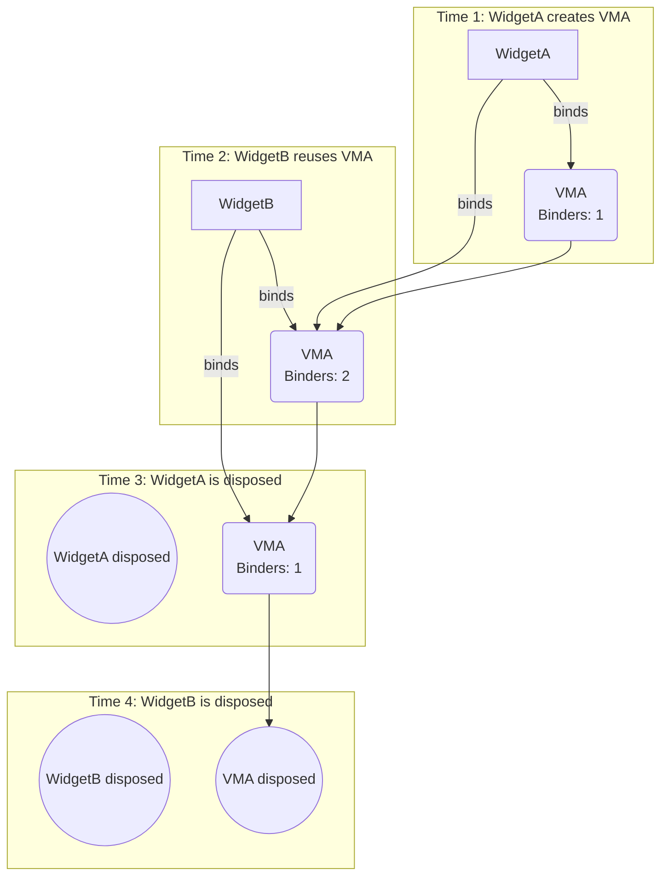
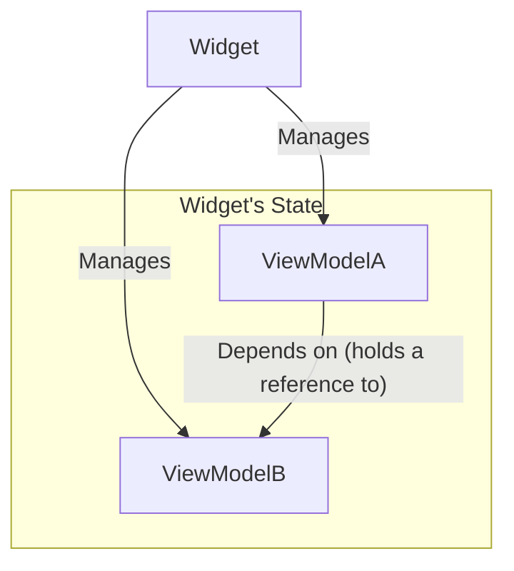

<p align="center">
  
</p>


# view_model

> The missing ViewModel in Flutter

[](https://pub.dev/packages/view_model) [](https://app.codecov.io/gh/lwj1994/flutter_view_model/tree/main)

[ChangeLog](https://github.com/lwj1994/flutter_view_model/blob/main/packages/view_model/CHANGELOG.md)

[English Doc](https://github.com/lwj1994/flutter_view_model/blob/main/packages/view_model/README.md) | [中文文档](https://github.com/lwj1994/flutter_view_model/blob/main/packages/view_model/README_ZH.md)

> Thank [Miolin](https://github.com/Miolin) for transferring the permission of
> the [view_model](https://pub.dev/packages/view_model) package to me.

---

- [view\_model](#view_model)
  - [Design Philosophy](#design-philosophy)
  - [Quick Start](#quick-start)
  - [Reuse One Instance](#reuse-one-instance)
  - [Basic Usage](#basic-usage)
    - [Adding Dependencies](#adding-dependencies)
    - [Creating a ViewModel](#creating-a-viewmodel)
    - [Creating a ViewModelFactory](#creating-a-viewmodelfactory)
      - [Custom ViewModelFactory](#custom-viewmodelfactory)
      - [DefaultViewModelFactory Quick Factory](#defaultviewmodelfactory-quick-factory)
    - [Using ViewModel in Widgets](#using-viewmodel-in-widgets)
      - [ViewModelStatelessMixin](#viewmodelstatelessmixin)
      - [ViewModelStateMixin](#viewmodelstatemixin)
      - [Alternative: ViewModelBuilder (no mixin required)](#alternative-viewmodelbuilder-no-mixin-required)
    - [Side‑effects with listeners](#sideeffects-with-listeners)
  - [ViewModel Lifecycle](#viewmodel-lifecycle)
      - [How It Works: Binder Counting](#how-it-works-binder-counting)
  - [Initialization](#initialization)
    - [Goloabl ViewModel Lifecycle](#goloabl-viewmodel-lifecycle)
  - [Stateful ViewModel (`StateViewModel<S>`)](#stateful-viewmodel-stateviewmodels)
    - [Defining the State Class](#defining-the-state-class)
    - [Creating a Stateful ViewModel](#creating-a-stateful-viewmodel)
    - [Creating a ViewModelFactory](#creating-a-viewmodelfactory-1)
    - [Using Stateful ViewModel in Widgets](#using-stateful-viewmodel-in-widgets)
    - [Side-effect Listeners](#side-effect-listeners)
    - [Fine-Grained Rebuilds with `StateViewModelValueWatcher`](#fine-grained-rebuilds-with-stateviewmodelvaluewatcher)
  - [ViewModel → ViewModel dependencies](#viewmodel--viewmodel-dependencies)
      - [Dependency Mechanism](#dependency-mechanism)
      - [Example](#example)
  - [Pause/Resume Lifecycle](#pauseresume-lifecycle)
  - [ValueLevel Rebuilds](#valuelevel-rebuilds)
    - [ValueListenableBuilder](#valuelistenablebuilder)
    - [ObserverBuilder](#observerbuilder)
    - [StateViewModelValueWatcher](#stateviewmodelvaluewatcher)
  - [DevTools Extension](#devtools-extension)

---

## Design Philosophy

The goal of `view_model` is **simplicity**. It is designed exclusively to serve the `Widget` (the View) and avoids other complex features.

In a Clean Architecture, the ViewModel acts as the **Presentation Layer**, bridging the Data Layer and the UI Layer. Its role is to hold UI state and handle UI logic, not to perform complex data manipulation.

- **For the UI Layer**: It manages the `Widget`'s lifecycle (including automatic Pause/Resume), handles user interactions, holds state ready for the UI to consume, and provides a convenient reuse mechanism.
- **Not for the Data Layer**: Complex data caching, combination, and transformation should be handled by the **Repository/Data Layer**. This is where tools like **Riverpod** or **Signals** can be powerful. For example, you can use Signals in your data layer for efficient data processing, and the ViewModel will consume the final, UI-ready data.

---

## Quick Start

- Watch: `watchViewModel<T>()` / `watchCachedViewModel<T>()`
- Read: `readViewModel<T>()` / `readCachedViewModel<T>()`
- Global: `ViewModel.readCached<T>() / maybeReadCached<T>()`
- Recycle: `recycleViewModel(vm)`
- Effects: `listen(onChanged)` / `listenState` / `listenStateSelect`

## Reuse One Instance

- Key: set `key()` in factory → all widgets share the same instance
- Tag: set `tag()` → bind newest instance via `watchCachedViewModel(tag)`
- Any param: pass any `Object` as key/tag (e.g. `'user:$id'`)

> [!IMPORTANT]
> When using custom objects as `key` or `tag`, ensure they properly implement 
> `==` operator and `hashCode` for correct cache lookup. You can use 
> third-party libraries like [equatable](https://pub.dev/packages/equatable) 
> or [freezed](https://pub.dev/packages/freezed) to simplify this implementation.

```dart
final f = DefaultViewModelFactory<UserViewModel>(
  builder: () => UserViewModel(userId: id),
  key: 'user:$id',
);
final vm1 = watchViewModel(factory: f);
final vm2 = watchCachedViewModel<UserViewModel>(key: 'user:$id'); // same
```


## Basic Usage

### Adding Dependencies

First, add `view_model` to your project's `pubspec.yaml` file:

```yaml
dependencies:
  flutter:
    sdk: flutter
  view_model: ^0.8.1 # Please use the latest version
```

### Creating a ViewModel

Inherit or mixin `ViewModel` to define business logic. Treat fields as state and call `notifyListeners()` or `update(block)` to trigger UI updates. The `update(block)` is recommended to avoid forgetting to call `notifyListeners()`.

```dart
import 'package:view_model/view_model.dart';
import 'package:flutter/foundation.dart'; // For debugPrint

class MySimpleViewModel extends ViewModel {
  String _message = "Initial Message";
  int _counter = 0;

  String get message => _message;

  int get counter => _counter;

  void updateMessage(String newMessage) {
    update(() {
      _message = newMessage;
    });
  }

  void incrementCounter() {
    update(() {
      _counter++;
    });
  }

  @override
  void dispose() {
    // Clean up resources here, such as closing StreamControllers, etc.
    debugPrint('MySimpleViewModel disposed');
    super.dispose();
  }
}
```

### Creating a ViewModelFactory

`ViewModelFactory` is responsible for instantiating `ViewModel`. Each `ViewModel` type typically
requires a corresponding `Factory`.

```dart
import 'package:view_model/view_model.dart';
// Assume MySimpleViewModel is defined as above

class MySimpleViewModelFactory with ViewModelFactory<MySimpleViewModel> {
  @override
  MySimpleViewModel build() {
    // Return a new MySimpleViewModel instance
    return MySimpleViewModel();
  }
}
```

#### Custom ViewModelFactory
Factory creates and identifies instances. Use `key()` to share one instance,
use `tag()` to group/discover.

| Method/Property | Type      | Optional          | Description                                                                                                                                            |
| --------------- | --------- | ----------------- | ------------------------------------------------------------------------------------------------------------------------------------------------------ |
| `build()`       | `T`       | ❌ Must implement | The factory method to create a ViewModel instance. Typically, constructor parameters are passed here.                                                  |
| `key()`         | `Object?` | ✅ Optional       | Provides a unique identifier for the ViewModel. ViewModels with the same key will be automatically shared (recommended for cross-widget/page sharing). |
| `tag()`      | `Object?` | ✅                | Add a tag for ViewModel instance. get tag by `viewModel.tag`. and it's used by find ViewModel by `watchViewModel(tag:tag)`.                            |

> **Note**: If you use a custom key object, implement `==` and `hashCode` to
> ensure correct cache lookup.

```dart
class MyViewModelFactory with ViewModelFactory<MyViewModel> {
  // Your custom parameters, usually passed to MyViewModel
  final String initialName;

  MyViewModelFactory({required this.initialName});

  @override
  MyViewModel build() {
    return MyViewModel(name: initialName);
  }

  /// The key for sharing the ViewModel. The key is unique, and only one ViewModel instance will be created for the same key.
  /// If the key is null, no sharing will occur.
  @override
  Object? key() => "user-profile";
}
```

#### DefaultViewModelFactory Quick Factory


For simple cases, use `DefaultViewModelFactory<T>` to avoid writing a custom
factory.


```dart

final factory = DefaultViewModelFactory<MyViewModel>(
  builder: () => MyViewModel(),
  isSingleton: true, // optional
);
```

- `builder`: Function to create the ViewModel instance.
- `key`: Custom key for singleton instance sharing.
- `tag`: Custom tag for identifying the ViewModel.
- `isSingleton`: Whether to use singleton mode. This is just a convenient way to set a unique key for you. Note that the priority is lower than the key parameter.

```dart

final factory = DefaultViewModelFactory<CounterViewModel>(
  builder: () => CounterViewModel(),
);
final sharedFactory = DefaultViewModelFactory<CounterViewModel>(
  builder: () => CounterViewModel(),
  key: 'global-counter',
);
```

---

### Using ViewModel in Widgets

Mix `ViewModelStatelessMixin` or `ViewModelStateMixin` into Widget to bind a `ViewModel`.
Use `watchViewModel` for reactive updates, or `readViewModel` to
avoid rebuilds. Lifecycle (create, share, dispose) is managed for
you automatically.

#### ViewModelStatelessMixin
`ViewModelStatelessMixin` enables `StatelessWidget` to bind a
`ViewModel`. 

```dart
import 'package:flutter/material.dart';
import 'package:view_model/view_model.dart';

/// Stateless widget using ViewModelStatelessMixin.
/// Displays counter state and a button to increment.
// ignore: must_be_immutable
class CounterStatelessWidget extends StatelessWidget
    with ViewModelStatelessMixin {
  CounterStatelessWidget({super.key});

  /// Create and watch the ViewModel instance for UI binding.
  late final vm = watchViewModel<CounterViewModel>(
    factory: DefaultViewModelFactory<CounterViewModel>(
      builder: CounterViewModel.new,
    ),
  );

  /// Builds UI bound to CounterViewModel state.
  @override
  Widget build(BuildContext context) {
    return Scaffold(
      body: Column(
        children: [
          Text('Count: ${vm.state}'),
          ElevatedButton(
            onPressed: vm.increment,
            child: const Text('Increment'),
          ),
        ],
      ),
    );
  }
}
```

#### ViewModelStateMixin


```dart
import 'package:flutter/material.dart';
import 'package:view_model/view_model.dart';

// Assume MySimpleViewModel and MySimpleViewModelFactory are defined

class MyPage extends StatefulWidget {
  const MyPage({super.key});

  @override
  State<MyPage> createState() => _MyPageState();
}

class _MyPageState extends State<MyPage>
    with ViewModelStateMixin<MyPage> {
  // 1. Mix in the Mixin
  late final MySimpleViewModel simpleVM;

  @override
  void initState() {
    super.initState();
    // 2. Use watchViewModel to create and get the ViewModel
    // When MyPage is built for the first time, the build() method of MySimpleViewModelFactory will be called to create an instance.
    // When MyPage is disposed, if this viewModel has no other listeners, it will also be disposed.
    simpleVM =
        watchViewModel<MySimpleViewModel>(factory: MySimpleViewModelFactory());
  }

  @override
  Widget build(BuildContext context) {
    return Scaffold(
      appBar: AppBar(title: Text(simpleVM.message)), // Directly access the ViewModel's properties
      body: Center(
        child: Column(
          mainAxisAlignment: MainAxisAlignment.center,
          children: <Widget>[
            Text('Button pressed: ${simpleVM.counter} times'), // Access the ViewModel's properties
            const SizedBox(height: 20),
            ElevatedButton(
              onPressed: () {
                simpleVM.updateMessage("Message Updated!"); // Call the ViewModel's method
              },
              child: const Text('Update Message'),
            ),
          ],
        ),
      ),
      floatingActionButton: FloatingActionButton(
        onPressed: () => simpleVM.incrementCounter(), // Call the ViewModel's method
        tooltip: 'Increment',
        child: const Icon(Icons.add),
      ),
    );
  }
}
```

#### Alternative: ViewModelBuilder (no mixin required)

```dart
// Example: Using ViewModelBuilder without mixing ViewModelStateMixin
ViewModelBuilder<MySimpleViewModel>(
  factory: MySimpleViewModelFactory(),
  builder: (vm) {
    return Column(
      mainAxisSize: MainAxisSize.min,
      children: [
        Text(vm.message),
        const SizedBox(height: 8),
        ElevatedButton(
          onPressed: () => vm.updateMessage("Message Updated!"),
          child: const Text('Update Message'),
        ),
      ],
    );
  },
)
```


or Using `CachedViewModelBuilder` to bind to an existing instance: 
```dart
// Example: Using CachedViewModelBuilder to bind to an existing instance
CachedViewModelBuilder<MySimpleViewModel>(
  shareKey: "shared-key", // or: tag: "shared-tag"
  builder: (vm) {
    return Row(
      children: [
        Expanded(child: Text(vm.message)),
        IconButton(
          onPressed: () => vm.incrementCounter(),
          icon: const Icon(Icons.add),
        ),
      ],
    );
  },
)
```

### Side‑effects with listeners

```dart
// In the initState of State or another appropriate method
late VoidCallback _disposeViewModelListener;

@override
void initState() {
  super.initState();

  // Get the ViewModel instance (usually obtained once in initState or via a getter)
  final myVm = watchViewModel<MySimpleViewModel>(factory: MySimpleViewModelFactory());

  _disposeViewModelListener = myVm.listen(onChanged: () {
    print('MySimpleViewModel called notifyListeners! Current counter: ${myVm.counter}');
    // For example: ScaffoldMessenger.of(context).showSnackBar(SnackBar(content: Text('Action performed!')));
  });
}

@override
void dispose() {
  _disposeViewModelListener(); // Clean up the listener to prevent memory leaks
  super.dispose();
}
```

## ViewModel Lifecycle

> [!IMPORTANT]
> Both `watch` (e.g., `watchViewModel`) and `read` (e.g., `readViewModel`) APIs will create a binding and increment the reference count. The `ViewModel` is disposed only when all bindings are removed.

The lifecycle of a `ViewModel` is managed automatically based on a **reference counting** mechanism. This ensures that a `ViewModel` instance is kept alive as long as it is being used by at least one widget and is automatically disposed of when it's no longer needed, preventing memory leaks.

#### How It Works: Binder Counting

The system keeps track of how many widgets are "binding" a `ViewModel` instance.

1.  **Creation & First Binder**: When `WidgetA` creates or binds a `ViewModel` (`VMA`) for the first time (e.g., using `watchViewModel`), the binder count for `VMA` becomes 1.
2.  **Reuse & More Binder**: If `WidgetB` reuses the same `VMA` instance (e.g., by using `watchCachedViewModel` with the same key), the binder count for `VMA` increments to 2.
3.  **Disposing a Binder**: When `WidgetA` is disposed, it stops watching `VMA`, and the binder count decrements to 1. At this point, `VMA` is **not** disposed because `WidgetB` is still using it.
4.  **Final Disposal**: Only when `WidgetB` is also disposed does the binder count for `VMA` drop to 0. At this moment, the `ViewModel` is considered unused, and its `dispose()` method is called automatically.

This mechanism is fundamental for sharing `ViewModel`s across different parts of your widget tree, ensuring state persistence as long as it's relevant to the UI.




## Initialization

Before using the `view_model` package, it's recommended to perform a one-time initialization in your `main` function. This allows you to configure global settings for the entire application.

```dart
void main() {
  // Configure ViewModel global settings
  ViewModel.initialize(
    config: ViewModelConfig(
      // Enable or disable logging for all ViewModels.
      // It's useful for debugging state changes and lifecycle events.
      // Defaults to false.
      isLoggingEnabled: true,
      
      // Provide a custom global function to determine if two states are equal.
      // This is used by `StateViewModel` and `listenStateSelect` with selectors to decide
      // whether to trigger a rebuild.
      // If not set, `StateViewModel` uses `identical()` and `listenStateSelect` uses `==`.
      equals: (previous, current) {
        // Example: Use a custom `isEqual` method for deep comparison
        return identical(previous, current);
      },
    ),
    // You can also register global lifecycle observers here
    lifecycles: [
      GlobalLifecycleObserver(),
    ],
  );
  
  runApp(const MyApp());
}
```


**Configuration Options:**

- `isLoggingEnabled`: A `bool` that toggles logging for all ViewModel instances. When enabled, you'll see outputs for state changes, creations, and disposals, which is helpful during development.
- `equals`: A function `bool Function(dynamic previous, dynamic current)` that provides a global strategy for state comparison. It affects:
    - `StateViewModel`: Determines if the new state is the same as the old one.
    - `ViewModel.listen`: Decides if the selected value has changed.
- `lifecycles`: A list of `ViewModelLifecycle` observers that listen to lifecycle events (e.g., `onCreate`, `onDispose`) for all ViewModels. This is useful for global logging, analytics, or other cross-cutting concerns.

### Goloabl ViewModel Lifecycle
```dart
/// Abstract interface for observing ViewModel lifecycle events.
///
/// Implement this interface to receive callbacks when ViewModels are created,
/// watched, unwatched, or disposed. This is useful for logging, analytics,
/// debugging, or other cross-cutting concerns.
///
/// Example:
/// ```dart
/// class LoggingLifecycle extends ViewModelLifecycle {
///   @override
///   void onCreate(ViewModel viewModel, InstanceArg arg) {
///     print('ViewModel created: ${viewModel.runtimeType}');
///   }
///
///   @override
///   void onDispose(ViewModel viewModel, InstanceArg arg) {
///     print('ViewModel disposed: ${viewModel.runtimeType}');
///   }
/// }
/// ```
abstract class ViewModelLifecycle {
  /// Called when a ViewModel instance is created.
  ///
  /// Parameters:
  /// - [viewModel]: The newly created ViewModel
  /// - [arg]: Creation arguments including key, tag, and other metadata
  void onCreate(ViewModel viewModel, InstanceArg arg) {}

  /// Called when a new binder is added to a ViewModel.
  ///
  /// Parameters:
  /// - [viewModel]: The ViewModel being watched
  /// - [arg]: Instance arguments
  /// - [newBinderId]: Unique identifier for the new binder
  void onAddBinder(ViewModel viewModel, InstanceArg arg, String newBinderId) {}

  /// Called when a binder is removed from a ViewModel.
  ///
  /// Parameters:
  /// - [viewModel]: The ViewModel being unwatched
  /// - [arg]: Instance arguments
  /// - [removedBinderId]: Unique identifier for the removed binder
  void onRemoveBinder(
      ViewModel viewModel, InstanceArg arg, String removedBinderId) {}

  /// Called when a ViewModel is disposed.
  ///
  /// Parameters:
  /// - [viewModel]: The ViewModel being disposed
  /// - [arg]: Instance arguments
  void onDispose(ViewModel viewModel, InstanceArg arg) {}
}
```


## Stateful ViewModel (`StateViewModel<S>`)

Use `StateViewModel<S>` when you prefer an immutable `state` object and
updates via `setState(newState)`. 


> [!NOTE]
> By default, `StateViewModel` uses `identical()` to compare state instances 
> (comparing object references, not content). This means `setState()` will 
> trigger a rebuild only when you provide a new state instance. You can 
> customize this comparison behavior globally via the `equals` function in 
> `ViewModel.initialize()` (see [Initialization](#initialization) section).

### Defining the State Class

First, you need to define a state class. It is strongly recommended that this class is immutable,
typically achieved by providing a `copyWith` method.

```dart
// example: lib/my_counter_state.dart
import 'package:flutter/foundation.dart';

@immutable // Recommended to mark as immutable
class MyCounterState {
  final int count;
  final String statusMessage;

  const MyCounterState({this.count = 0, this.statusMessage = "Ready"});

  MyCounterState copyWith({int? count, String? statusMessage}) {
    return MyCounterState(
      count: count ?? this.count,
      statusMessage: statusMessage ?? this.statusMessage,
    );
  }

  @override
  bool operator ==(Object other) =>
      identical(this, other) ||
          other is MyCounterState &&
              runtimeType == other.runtimeType &&
              count == other.count &&
              statusMessage == other.statusMessage;

  @override
  int get hashCode => count.hashCode ^ statusMessage.hashCode;

  @override
  String toString() => 'MyCounterState{count: $count, statusMessage: $statusMessage}';
}
```

### Creating a Stateful ViewModel

Inherit from `StateViewModel<S>`, where `S` is the type of the state class you defined.

```dart
// example: lib/my_counter_view_model.dart
import 'package:view_model/view_model.dart';
import 'package:flutter/foundation.dart';
import 'my_counter_state.dart'; // Import the state class

class MyCounterViewModel extends StateViewModel<MyCounterState> {
  // The constructor must initialize the state via super
  MyCounterViewModel({required MyCounterState initialState}) : super(state: initialState);

  void increment() {
    // Use setState to update the state, which will automatically handle notifyListeners
    setState(state.copyWith(count: state.count + 1, statusMessage: "Incremented"));
  }

  void decrement() {
    if (state.count > 0) {
      setState(state.copyWith(count: state.count - 1, statusMessage: "Decremented"));
    } else {
      setState(state.copyWith(statusMessage: "Cannot decrement below zero"));
    }
  }

  void reset() {
    // You can directly replace the old state with a new State instance
    setState(const MyCounterState(count: 0, statusMessage: "Reset"));
  }

  @override
  void dispose() {
    debugPrint('Disposed MyCounterViewModel with state: $state');
    super.dispose();
  }
}
```

In `StateViewModel`, you update the state by calling `setState(newState)`. This method replaces the
old state with the new one and automatically notifies all listeners.

### Creating a ViewModelFactory

Create a corresponding `Factory` for your `StateViewModel`.

```dart
// example: lib/my_counter_view_model_factory.dart
import 'package:view_model/view_model.dart';
import 'my_counter_state.dart';
import 'my_counter_view_model.dart';

class MyCounterViewModelFactory with ViewModelFactory<MyCounterViewModel> {
  final int initialCount;

  MyCounterViewModelFactory({this.initialCount = 0});

  @override
  MyCounterViewModel build() {
    // Create and return the ViewModel instance in the build method, passing the initial state
    return MyCounterViewModel(
        initialState: MyCounterState(count: initialCount, statusMessage: "Initialized"));
  }
}
```

### Using Stateful ViewModel in Widgets

Using a stateful `ViewModel` in a `StatefulWidget` is very similar to using a stateless `ViewModel`,
with the main difference being that you can directly access `viewModel.state` to obtain the current
state object.

```dart
// example: lib/my_counter_page.dart
import 'package:flutter/material.dart';
import 'package:view_model/view_model.dart';
import 'my_counter_view_model.dart';
import 'my_counter_view_model_factory.dart';
// MyCounterState will be referenced internally by MyCounterViewModel

class MyCounterPage extends StatefulWidget {
  const MyCounterPage({super.key});

  @override
  State<MyCounterPage> createState() => _MyCounterPageState();
}

class _MyCounterPageState extends State<MyCounterPage>
    with ViewModelStateMixin<MyCounterPage> {
  late final MyCounterViewModel counterVM;

  @override
  void initState() {
    super.initState();
    counterVM = watchViewModel<MyCounterViewModel>(
        factory: MyCounterViewModelFactory(initialCount: 10)); // You can pass an initial value
  }

  @override
  Widget build(BuildContext context) {
    return Scaffold(
      appBar: AppBar(title: const Text('Stateful ViewModel Counter')),
      body: Center(
        child: Column(
          mainAxisAlignment: MainAxisAlignment.center,
          children: <Widget>[
            Text(
              'Count: ${counterVM.state.count}', // Directly access the state's properties
              style: Theme
                  .of(context)
                  .textTheme
                  .headlineMedium,
            ),
            const SizedBox(height: 8),
            Text(
              'Status: ${counterVM.state.statusMessage}', // Access other properties of the state
              style: Theme
                  .of(context)
                  .textTheme
                  .titleMedium,
            ),
          ],
        ),
      ),
      floatingActionButton: Column(
        mainAxisAlignment: MainAxisAlignment.end,
        crossAxisAlignment: CrossAxisAlignment.end,
        children: [
          FloatingActionButton(
            onPressed: () => counterVM.increment(),
            tooltip: 'Increment',
            child: const Icon(Icons.add),
          ),
          const SizedBox(height: 8),
          FloatingActionButton(
            onPressed: () => counterVM.decrement(),
            tooltip: 'Decrement',
            child: const Icon(Icons.remove),
          ),
          const SizedBox(height: 8),
          FloatingActionButton.extended(
            onPressed: () => counterVM.reset(),
            tooltip: 'Reset',
            icon: const Icon(Icons.refresh),
            label: const Text("Reset"),
          ),
        ],
      ),
    );
  }
}
```


### Side-effect Listeners

In addition to the standard `listen()` method inherited from `ViewModel`, `StateViewModel` provides two specialized listeners for reacting to state changes without rebuilding the widget:

- **`listenState((previous, current) { ... })`**: Triggers a callback whenever the `state` object changes. It provides both the previous and the current state, which is useful for comparison or logic that depends on the transition.

- **`listenStateSelect<T>((state) => state.someValue, (previous, current) { ... })`**: A more optimized listener that triggers a callback only when a specific selected value within the state changes. This avoids unnecessary reactions when other parts of the state are updated.

```dart
// In initState
final myVm = watchViewModel<MyCounterViewModel>(/* ... */);

// Listen to the entire state object
final dispose1 = myVm.listenState((previous, current) {
  if (previous.count != current.count) {
    print('Counter changed from ${previous.count} to ${current.count}');
  }
});

// Listen only to changes in the statusMessage
final dispose2 = myVm.listenStateSelect(
  (state) => state.statusMessage,
  (previous, current) {
    print('Status message changed: $current');
    // e.g., ScaffoldMessenger.of(context).showSnackBar(SnackBar(content: Text(current)));
  },
);

// Remember to call dispose1() and dispose2() in the widget's dispose method.
```


### Fine-Grained Rebuilds with `StateViewModelValueWatcher`

For highly optimized performance, `StateViewModelValueWatcher` allows you to rebuild a widget based on changes to one or more specific values within your state. This is particularly useful when your widget only depends on a small subset of a larger state object.

It takes a `viewModel`, a list of `selectors`, and a `builder`. The widget rebuilds only when the result of any selector function changes.

**How it works:**

1.  **`viewModel`**: The `StateViewModel` instance to listen to.
2.  **`selectors`**: A list of functions, where each function extracts a specific value from the state (e.g., `(state) => state.userName`).
3.  **`builder`**: A function that builds the widget, which is called only when any of the selected values change.

**Example:**

Imagine a `UserProfileViewModel` with a state containing `userName`, `age`, and `lastLogin`. If a widget only needs to display the user's name and age, you can use `StateViewModelValueWatcher` to ensure it only rebuilds when `userName` or `age` changes, ignoring updates to `lastLogin`.

```dart
// Assume you have a MyCounterViewModel and its state MyCounterState { count, statusMessage }

// Obtain the ViewModel instance (usually with readCachedViewModel if you don't need the whole widget to rebuild)
final myVm = readCachedViewModel<MyCounterViewModel>();

// This widget will only rebuild if `state.count` or `state.statusMessage` changes.
StateViewModelValueWatcher<MyCounterState>(
  viewModel: myVm,
  selectors: [
    (state) => state.count, 
    (state) => state.statusMessage
  ],
  builder: (state) {
    // This Text widget is only rebuilt when count or statusMessage changes.
    return Text('Count: ${state.count}, Status: ${state.statusMessage}');
  },
)
```

This approach provides a powerful way to achieve fine-grained control over your UI updates, leading to better performance.

## ViewModel → ViewModel dependencies

The `view_model` package provides a smart dependency mechanism that allows ViewModels to depend on each other. use `readViewModel/readCachedViewModel` in `ViewModel`. The APIs are the same as in `ViewModelStateMixin`.

#### Dependency Mechanism

A `ViewModel` can depend on other `ViewModel`s. For example, `ViewModelA` might need to access data or logic from `ViewModelB`.

Even when one `ViewModel` depends on another, all `ViewModel` instances are managed directly by the `Widget`'s `State`. The dependency structure is **flat**, not nested.

When `ViewModelA` (which is managed by a `Widget`) requests `ViewModelB` as a dependency, `ViewModelB` is not created "inside" `ViewModelA`. Instead, `ViewModelB` is also attached directly to the same `Widget`.

This means:
- **Lifecycle**: Both `ViewModelA` and `ViewModelB`'s lifecycles are tied to the `Widget`.
- **Management**: The `Widget` is responsible for creating and disposing of all its associated `ViewModel`s.
- **Relationship**: `ViewModelA` simply holds a reference to `ViewModelB`.

Essentially, calling `readViewModel` or `watchViewModel` from within a `ViewModel` is the same as calling it from the `Widget`. Both access the same central management system.

This flattened approach simplifies lifecycle management and avoids complex, nested dependency chains.

Here's a visual representation of the relationship:



#### Example

Let's say you have a `ViewModelA` that depends on `ViewModelB`.

```dart
// ViewModelB
class ViewModelB extends ViewModel {
  // ...
}

// ViewModelA
class ViewModelA extends ViewModel {
  late final ViewModelB viewModelB;

  ViewModelA() {
    viewModelB = readCachedViewModel<ViewModelB>();
  }
}
```

When you create `ViewModelA` in your widget, the dependency mechanism will automatically create and provide `ViewModelB`.

```dart
// In your widget
class _MyWidgetState extends State<MyWidget> with ViewModelStateMixin {
  late final ViewModelA viewModelA;

  @override
  void initState() {
    super.initState();
    viewModelA = watchViewModel<ViewModelA>(factory: ...);
  }

  // ...
}
```

This system allows for a clean and decoupled architecture, where ViewModels can be developed and tested independently.

## Pause/Resume Lifecycle

[doc](https://github.com/lwj1994/flutter_view_model/blob/main/docs/PAUSE_RESUME_LIFECYCLE.md)


The pause/resume lifecycle is managed by `ViewModelPauseProvider`s. By default,
`PageRoutePauseProvider`, `TickerModePauseProvider` and `AppPauseProvider` handle pausing/resuming based
on route visibility and app lifecycle events, respectively.


## ValueLevel Rebuilds
Since the ViewModel updates the entire widget (coarse-grained), if you need more fine-grained updates, here are three methods for your reference.

### ValueListenableBuilder
- For fine-grained UI updates, use `ValueNotifier` with `ValueListenableBuilder`.
```dart
final title = ValueNotifier('Hello');
ValueListenableBuilder(
  valueListenable: title,
  builder: (_, v, __) => Text(v),
);
```

### ObserverBuilder

[doc](https://github.com/lwj1994/flutter_view_model/blob/main/docs/value_observer_doc.md)

- For more dynamic scenarios, `ObservableValue` and `ObserverBuilder` offer more flexibility.

```dart
// shareKey for share value cross any widget
final observable = ObservableValue<int>(0, shareKey: share);
observable.value = 20;

ObserverBuilder<int>(observable: observable, 
        builder: (v) {
          return Text(v.toString());
        },
      )
```

### StateViewModelValueWatcher

- To rebuild only when a specific value within a `StateViewModel` changes, use [`StateViewModelValueWatcher`](#fine-grained-rebuilds-with-stateviewmodelvaluewatcher).  


```dart
class MyWidget extends State with ViewModelStateMixin {
  const MyWidget({super.key});

  late final MyViewModel stateViewModel;

  @override
  void initState() {
    super.initState();
    stateViewModel = readViewModel<MyViewModel>(
      factory: MyViewModelFactory(),
    );
  }

  @override
  Widget build(BuildContext context) {
    // Watch value changes on `stateViewModel` and rebuild only when `name` or `age` changes.
    return StateViewModelValueWatcher<MyViewModel>(
      stateViewModel: stateViewModel,
      selectors: [(state) => state.name, (state) => state.age],
      builder: (state) {
        return Text('Name: \${state.name}, Age: \${state.age}');
      },
    );
  }
}
```


## DevTools Extension

Enable the DevTools extension for real‑time ViewModel monitoring.

create `devtools_options.yaml` in root directory of project.

```yaml
description: This file stores settings for Dart & Flutter DevTools.
documentation: https://docs.flutter.dev/tools/devtools/extensions#configure-extension-enablement-states
extensions:
  - view_model: true
```


