<p align="center">
  
</p>

# view_model

> The missing ViewModel in Flutter — Everything is ViewModel.

[](https://pub.dev/packages/view_model) [](https://app.codecov.io/gh/lwj1994/flutter_view_model/tree/main)

[ChangeLog](https://github.com/lwj1994/flutter_view_model/blob/main/packages/view_model/CHANGELOG.md) | [中文文档](https://github.com/lwj1994/flutter_view_model/blob/main/README_ZH.md)

> Special thanks to [Miolin](https://github.com/Miolin) for transferring the `view_model` package ownership.

---

## ✨ Features

- **Zero Boilerplate** — No manual registration, no complex provider graphs
- **Automatic Lifecycle** — ViewModels are created, cached, and disposed automatically
- **Instance Sharing** — Share the same ViewModel across multiple widgets using keys
- **Widget-Agnostic** — ViewModels don't hold `BuildContext`, fully decoupled from UI
- **Fine-Grained Rebuilds** — Rebuild only what changes with selectors
- **Pause/Resume** — Automatically pause updates when widgets are hidden
- **Code Generation** — Optional `@genProvider` annotation reduces boilerplate further

---

## 📦 Installation

```yaml
dependencies:
  view_model: ^latest

dev_dependencies:
  build_runner: ^latest
  view_model_generator: ^latest  # Optional: for code generation
```

---

## 🚀 Quick Start

```dart
// 1. Define a ViewModel
class CounterViewModel extends ViewModel {
  int count = 0;
  void increment() => update(() => count++);
}

// 2. Create a Provider
final counterProvider = ViewModelProvider<CounterViewModel>(
  builder: () => CounterViewModel(),
);

// 3. Use in a Widget
class CounterPage extends StatefulWidget {
  @override
  State<CounterPage> createState() => _CounterPageState();
}

class _CounterPageState extends State<CounterPage> with ViewModelStateMixin {
  @override
  Widget build(BuildContext context) {
    final vm = vef.watch(counterProvider);  // Rebuilds when vm changes
    return ElevatedButton(
      onPressed: vm.increment,
      child: Text('Count: ${vm.count}'),
    );
  }
}
```

---

## 📖 Core Concepts

### ViewModel

A lifecycle-aware container for your business logic. Use `update()` to notify listeners:

```dart
class UserViewModel extends ViewModel {
  String name = '';
  
  Future<void> fetchUser() async {
    final user = await api.getUser();
    update(() => name = user.name);  // Triggers rebuild
  }
  
  @override
  void dispose() {
    // Clean up resources
    super.dispose();
  }
}
```

### StateViewModel

For immutable state patterns with `copyWith`:

```dart
class CounterState {
  final int count;
  final String message;
  const CounterState({this.count = 0, this.message = ''});
  
  CounterState copyWith({int? count, String? message}) => CounterState(
    count: count ?? this.count,
    message: message ?? this.message,
  );
}

class CounterViewModel extends StateViewModel<CounterState> {
  CounterViewModel() : super(state: const CounterState());
  
  void increment() => setState(state.copyWith(
    count: state.count + 1,
    message: 'Incremented!',
  ));
}
```

### ViewModelProvider

Defines how to build and cache ViewModels:

```dart
// Simple provider
final counterProvider = ViewModelProvider<CounterViewModel>(
  builder: () => CounterViewModel(),
  key: 'counter',      // Optional: for instance sharing
  isSingleton: true,   // Optional: global singleton
);

// Provider with arguments
final userProvider = ViewModelProvider.arg<UserViewModel, String>(
  builder: (userId) => UserViewModel(userId),
  key: (userId) => 'user:$userId',  // Key from argument
);
```

### The `vef` Accessor

Access ViewModels in widgets through the `vef` object:

| Method | Description |
|--------|-------------|
| `vef.watch(provider)` | Get VM and rebuild on changes |
| `vef.read(provider)` | Get VM without rebuilding |
| `vef.watchCached<T>(key:)` | Get cached VM by key with rebuilds |
| `vef.readCached<T>(key:)` | Get cached VM by key, no rebuilds |
| `vef.listen(provider, onChanged:)` | Side effects, auto-disposed |
| `vef.recycle(vm)` | Force dispose and recreate |

---

## 🔌 Widget Integration

### ViewModelStateMixin (Recommended)

The standard pattern for StatefulWidget:

```dart
class MyPage extends StatefulWidget {
  @override
  State<MyPage> createState() => _MyPageState();
}

class _MyPageState extends State<MyPage> with ViewModelStateMixin {
  CounterViewModel get vm => vef.watch(counterProvider);
  
  @override
  void initState() {
    super.initState();
    // Listen for side effects (auto-disposed)
    vef.listen(counterProvider, onChanged: (vm) {
      print('Count changed: ${vm.count}');
    });
  }
  
  @override
  Widget build(BuildContext context) {
    return Text('Count: ${vm.count}');
  }
}
```

### ViewModelBuilder (Alternative)

No mixin required:

```dart
ViewModelBuilder<CounterViewModel>(
  counterProvider,
  builder: (vm) => Text('Count: ${vm.count}'),
)
```

### ViewModelStatelessMixin

> ⚠️ **Warning**: Intercepts Element lifecycle, may conflict with other mixins. Prefer StatefulWidget pattern.

```dart
class CounterWidget extends StatelessWidget with ViewModelStatelessMixin {
  @override
  Widget build(BuildContext context) {
    final vm = vef.watch(counterProvider);
    return Text('Count: ${vm.count}');
  }
}
```

---

## 🔗 Instance Sharing

Share the same ViewModel across different widgets:

### Using Provider with Key

```dart
final userProvider = ViewModelProvider<UserViewModel>(
  builder: () => UserViewModel(userId: currentUserId),
  key: 'user:$currentUserId',
);

// Widget A and Widget B both get the same instance
class WidgetA extends StatefulWidget { /* ... */ }
class _WidgetAState extends State<WidgetA> with ViewModelStateMixin {
  UserViewModel get vm => vef.watch(userProvider);
  // ...
}

class WidgetB extends StatefulWidget { /* ... */ }
class _WidgetBState extends State<WidgetB> with ViewModelStateMixin {
  UserViewModel get vm => vef.watch(userProvider);  // Same instance!
  // ...
}
```

### Direct Key Lookup

For deeply nested widgets or cross-module access:

```dart
// Access by key when provider isn't available
final vm = vef.watchCached<UserViewModel>(key: 'user:123');
```

> **Note**: Throws if no instance exists. Use `vef.maybeWatchCached()` for nullable return.

---

## ♻️ Lifecycle Management

ViewModels use **reference counting**:

```mermaid
graph LR
    A[WidgetA watches] --> B[Ref: 1]
    B --> C[WidgetB watches]
    C --> D[Ref: 2]
    D --> E[WidgetA disposes]
    E --> F[Ref: 1]
    F --> G[WidgetB disposes]
    G --> H[Ref: 0 → dispose]
```



- First `watch()` → creates instance
- Additional `watch()` → reuses instance, increments ref
- Widget disposes → decrements ref
- Ref reaches 0 → calls `ViewModel.dispose()`

---

## ⏸️ Pause/Resume

ViewModels automatically pause when hidden:

- **Navigation**: Route pushed/popped
- **App Lifecycle**: App backgrounded
- **Tabs**: TabBarView/PageView switching

Setup:
```dart
MaterialApp(
  navigatorObservers: [ViewModel.routeObserver],
  // ...
)
```

See [Pause/Resume Lifecycle](./docs/PAUSE_RESUME_LIFECYCLE.md) for details.

---

## 🎯 Fine-Grained Rebuilds

### StateViewModel Selectors

Listen to specific state fields:

```dart
// Listen to entire state
vef.listenState(counterProvider, (prev, curr) {
  print('State changed');
});

// Listen to specific field
vef.listenStateSelect(
  counterProvider,
  (state) => state.count,
  (prev, curr) => print('Count: $prev → $curr'),
);
```

### StateViewModelValueWatcher

Rebuild only when selected values change:

```dart
StateViewModelValueWatcher<CounterState>(
  viewModel: vm,
  selectors: [(s) => s.count],
  builder: (state) => Text('${state.count}'),
)
```

### ObservableValue

Lightweight shared values:

```dart
final counter = ObservableValue<int>(0, shareKey: 'counter');

ObserverBuilder<int>(
  observable: counter,
  builder: (value) => Text('$value'),
)

// Update from anywhere
counter.value++;
```

---

## ⚙️ Code Generation

Use `@genProvider` to auto-generate providers:

```dart
import 'package:view_model/view_model.dart';
part 'counter_view_model.vm.dart';

@genProvider
class CounterViewModel extends ViewModel {
  int count = 0;
  void increment() => update(() => count++);
}
// Generates: counterProvider
```

With arguments:
```dart
@genProvider
class UserViewModel extends ViewModel {
  final String userId;
  UserViewModel(this.userId);
}
// Generates: userViewModelProvider (ViewModelProvider.arg)
```

With key/tag:
```dart
@GenProvider(key: r'user-$id', tag: r'user-$id')
class UserViewModel extends ViewModel {
  final String id;
  UserViewModel(this.id);
}
```

Run: `dart run build_runner build`

See [Generator README](./packages/view_model_generator/README.md) for advanced usage.

---

## 🧪 Testing

Mock ViewModels using `setProxy`:

```dart
class MockAuthViewModel extends AuthViewModel {
  @override
  bool get isLoggedIn => false;
}

testWidgets('shows login prompt', (tester) async {
  // Override
  authProvider.setProxy(
    ViewModelProvider(builder: () => MockAuthViewModel()),
  );
  
  await tester.pumpWidget(MyApp());
  expect(find.text('Please log in'), findsOneWidget);
  
  // Cleanup
  authProvider.clearProxy();
});
```

---

## 🔧 Configuration

Global settings in `main()`:

```dart
void main() {
  ViewModel.initialize(
    config: ViewModelConfig(
      isLoggingEnabled: true,
      equals: (a, b) => identical(a, b),  // State equality
    ),
    lifecycles: [MyLifecycleObserver()],
  );
  runApp(MyApp());
}
```

---

## 📚 Related Packages

| Package | Description |
|---------|-------------|
| [view_model](https://pub.dev/packages/view_model) | Core library |
| [view_model_generator](https://pub.dev/packages/view_model_generator) | Code generator |
| [view_model_annotation](https://pub.dev/packages/view_model_annotation) | Annotations |

---

## 📄 License

MIT License - see [LICENSE](./LICENSE) file.
