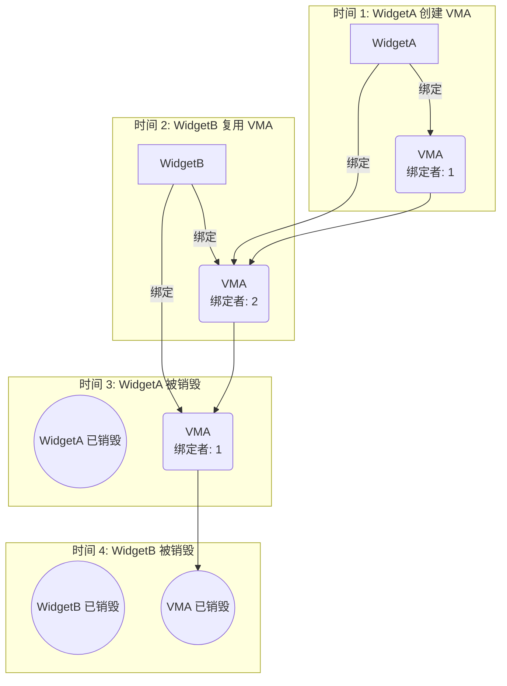
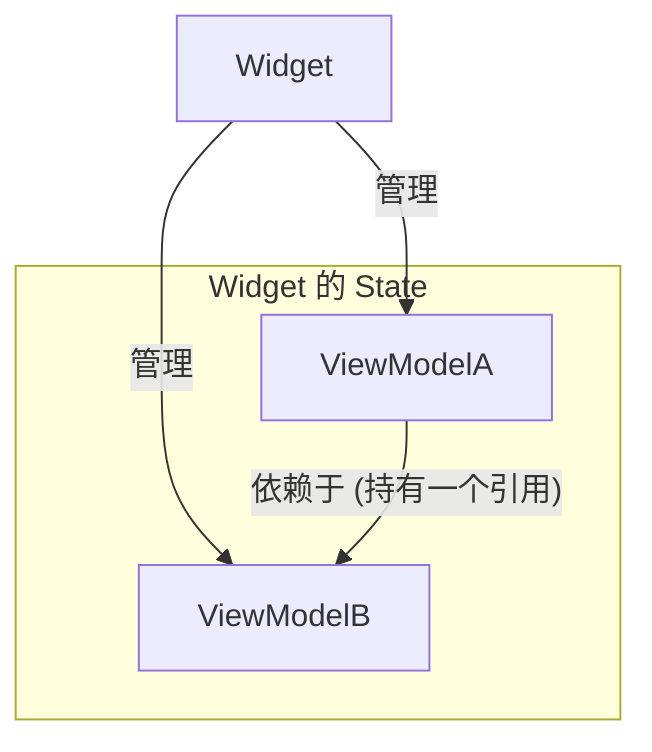

<p align="center">
  
</p>

# view_model

> Flutter 中缺失的 ViewModel，万物皆是 ViewModel。

[](https://pub.dev/packages/view_model) [](https://app.codecov.io/gh/lwj1994/flutter_view_model/tree/main)

[更新日志](https://github.com/lwj1994/flutter_view_model/blob/main/packages/view_model/CHANGELOG.md)

[English Doc](https://github.com/lwj1994/flutter_view_model/blob/develop/packages/view_model/README.md) | [中文文档](https://github.com/lwj1994/flutter_view_model/blob/main/packages/view_model/README_ZH.md)

> 感谢 [Miolin](https://github.com/Miolin) 将
> [view_model](https://pub.dev/packages/view_model) 包的权限转移给我。

---

- [view\_model](#view_model)
    - [万物皆是 ViewModel](#万物皆是-viewmodel)
    - [快速开始](#快速开始)
    - [复用实例](#复用实例)
    - [基本用法](#基本用法)
        - [添加依赖](#添加依赖)
        - [创建 ViewModel](#创建-viewmodel)
            - [ViewModelProvider（建议搭配生成器使用）](#viewmodelprovider建议搭配生成器使用)
            - [Provider 生成器（推荐）](#provider-生成器推荐)
        - [在 Widget 中使用 ViewModel](#在-widget-中使用-viewmodel)
            - [ViewModelStatelessMixin](#viewmodelstatelessmixin)
            - [ViewModelStateMixin](#viewmodelstatemixin)
            - [替代方案: ViewModelBuilder (无需 mixin)](#替代方案-viewmodelbuilder-无需-mixin)
        - [使用监听器处理副作用](#使用监听器处理副作用)
    - [ViewModel 生命周期](#viewmodel-生命周期)
        - [工作原理: 引用计数](#工作原理-引用计数)

    - [初始化](#初始化)
        - [全局 ViewModel 生命周期](#全局-viewmodel-生命周期)
    - [有状态的 ViewModel (`StateViewModel<S>`)](#有状态的-viewmodel-stateviewmodels)
        - [定义 State 类](#定义-state-类)
        - [创建有状态的 ViewModel](#创建有状态的-viewmodel)
        - [为有状态的 ViewModel 创建 ViewModelFactory](#为有状态的-viewmodel-创建-viewmodelfactory)
        - [在 Widget 中使用有状态的 ViewModel](#在-widget-中使用有状态的-viewmodel)
        - [副作用监听器](#副作用监听器)
        - [使用
          `StateViewModelValueWatcher` 实现细粒度重建](#使用-stateviewmodelvaluewatcher-实现细粒度重建)
    - [ViewModel → ViewModel 依赖](#viewmodel--viewmodel-依赖)
        - [依赖机制](#依赖机制)
        - [示例](#示例)
    - [暂停/恢复生命周期](#暂停恢复生命周期)
    - [值级别重建](#值级别重建)
        - [ValueListenableBuilder](#valuelistenablebuilder)
        - [ObserverBuilder](#observerbuilder)
        - [StateViewModelValueWatcher](#stateviewmodelvaluewatcher)
    - [自定义 Refer](#自定义-refer)
        - [核心概念](#核心概念)
        - [示例：StartTaskRef（常用于应用启动）](#示例starttaskref常用于应用启动)
    - [DevTools 扩展](#devtools-扩展)

---

## 万物皆是 ViewModel

我们重新定义了 "ViewModel":它不再局限于 MVVM 模式,而是一个具备生命周期感知能力的**特殊 Manager 容器
**。

**1. 以 Widget 为核心的架构**
Flutter App 的运作是以页面和组件为核心的。无论逻辑多复杂,数据的最终消费者永远是 Widget。因此,将
Manager 的生命周期直接与 Widget 树绑定,是逻辑最自洽、最自然的架构方式。

**2. 统一概念,灵活作用域**
你不需要区分什么是 Service、Controller 或 Store。它们都是 ViewModel。区别仅仅在于**挂载位置**:

* **全局**:挂载在顶层 **`AppMain`**,实现全局单例。
* **局部**:挂载在 **Page**,自动跟随页面销毁。
* **共享**:通过唯一的 **`key`**(如商品ID),在不同页面间共享同一个实例。

**3. 无缝组合与逻辑解耦**
ViewModel 可以在内部直接依赖或读取其他 ViewModel(例如 `UserVM` 读取 `NetworkVM`)。但 ViewModel 本身是
**Widget 无感知的**——它只负责逻辑和状态,完全不知道 Widget 的存在,也不持有 `BuildContext`。

**4. 极致的开箱即用**
相比于 **GetIt**(需要手写绑定胶水代码)或 **Riverpod**(涉及复杂的图谱概念)
,这套方案是绝对实用主义的。它提供了自动化的生命周期管理和依赖注入,零样板代码,真正的**开箱即用**。

**5. 超越 Widget:自定义 Refer**
通过自定义 `Refer`,ViewModel 可以**脱离 Widget 独立存在**。任何 Dart 类都可以 `with Refer` 成为
ViewModel 的宿主,实现以下场景:

* **后台服务**:在后台任务中运行 ViewModel 逻辑(如下载、同步)。
* **纯 Dart 测试**:无需 `testWidgets` 即可测试 ViewModel 交互。
* **启动任务**:在任何 Widget 渲染前执行初始化逻辑。

这让 ViewModel 真正做到了万能——**万物皆可 ViewModel**,不仅仅是 UI
组件。详见[自定义 Refer](#自定义-ref)。

---

## 快速开始

- 监听 (Watch): `refer.watch<T>()` / `refer.watchCached<T>()`
- 读取 (Read): `refer.read<T>()` / `refer.readCached<T>()`
- 副作用 (Effects): `vm.listen(onChanged)` / `vm.listenState` / `vm.listenStateSelect`

```dart
// 1. 定义 ViewModel
class CounterViewModel extends ViewModel {
  int count = 0;

  void increment() => update(() => count++);
}

// 2. 在 Widget 中使用
class CounterPage extends StatelessWidget with ViewModelStatelessMixin {
  @override
  Widget build(BuildContext context) {
    final vm = refer.watch(
      ViewModelProvider<CounterViewModel>(builder: () => CounterViewModel()),
    );
    return ElevatedButton(
      onPressed: vm.increment,
      child: Text('${vm.count}'),
    );
  }
}
```

## 复用实例

- Key: 在 factory 中设置 `key()` → 所有 widget 共享同一个实例
- Tag: 设置 `tag()` → 通过 `refer.watchCached(tag)` 绑定最新实例
- 任意参数: 传递任意 `Object` 作为 key/tag (例如 `'user:$id'`)

> [!IMPORTANT]
> 当使用自定义对象作为 `key` 或 `tag` 时，请确保正确实现 `==` 运算符和
> `hashCode` 方法，以保证缓存查找的准确性。可以使用第三方库如
> [equatable](https://pub.dev/packages/equatable) 或
> [freezed](https://pub.dev/packages/freezed) 来简化实现。

```dart

final f = ViewModelProvider<UserViewModel>(
  builder: () => UserViewModel(userId: id),
  key: 'user:$id',
);
final vm1 = refer.watch(f);
final vm2 = refer.watchCached<UserViewModel>(key: 'user:$id'); // 相同
```

## 基本用法

### 添加依赖

首先，将 `view_model` 添加到你的 `pubspec.yaml` 文件中：

```yaml
dependencies:
  flutter:
    sdk: flutter
  view_model: ^latest_version # 请使用最新版本

dev_dependencies:
  build_runner: ^latest_version
  view_model_generator: ^latest_version
```

### 创建 ViewModel

继承或混入 `ViewModel` 来定义业务逻辑。将字段视为状态，并调用 `notifyListeners()` 或 `update(block)`
来触发 UI 更新。推荐使用 `update(block)` 以避免忘记调用 `notifyListeners()`。

```dart
import 'package:view_model/view_model.dart';
import 'package:flutter/foundation.dart'; // 用于 debugPrint

class MySimpleViewModel extends ViewModel {
  String _message = "Initial Message";
  int _counter = 0;

  String get message => _message;

  int get counter => _counter;

  void updateMessage(String newMessage) {
    update(() {
      _message = newMessage;
    });
  }

  void incrementCounter() {
    update(() {
      _counter++;
    });
  }

  @override
  void dispose() {
    // 在此清理资源，例如关闭 StreamControllers 等。
    debugPrint('MySimpleViewModel disposed');
    super.dispose();
  }
}
```

#### ViewModelProvider（建议搭配生成器使用）

Provider 用于声明 `ViewModel` 的构造与缓存识别规则。
你可以手写 Provider，也可以——更推荐——使用 `view_model_generator`
自动生成 Provider，从而减少样板代码、统一风格。
[迁移指南](
https://github.com/lwj1994/flutter_view_model/blob/main/packages/view_model/docs/VIEWMODEL_PROVIDER_MIGRATION.md)

**无参数**

```dart
// 定义一个 Provider
final counterProvider = ViewModelProvider<CounterViewModel>(
  builder: () => CounterViewModel(),
  key: 'counter',
);

// 在部件中使用它
final vm = refer.watch(counterProvider);
```

**有参数**

当 `ViewModel` 的创建或其缓存键取决于参数时，使用
`ViewModelProvider.arg` 声明构造与共享规则。

```dart
// 定义一个接受用户 ID 字符串的 Provider
final userProvider = ViewModelProvider.arg<UserViewModel, String>(
  builder: (id) => UserViewModel(userId: id),
  key: (id) => 'user-$id',
  tag: (id) => 'user-$id',
);

// 在部件中使用它，直接传参给 Provider
final vm = refer.watch(userProvider('user-123'));
```

这种方法使 `ViewModel` 的创建逻辑保持清晰和可重用。
`ViewModelProvider` 用于创建并标识实例。使用 `key` 共享一个实例，
使用 `tag` 进行分组/发现。之后可以通过 `watchCached` 获取缓存实例。

#### Provider 生成器（推荐）

使用 `view_model_generator` 自动生成 Provider。
文档
https://github.com/lwj1994/flutter_view_model/blob/main/packages/view_model_generator/README_ZH.md

**安装**

```yaml
dependencies:
  view_model: ^latest_version

dev_dependencies:
  build_runner: ^latest_version
  view_model_generator: ^latest_version
```

**使用**

1）给 ViewModel 添加注解：

```dart
import 'package:view_model/view_model.dart';
import 'package:view_model_annotation/view_model_annotation.dart';

part 'counter_view_model.vm.dart';

@genProvider
class CounterViewModel extends ViewModel {
  int count = 0;
  void increment() => update(() => count++);
}
```

2）运行构建（Flutter）：

```bash
flutter pub run build_runner build --delete-conflicting-outputs
```

纯 Dart：

```bash
dart run build_runner build
```

3）生成的 Provider（无参示例）：

```dart
final counterProvider = ViewModelProvider<CounterViewModel>(
  builder: () => CounterViewModel(),
);
```

**带构造函数参数（最多 4 个）**：生成 `arg/arg2/arg3/arg4` 变体，
会排除 `required super.xxx` 的转发参数。

```dart
@genProvider
class UserViewModel extends ViewModel {
  final String userId;
  UserViewModel(this.userId);
}

// 生成
final userViewModelProvider = ViewModelProvider.arg<UserViewModel, String>(
  builder: (String userId) => UserViewModel(userId),
);
```

**Key/Tag 声明**：在 `@GenProvider(...)` 中声明，支持：

- 字符串：`'fixed'`、`"ok"`、`r'${id}'`、`r'kp-$p'`
- 对象/表达式：`Object()`、数字、布尔、`null`
- 表达式标记 `Expr('...')`：作为非字符串表达式在闭包中展开，如
  `repo`、`repo.id`、`repo.compute(page)`

有参 Provider 下，`key/tag` 生成与 `builder` 相同签名的闭包；
无参 Provider 下，`key/tag` 直接作为常量插入。

示例：

```dart
// 单参 + 字符串模板
@GenProvider(key: r'kp-$p', tag: r'tg-$p')
class B { B({required this.p}); final String p; }

final bProvider = ViewModelProvider.arg<B, String>(
  builder: (String p) => B(p: p),
  key: (String p) => 'kp-$p',
  tag: (String p) => 'tg-$p',
);

// 单参 + 表达式
@GenProvider(key: Expr('repo'), tag: Expr('repo.id'))
class RepoVM { RepoVM({required this.repo}); final Repository repo; }

final repoProvider = ViewModelProvider.arg<RepoVM, Repository>(
  builder: (Repository repo) => RepoVM(repo: repo),
  key: (Repository repo) => repo,
  tag: (Repository repo) => repo.id,
);

// 无参 + 常量
@GenProvider(key: 'fixed', tag: Object())
class E extends ViewModel { E(); }

final eProvider = ViewModelProvider<E>(
  builder: () => E(),
  key: 'fixed',
  tag: Object(),
);
```

**Factory 优先（适配 StateViewModel）**：

如果类中定义了 `factory ClassName.provider(...)`，生成器会优先选择
这个 factory（当参数数量匹配时）。对于 `StateViewModel<S>`，通常可以
在 factory 中基于入参初始化 `state`：

```dart
@genProvider
class MyStateViewModel extends StateViewModel<MyState> {
  final String name;

  MyStateViewModel({required MyState state, required this.name})
      : super(state);

  factory MyStateViewModel.provider(Arg arg) => MyStateViewModel(
        state: MyState(name: arg.name),
        name: arg.name,
      );
}
```

**参数来源说明**：

- Provider 的参数来自主构造（匿名构造）的必填参数，
  会排除 `required super.xxx` 的转发参数；
- 当存在 `factory ClassName.provider(...)` 时，生成器优先使用该
  factory，此时 `builder` 的签名以 factory 的必填参数为准。


### 在 Widget 中使用 ViewModel

将 `ViewModelStatelessMixin` 或 `ViewModelStateMixin` 混入你的 Widget 并调用 `refer.watch` 来绑定并在
`notifyListeners()` 被调用时重建。也可用 `refer.read` 只读取不重建。生命周期会自动为你处理。

#### ViewModelStatelessMixin

```dart
import 'package:flutter/material.dart';
import 'package:view_model/view_model.dart';

/// Stateless widget using ViewModelStatelessMixin.
/// Displays counter state and a button to increment.
// ignore: must_be_immutable
final provider = ViewModelProvider<CounterViewModel>(
  builder: () => CounterViewModel(),
);

class CounterStatelessWidget extends StatelessWidget
    with ViewModelStatelessMixin {
  CounterStatelessWidget({super.key});

  late final vm = refer.watch(provider);

  /// Builds UI bound to CounterViewModel state.
  @override
  Widget build(BuildContext context) {
    return Scaffold(
      body: Column(
        children: [
          Text('Count: ${vm.state}'),
          ElevatedButton(
            onPressed: vm.increment,
            child: const Text('Increment'),
          ),
        ],
      ),
    );
  }
}
```

#### ViewModelStateMixin

```dart
import 'package:flutter/material.dart';
import 'package:view_model/view_model.dart';

// 假设 MySimpleViewModel 和 MySimpleViewModelFactory 已定义

class MyPage extends StatefulWidget {
  const MyPage({super.key});

  @override
  State<MyPage> createState() => _MyPageState();
}

class _MyPageState extends State<MyPage>
    with ViewModelStateMixin<MyPage> {
  // 1. 混入 Mixin
  late final MySimpleViewModel simpleVM;

  @override
  void initState() {
    super.initState();
    // 2. 使用 ViewModelProvider 创建并获取 ViewModel
    // 当 MyPage 第一次构建时将创建实例；当 MyPage 被销毁且无其他监听者时也将销毁。
    simpleVM = refer.watch(
      ViewModelProvider<MySimpleViewModel>(builder: () => MySimpleViewModel()),
    );
  }

  @override
  Widget build(BuildContext context) {
    return Scaffold(
      appBar: AppBar(title: Text(simpleVM.message)), // 直接访问 ViewModel 的属性
      body: Center(
        child: Column(
          mainAxisAlignment: MainAxisAlignment.center,
          children: <Widget>[
            Text('按钮按下了: ${simpleVM.counter} 次'), // 访问 ViewModel 的属性
            const SizedBox(height: 20),
            ElevatedButton(
              onPressed: () {
                simpleVM.updateMessage("消息已更新!"); // 调用 ViewModel 的方法
              },
              child: const Text('更新消息'),
            ),
          ],
        ),
      ),
      floatingActionButton: FloatingActionButton(
        onPressed: () => simpleVM.incrementCounter(), // 调用 ViewModel 的方法
        tooltip: 'Increment',
        child: const Icon(Icons.add),
      ),
    );
  }
}
```

#### 替代方案: ViewModelBuilder (无需 mixin)

```dart
// 示例: 使用 ViewModelBuilder 而不混入 ViewModelStateMixin
ViewModelBuilder<MySimpleViewModel>
(
spec: ViewModelProvider(builder: () => MySimpleViewModel()),
builder: (vm) {
return Column(
mainAxisSize: MainAxisSize.min,
children: [
Text(vm.message),
const SizedBox(height: 8),
ElevatedButton(
onPressed: () => vm.updateMessage("消息已更新!"),
child: const Text('更新消息'),
),
],
);
},
)
```

或者使用 `CachedViewModelBuilder` 复用已有的 vm.

```dart
// 示例: 使用 CachedViewModelBuilder 绑定到已存在的实例
CachedViewModelBuilder<MySimpleViewModel>
(
shareKey: "shared-key", // 或: tag: "shared-tag"
builder: (vm) {
return Row(
children: [
Expanded(child: Text(vm.message)),
IconButton(
onPressed: () => vm.incrementCounter(),
icon: const Icon(Icons.add),
),
],
);
},
)
```

### 使用监听器处理副作用

```dart
// 在 State 的 initState 或其他合适的方法中
late VoidCallback _disposeViewModelListener;

@override
void initState() {
  super.initState();

  // 获取 ViewModel 实例 (通常在 initState 中获取一次或通过 getter)
  final myVm = refer.watch(
    ViewModelProvider<MySimpleViewModel>(builder: () => MySimpleViewModel()),
  );

  _disposeViewModelListener = myVm.listen(onChanged: () {
    print('MySimpleViewModel 调用了 notifyListeners！当前计数：${myVm.counter}');
    // 例如：ScaffoldMessenger.of(context).showSnackBar(SnackBar(content: Text('操作已执行！')));
  });
}

@override
void dispose() {
  _disposeViewModelListener(); // 清理监听器以防内存泄漏
  super.dispose();
}
```

## ViewModel 生命周期

> [!IMPORTANT]
> `refer.watch` 和 `refer.read` API 都会创建一个绑定并增加引用计数。只有当所有绑定都被移除时，
`ViewModel` 才会被销毁。

`ViewModel` 的生命周期是基于 **引用计数** 机制自动管理的。这确保了只要至少有一个 widget 在使用
`ViewModel` 实例，它就会保持活动状态，并且在不再需要时自动销毁，从而防止内存泄漏。

#### 工作原理: 引用计数

系统会跟踪有多少个 widget “绑定”了一个 `ViewModel` 实例。

1. **创建与第一个引用**: 当 `WidgetA` 第一次创建或绑定一个 `ViewModel` (`VMA`) 时 (例如，使用
   `watch`)，`VMA` 的引用计数变为 1。
2. **复用与更多引用**: 如果 `WidgetB` 复用同一个 `VMA` 实例 (例如，通过使用具有相同 key 的
   `watchCached`)，`VMA` 的引用计数增加到 2。
3. **销毁一个引用**: 当 `WidgetA` 被销毁时，它停止监听 `VMA`，引用计数递减为 1。此时，`VMA` **不会**
   被销毁，因为 `WidgetB` 仍在使用它。
4. **最终销毁**: 只有当 `WidgetB` 也被销毁时，`VMA` 的引用计数才会降至 0。此时，`ViewModel` 被认为是未使用的，其
   `dispose()` 方法会自动被调用。

这个机制对于在你的 widget 树的不同部分共享 `ViewModel` 至关重要，确保只要状态与 UI 相关，它就会持久存在。




## 初始化

在使用 `view_model` 包之前，建议在你的 `main` 函数中执行一次性初始化。这允许你为整个应用程序配置全局设置。

```dart
void main() {
  // 配置 ViewModel 全局设置
  ViewModel.initialize(
    config: ViewModelConfig(
      // 为所有 ViewModel 启用或禁用日志记录。
      // 这对于调试状态变化和生命周期事件很有用。
      // 默认为 false。
      isLoggingEnabled: true,

      // 提供一个自定义的全局函数来确定两个状态是否相等。
      // `StateViewModel` 和带有选择器的 `listenStateSelect` 使用它来决定
      // 是否触发重建。
      // 如果未设置，`StateViewModel` 使用 `identical()`，`listenStateSelect` 使用 `==`。
      equals: (previous, current) {
        // 示例: 使用自定义的 `isEqual` 方法进行深度比较
        return identical(previous, current);
      },
    ),
    // 你也可以在这里注册全局生命周期观察者
    lifecycles: [
      GlobalLifecycleObserver(),
    ],
  );

  runApp(const MyApp());
}
```

**配置选项:**

- `isLoggingEnabled`: 一个 `bool` 值，用于切换所有 ViewModel
  实例的日志记录。启用后，你将看到状态更改、创建和销毁的输出，这在开发过程中很有帮助。
- `equals`: 一个函数 `bool Function(dynamic previous, dynamic current)`，提供全局的状态比较策略。它影响：
    - `StateViewModel`: 确定新状态是否与旧状态相同。
    - `ViewModel.listen`: 决定所选值是否已更改。
- `lifecycles`: 一个 `ViewModelLifecycle` 观察者列表，用于监听所有 ViewModel 的生命周期事件 (例如
  `onCreate`, `onDispose`)。这对于全局日志记录、分析或其他横切关注点很有用。

### 全局 ViewModel 生命周期

```dart
/// 用于观察 ViewModel 生命周期事件的抽象接口。
///
/// 实现此接口以接收 ViewModel 创建、
/// 监听、取消监听或销毁时的回调。这对于日志记录、分析、
/// 调试或其他横切关注点很有用。
///
/// 示例:
/// ```dart
/// class LoggingLifecycle extends ViewModelLifecycle {
///   @override
///   void onCreate(ViewModel viewModel, InstanceArg arg) {
///     print('ViewModel created: ${viewModel.runtimeType}');
///   }
///
///   @override
///   void onDispose(ViewModel viewModel, InstanceArg arg) {
///     print('ViewModel disposed: ${viewModel.runtimeType}');
///   }
/// }
/// ```
abstract class ViewModelLifecycle {
  /// 当 ViewModel 实例被创建时调用。
  ///
  /// 参数:
  /// - [viewModel]: 新创建的 ViewModel
  /// - [arg]: 创建参数，包括 key、tag 和其他元数据
  void onCreate(ViewModel viewModel, InstanceArg arg) {}

  /// 当一个新的绑定者被添加到 ViewModel 时调用。
  ///
  /// 参数:
  /// - [viewModel]: 被监听的 ViewModel
  /// - [arg]: 实例参数
  /// - [newBinderId]: 新绑定者的唯一标识符
  void onAddBinder(ViewModel viewModel, InstanceArg arg, String newBinderId) {}

  /// 当一个绑定者从 ViewModel 中移除时调用。
  ///
  /// 参数:
  /// - [viewModel]: 被取消监听的 ViewModel
  /// - [arg]: 实例参数
  /// - [removedBinderId]: 被移除的绑定者的唯一标识符
  void onRemoveBinder(ViewModel viewModel, InstanceArg arg, String removedBinderId) {}

  /// 当 ViewModel 被销毁时调用。
  ///
  /// 参数:-

  [

  viewModel

  ]

      :

  被

  销

  毁

  的

  ViewModel

  -

  [

  arg

  ]

      :

  实

  例

  参

  数

  void onDispose(ViewModel viewModel, InstanceArg arg) {}
}
```

## 有状态的 ViewModel (`StateViewModel<S>`)

当你更喜欢使用不可变的 `state` 对象并通过 `setState(newState)` 进行更新时，请使用
`StateViewModel<S>`。

> [!NOTE]
> 默认情况下，`StateViewModel` 使用 `identical()` 来比较 state 实例
> (比较对象引用，而非内容)。这意味着 `setState()` 只有在你提供一个新的 state 实例时才会触发重建。
> 你可以通过在 `ViewModel.initialize()` 中配置 `equals` 函数来全局自定义这种比较
> 行为 (参见[初始化](#初始化)部分)。

### 定义 State 类

首先，你需要定义一个 state 类。强烈建议该类是不可变的，通常通过提供 `copyWith` 方法来实现。

```dart
// 示例: lib/my_counter_state.dart
import 'package:flutter/foundation.dart';

@immutable // 推荐标记为不可变
class MyCounterState {
  final int count;
  final String statusMessage;

  const MyCounterState({this.count = 0, this.statusMessage = "Ready"});

  MyCounterState copyWith({int? count, String? statusMessage}) {
    return MyCounterState(
      count: count ?? this.count,
      statusMessage: statusMessage ?? this.statusMessage,
    );
  }

  @override
  bool operator ==(Object other) =>
      identical(this, other) ||
          other is MyCounterState &&
              runtimeType == other.runtimeType &&
              count == other.count &&
              statusMessage == other.statusMessage;

  @override
  int get hashCode => count.hashCode ^ statusMessage.hashCode;

  @override
  String toString() => 'MyCounterState{count: $count, statusMessage: $statusMessage}';
}
```

### 创建有状态的 ViewModel

在 `StateViewModel` 中，你通过调用 `setState(newState)` 来更新状态。此方法会用新状态替换旧状态，并自动通知所有监听器。

```dart
// 示例: lib/my_counter_view_model.dart
import 'package:view_model/view_model.dart';
import 'package:flutter/foundation.dart';
import 'my_counter_state.dart'; // 导入 state 类

class MyCounterViewModel extends StateViewModel<MyCounterState> {
  // 构造函数必须通过 super 初始化 state
  MyCounterViewModel({required MyCounterState initialState}) : super(state: initialState);

  void increment() {
    // 使用 setState 更新状态，它会自动处理 notifyListeners
    setState(state.copyWith(count: state.count + 1, statusMessage: "Incremented"));
  }

  void decrement() {
    if (state.count > 0) {
      setState(state.copyWith(count: state.count - 1, statusMessage: "Decremented"));
    } else {
      setState(state.copyWith(statusMessage: "Cannot decrement below zero"));
    }
  }

  void reset() {
    // 你可以直接用一个新的 State 实例替换旧的状态
    setState(const MyCounterState(count: 0, statusMessage: "Reset"));
  }

  @override
  void dispose() {
    debugPrint('Disposed MyCounterViewModel with state: $state');
    super.dispose();
  }
}
```

### 为有状态的 ViewModel 创建 ViewModelFactory

为你的 `StateViewModel` 创建一个对应的 `Factory`。

```dart
// 示例: lib/my_counter_view_model_factory.dart
import 'package:view_model/view_model.dart';
import 'my_counter_state.dart';
import 'my_counter_view_model.dart';

class MyCounterViewModelFactory with ViewModelFactory<MyCounterViewModel> {
  final int initialCount;

  MyCounterViewModelFactory({this.initialCount = 0});

  @override
  MyCounterViewModel build() {
    // 在 build 方法中创建并返回 ViewModel 实例，传入初始状态
    return MyCounterViewModel(
        initialState: MyCounterState(count: initialCount, statusMessage: "Initialized"));
  }
}
```

### 在 Widget 中使用有状态的 ViewModel

在 `StatefulWidget` 中使用有状态的 `ViewModel` 与使用无状态的 `ViewModel` 非常相似，主要区别在于你可以直接访问
`viewModel.state` 来获取当前的状态对象。

```dart
// 示例: lib/my_counter_page.dart
import 'package:flutter/material.dart';
import 'package:view_model/view_model.dart';
import 'my_counter_view_model.dart';
import 'my_counter_view_model_factory.dart';
// MyCounterState 将被 MyCounterViewModel 内部引用

class MyCounterPage extends StatefulWidget {
  const MyCounterPage({super.key});

  @override
  State<MyCounterPage> createState() => _MyCounterPageState();
}

class _MyCounterPageState extends State<MyCounterPage>
    with ViewModelStateMixin<MyCounterPage> {
  late final MyCounterViewModel counterVM;

  @override
  void initState() {
    super.initState();
    counterVM = refer.watch(
      ViewModelProvider<MyCounterViewModel>(
        builder: () =>
            MyCounterViewModel(
              initialState: MyCounterState(count: 10, statusMessage: "Initialized"),
            ),
      ),
    );
  }

  @override
  Widget build(BuildContext context) {
    return Scaffold(
      appBar: AppBar(title: const Text('有状态的 ViewModel 计数器')),
      body: Center(
        child: Column(
          mainAxisAlignment: MainAxisAlignment.center,
          children: <Widget>[
            Text(
              '计数值: ${counterVM.state.count}', // 直接访问 state 的属性
              style: Theme
                  .of(context)
                  .textTheme
                  .headlineMedium,
            ),
            const SizedBox(height: 8),
            Text(
              '状态: ${counterVM.state.statusMessage}', // 访问 state 的其他属性
              style: Theme
                  .of(context)
                  .textTheme
                  .titleMedium,
            ),
          ],
        ),
      ),
      floatingActionButton: Column(
        mainAxisAlignment: MainAxisAlignment.end,
        crossAxisAlignment: CrossAxisAlignment.end,
        children: [
          FloatingActionButton(
            onPressed: () => counterVM.increment(),
            tooltip: 'Increment',
            child: const Icon(Icons.add),
          ),
          const SizedBox(height: 8),
          FloatingActionButton(
            onPressed: () => counterVM.decrement(),
            tooltip: 'Decrement',
            child: const Icon(Icons.remove),
          ),
          const SizedBox(height: 8),
          FloatingActionButton.extended(
            onPressed: () => counterVM.reset(),
            tooltip: 'Reset',
            icon: const Icon(Icons.refresh),
            label: const Text("Reset"),
          ),
        ],
      ),
    );
  }
}
```

### 副作用监听器

除了从 `ViewModel` 继承的标准 `listen()` 方法外，`StateViewModel` 还提供了两个专门的监听器，用于在不重建
widget 的情况下对状态变化做出反应：

- **`listenState((previous, current) { ... })`**: 每当 `state`
  对象发生变化时触发回调。它同时提供前一个和当前的状态，这对于比较或依赖于状态转换的逻辑很有用。

- **`listenStateSelect<T>((state) => state.someValue, (previous, current) { ... })`**:
  一个更优化的监听器，仅当状态中特定选定值发生变化时才触发回调。这避免了当状态的其他部分更新时不必要地触发反应。

```dart
// 在 initState 中
final myVm = refer.watch<MyCounterViewModel>(/* ... */);

// 监听整个 state 对象
final dispose1 = myVm.listenState((previous, current) {
  if (previous.count != current.count) {
    print('计数值从 ${previous.count} 变为 ${current.count}');
  }
});

// 仅监听 statusMessage 的变化
final dispose2 = myVm.listenStateSelect(
      (state) => state.statusMessage,
      (previous, current) {
    print('状态消息已更改: $current');
    // 例如：ScaffoldMessenger.of(context).showSnackBar(SnackBar(content: Text(current)));
  },
);

// 记得在 widget 的 dispose 方法中调用 dispose1() 和 dispose2()。
```

### 使用 `StateViewModelValueWatcher` 实现细粒度重建

为了实现高度优化的性能，`StateViewModelValueWatcher` 允许你根据状态中一个或多个特定值的变化来重建
widget。当你的 widget 仅依赖于一个大型状态对象的一小部分时，这尤其有用。

它需要一个 `viewModel`、一个 `selectors` 列表和一个 `builder`。只有当任何选择器函数的结果发生变化时，widget
才会重建。

**工作原理:**

1. **`viewModel`**: 要监听的 `StateViewModel` 实例。
2. **`selectors`**: 一个函数列表，每个函数从状态中提取一个特定的值 (例如
   `(state) => state.userName`)。
3. **`builder`**: 构建 widget 的函数，仅在任何选定值发生变化时才被调用。

**示例:**

假设有一个 `UserProfileViewModel`，其状态包含 `userName`、`age` 和 `lastLogin`。如果一个 widget
只需要显示用户的姓名和年龄，你可以使用 `StateViewModelValueWatcher` 来确保它只在 `userName` 或 `age`
发生变化时重建，而忽略对 `lastLogin` 的更新。

```dart
// 假设你有一个 MyCounterViewModel 和它的状态 MyCounterState { count, statusMessage }

// 获取 ViewModel 实例 (如果你不需要整个 widget 重建，通常使用 refer.readCached)
final myVm = refer.readCached<MyCounterViewModel>();

// 这个 widget 将只在 `state.count` 或 `state.statusMessage` 变化时重建。
StateViewModelValueWatcher<MyCounterState>
(
viewModel: myVm,
selectors: [
(state) => state.count,
(state) => state.statusMessage
],
builder: (state) {
// 这个 Text widget 仅在 count 或 statusMessage 变化时重建。
return Text('计数值: ${state.count}, 状态: ${state.statusMessage}');
},
)
```

这种方法提供了一种强大的方式来实现对 UI 更新的细粒度控制，从而带来更好的性能。

## ViewModel → ViewModel 依赖

`view_model` 包提供了一个智能的依赖机制，允许 ViewModel 相互依赖。在 `ViewModel` 中使用
`refer.read/refer.readCached`。API 与 `ViewModelStateMixin` 中的相同。

#### 依赖机制

一个 `ViewModel` 可以依赖于其他 `ViewModel`。例如，`ViewModelA` 可能需要访问 `ViewModelB` 的数据或逻辑。

即使一个 `ViewModel` 依赖于另一个，所有 `ViewModel` 实例都由 `Widget` 的 `State` 直接管理。依赖结构是
**扁平的**，而不是嵌套的。

当 `ViewModelA` (由一个 `Widget` 管理) 请求 `ViewModelB` 作为依赖时，`ViewModelB` 并不会在
`ViewModelA` “内部”创建。相反，`ViewModelB` 也直接附加到同一个 `Widget` 上。

这意味着：

- **生命周期**: `ViewModelA` 和 `ViewModelB` 的生命周期都与 `Widget` 绑定。
- **管理**: `Widget` 负责创建和销毁其所有关联的 `ViewModel`。
- **关系**: `ViewModelA` 只是持有一个对 `ViewModelB` 的引用。

本质上，从 `ViewModel` 内部调用 `refer.read` 或 `refer.watch` 与从 `Widget` 调用它们是相同的。两者都访问同一个中央管理系统。

这种扁平化的方法简化了生命周期管理，并避免了复杂的嵌套依赖链。

以下是这种关系的可视化表示：



#### 示例

假设你有一个依赖于 `ViewModelB` 的 `ViewModelA`。

```dart
// ViewModelB
class ViewModelB extends ViewModel {
  // ...
}

// ViewModelA
class ViewModelA extends ViewModel {
  late final ViewModelB viewModelB;

  ViewModelA() {
    viewModelB = refer.readCached<ViewModelB>();
  }
}
```

当你在你的 widget 中创建 `ViewModelA` 时，依赖机制将自动创建并提供 `ViewModelB`。

```dart
// 在你的 widget 中
class _MyWidgetState extends State<MyWidget> with ViewModelStateMixin {
  late final ViewModelA viewModelA;

  @override
  void initState() {
    super.initState();
    viewModelA = refer.watch(ViewModelProvider(builder: () => ViewModelA()));
  }

// ...
}
```

这个系统允许一个清晰和解耦的架构，其中 ViewModel 可以独立开发和测试。

## 暂停/恢复生命周期

[文档](https://github.com/lwj1994/flutter_view_model/blob/main/docs/PAUSE_RESUME_LIFECYCLE.md)

暂停/恢复生命周期由 `ReferPauseProvider` 管理。默认情况下,`PageRoutePauseProvider`、
`TickerModePauseProvider` 和 `AppPauseProvider` 分别根据路由可见性和应用生命周期事件处理 `Refer`
的暂停/恢复。

当 `Refer` 被暂停时(例如:Widget 导航离开),它会停止响应 ViewModel 的状态变化,从而避免不必要的重建。ViewModel
会继续发出通知,但暂停的 Refer 会忽略这些通知。当恢复时,Refer 会检查是否有错过的更新,如有则触发重建。

## 值级别重建

由于 ViewModel 更新整个 widget (粗粒度)，如果你需要更细粒度的更新，这里有三种方法可供参考。

### ValueListenableBuilder

- 对于细粒度的 UI 更新，使用 `ValueNotifier` 和 `ValueListenableBuilder`。

```dart

final title = ValueNotifier('Hello');
ValueListenableBuilder
(
valueListenable: title,
builder: (_, v, __) => Text(v),
);
```

### ObserverBuilder

[文档](https://github.com/lwj1994/flutter_view_model/blob/main/docs/value_observer_doc.md)

- 对于更动态的场景，`ObservableValue` 和 `ObserverBuilder` 提供了更大的灵活性。

```dart
// shareKey 用于在任何 widget 之间共享值
final observable = ObservableValue<int>(0, shareKey: share);
observable.value = 20;

ObserverBuilder<int>
(
observable: observable,
builder: (v) {
return Text(v.toString());
},
)
```

### StateViewModelValueWatcher

- 要仅在 `StateViewModel` 中的特定值发生变化时重建，请使用 [
  `StateViewModelValueWatcher`](#使用-stateviewmodelvaluewatcher-实现细粒度重建)。

```dart
class MyWidget extends State with ViewModelStateMixin {
  const MyWidget({super.key});

  late final MyViewModel stateViewModel;

  @override
  void initState() {
    super.initState();
    stateViewModel = refer.read(
      ViewModelProvider(builder: () => MyViewModel()),
    );
  }

  @override
  Widget build(BuildContext context) {
    // 监听 `stateViewModel` 上的值变化，并且仅在 `name` 或 `age` 变化时重建。
    // 假设 MyViewModel 继承自 StateViewModel<MyState>
    return StateViewModelValueWatcher<MyState>(
      viewModel: stateViewModel,
      selectors: [(state) => state.name, (state) => state.age],
      builder: (state) {
        return Text('姓名: ${state.name}, 年龄: ${state.age}');
      },
    );
  }
}
```

## 自定义 Refer

`Refer` 主要是为了某些不需要 UI 的场景设计的。例如，在 App 启动时可能需要执行一些初始化任务（如预加载数据、检查登录状态），但此时还没有任何
Widget 显示。在这种情况下，你可以创建一个 `StartTaskRef` 作为 ViewModel 的宿主来运行这些逻辑。

`Refer` 是 `view_model` 库的核心，它负责管理 ViewModel 的生命周期和依赖注入。`WidgetMixin` 本质上只是
`WidgetRef` 的一个封装。

这意味着你可以**脱离 Widget**，在任何 Dart 类中使用 ViewModel。

### 核心概念

* **Refer**: 通用的 ViewModel 管理器。它模拟了宿主环境，提供 `watch` 等方法。
* **WidgetRef**: `Refer` 的子类，专门适配 Flutter Widget，实现了 `onUpdate` -> `setState` 的桥接。

### 示例：StartTaskRef（常用于应用启动）

```dart
import 'package:view_model/view_model.dart';

/// Refer that runs startup tasks before UI is shown.
/// Typical use: preload data, check auth, warm caches.
class StartTaskRef with Refer {
  final spec = ViewModelProvider(builder: () => AppInitViewModel());
  late final AppInitViewModel _initVM = refer.watch(spec);

  /// Triggers startup logic. Call this from main() before runApp.
  Future<void> run() async {
    await _initVM.runStartupTasks();
  }

  /// Handles ViewModel updates (logs, metrics, etc.).
  @override
  void onUpdate() {
    // e.g., print status or send analytics event
    debugPrint('Init status: ${_initVM.status}');
  }

  /// Disposes ref and all bound ViewModels.
  void close() {
    super.dispose();
  }
}

// Usage in main():
// final starter = StartTaskRef();
// await starter.run();
// starter.close();
```


## DevTools 扩展

启用 DevTools 扩展以进行实时 ViewModel 监控。

在项目的根目录中创建 `devtools_options.yaml`。

```yaml
description: This file stores settings for Dart & Flutter DevTools.
documentation: https://docs.flutter.dev/tools/devtools/extensions#configure-extension-enablement-states
extensions:
  - view_model: true
```


