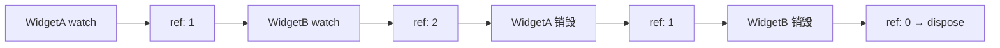
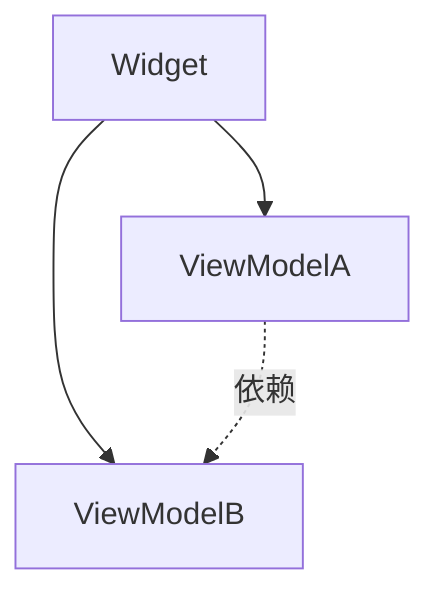

<p align="center">
  
</p>

# view_model

> Flutter 缺失的 ViewModel 方案，一切皆 ViewModel

[](https://pub.dev/packages/view_model) [](https://app.codecov.io/gh/lwj1994/flutter_view_model/tree/main)

[更新日志](https://github.com/lwj1994/flutter_view_model/blob/main/packages/view_model/CHANGELOG.md) | [English Doc](https://github.com/lwj1994/flutter_view_model/blob/main/packages/view_model/README.md) | [中文文档](https://github.com/lwj1994/flutter_view_model/blob/main/packages/view_model/README_ZH.md)

> 感谢 [Miolin](https://github.com/Miolin) 转让 `view_model` 包。

---

## 背景

Android 转 Flutter，用 Riverpod 踩了不少坑：

- **跨页面共享难**：复用同一个实例只能靠传参
- **侵入性强**：到处继承 `ConsumerWidget`、包 `Consumer`
- **Provider 依赖乱**：项目大了时序关系根本理不清
- **功能臃肿**：`AsyncValue`、mutations、持久化... 我只想自动管理生命周期

于是自己撸了这个库。

---

## 目录

- [核心理念](#核心理念)
- [快速上手](#快速上手)
- [共享实例](#共享实例)
- [基础用法](#基础用法)
- [生命周期](#生命周期)
- [全局配置](#全局配置)
- [StateViewModel](#stateviewmodel)
- [ViewModel 依赖](#viewmodel-依赖)
- [进阶](#进阶)
- [测试](#测试)

---

## 核心理念

ViewModel 不是 MVVM 那套，而是**带生命周期的业务容器**。

### 以 Widget 为中心

所有逻辑最终服务于 Widget，生命周期自然绑定 Widget 树。

### 统一概念

不区分 Service、Controller、Store，统一叫 ViewModel，区别在于挂载位置：

| 作用域 | 挂载位置 | 说明 |
|-------|---------|------|
| 全局 | App 根节点 | 全局单例 |
| 页面 | Page | 跟随页面销毁 |
| 共享 | 指定 key | 多 Widget 共享 |

### 解耦

ViewModel 可依赖其他 ViewModel，但不感知 Widget，不持有 `BuildContext`。

### 零样板

比 GetIt 少注册代码，比 Riverpod 少 Provider 图谱，自动管理生命周期和依赖注入。

### 脱离 Widget

通过自定义 `Vef`，ViewModel 可独立运行：后台任务、纯 Dart 测试、启动初始化。详见 [自定义 Vef](#自定义-vef)。

---

## 快速上手

```dart
// 1. 定义
class CounterViewModel extends ViewModel {
  int count = 0;
  void increment() => update(() => count++);
}

// 2. Provider
final counterProvider = ViewModelProvider<CounterViewModel>(
  builder: () => CounterViewModel(),
);

// 3. 使用
class CounterPage extends StatelessWidget with ViewModelStatelessMixin {
  @override
  Widget build(BuildContext context) {
    final vm = vef.watch(counterProvider);
    return ElevatedButton(
      onPressed: vm.increment,
      child: Text('${vm.count}'),
    );
  }
}
```

**核心 API**

| API | 说明 |
|-----|------|
| `vef.watch(provider)` | 监听，变化时刷新 |
| `vef.read(provider)` | 只读，不刷新 |
| `vef.watchCached<T>(key:)` | 按 key 取缓存实例 |
| `vef.readCached<T>(key:)` | 按 key 只读 |
| `vef.listen(provider, onChanged:)` | 监听副作用，自动释放 |

---

## 共享实例

### 方式一：Provider + Key（推荐）

```dart
final userProvider = ViewModelProvider<UserViewModel>(
  builder: () => UserViewModel(userId: id),
  key: 'user:$id',
);

// WidgetA
UserViewModel get vm => vef.watch(userProvider);

// WidgetB（同一实例）
UserViewModel get vm => vef.watch(userProvider);
```

### 方式二：按 Key 直接取

适用于拿不到 Provider 的场景（深层嵌套、跨模块）：

```dart
// 前提：别的地方用 key 创建过
UserViewModel get vm => vef.watchCached<UserViewModel>(key: 'user:123');
```

> ⚠️ 实例不存在会报错，确定存在再用。

**适用场景**：跨模块通信、插件架构、动态 key

> 自定义对象做 key 需实现 `==` 和 `hashCode`，推荐用 [equatable](https://pub.dev/packages/equatable) / [freezed](https://pub.dev/packages/freezed)。  
> `List`/`Set`/`Map` 按引用比较，内容相同也是不同 key，建议转 String。

---

## 基础用法

### 安装

```yaml
dependencies:
  view_model:

dev_dependencies:
  build_runner:
  view_model_generator:
```

### 创建 ViewModel

```dart
class CounterViewModel extends ViewModel {
  int _count = 0;
  int get count => _count;
  
  void increment() => update(() => _count++);
  
  @override
  void dispose() {
    // 清理资源
    super.dispose();
  }
}
```

### 代码生成

```dart
@genProvider
class CounterViewModel extends ViewModel {
  int count = 0;
  void increment() => update(() => count++);
}
```

```bash
dart run build_runner build
```

带参数：

```dart
@genProvider
class UserViewModel extends ViewModel {
  final String userId;
  UserViewModel(this.userId);
}
// 生成 ViewModelProvider.arg<UserViewModel, String>
```

带 key/tag：

```dart
@GenProvider(key: r'user-$id', tag: r'user-$id')
class UserViewModel extends ViewModel { ... }
```

详见 [生成器文档](https://github.com/lwj1994/flutter_view_model/blob/main/packages/view_model_generator/README_ZH.md)。

### Widget 中使用

**StatefulWidget（推荐）**

```dart
class _MyPageState extends State<MyPage> with ViewModelStateMixin<MyPage> {
  CounterViewModel get vm => vef.watch(counterProvider);
  
  @override
  Widget build(BuildContext context) {
    return Text('${vm.count}');
  }
}
```

**StatelessWidget**

> ⚠️ 通过拦截 Element 实现，可能与其他 mixin 冲突

```dart
class CounterWidget extends StatelessWidget with ViewModelStatelessMixin {
  CounterViewModel get vm => vef.watch(counterProvider);
  
  @override
  Widget build(BuildContext context) => Text('${vm.count}');
}
```

**Builder**

```dart
ViewModelBuilder<CounterViewModel>(
  provider: counterProvider,
  builder: (vm) => Text('${vm.count}'),
)

// 绑定已有实例
CachedViewModelBuilder<CounterViewModel>(
  shareKey: 'counter-key',
  builder: (vm) => Text('${vm.count}'),
)
```

### 副作用监听

```dart
@override
void initState() {
  super.initState();
  // 自动释放，无需手动 dispose
  vef.listen(counterProvider, onChanged: (vm) {
    print('count: ${vm.count}');
  });
}
```

---

## 生命周期

基于引用计数：

1. `vef.watch` → 引用 +1
2. 另一个 Widget 共享 → 引用 +1
3. Widget 销毁 → 引用 -1
4. 引用归零 → 调用 `dispose()`



> `vef.watch` 和 `vef.read` 都会增加引用计数。

---

## 全局配置

```dart
void main() {
  ViewModel.initialize(
    config: ViewModelConfig(
      isLoggingEnabled: true,
      equals: (prev, curr) => identical(prev, curr),
    ),
    lifecycles: [MyLifecycleObserver()],
  );
  runApp(MyApp());
}
```

```dart
class MyLifecycleObserver extends ViewModelLifecycle {
  @override
  void onCreate(ViewModel vm, InstanceArg arg) => print('创建: ${vm.runtimeType}');
  
  @override
  void onDispose(ViewModel vm, InstanceArg arg) => print('销毁: ${vm.runtimeType}');
}
```

---

## StateViewModel

不可变 State 模式：

```dart
@immutable
class CounterState {
  final int count;
  final String message;
  const CounterState({this.count = 0, this.message = ''});
  
  CounterState copyWith({int? count, String? message}) => CounterState(
    count: count ?? this.count,
    message: message ?? this.message,
  );
}

class CounterViewModel extends StateViewModel<CounterState> {
  CounterViewModel() : super(state: CounterState());
  
  void increment() => setState(state.copyWith(count: state.count + 1));
}
```

使用：

```dart
Text('${vm.state.count}')
```

监听 State：

```dart
// 监听整个 state
vef.listenState(counterProvider, (prev, curr) {
  print('${prev.count} → ${curr.count}');
});

// 监听指定字段
vef.listenStateSelect(
  counterProvider,
  (state) => state.message,
  (prev, curr) => print(curr),
);
```

精准刷新：

```dart
StateViewModelValueWatcher<CounterState>(
  viewModel: vm,
  selectors: [(s) => s.count, (s) => s.message],
  builder: (state) => Text('${state.count}'),
)
```

> `StateViewModel` 默认用 `identical()` 比较，需深度比较可在 `ViewModel.initialize` 中配置 `equals`。

---

## ViewModel 依赖

```dart
class UserViewModel extends ViewModel {
  late final NetworkViewModel network;
  
  UserViewModel() {
    network = vef.read<NetworkViewModel>(networkProvider);
  }
}
```

依赖结构扁平，统一由 Widget 管理。



---

## 进阶

### 暂停/恢复

Widget 不可见时暂停监听，可见时恢复。详见 [文档](https://github.com/lwj1994/flutter_view_model/blob/main/docs/PAUSE_RESUME_LIFECYCLE.md)。

### 精准刷新

| 方式 | 场景 |
|-----|------|
| `ValueListenableBuilder` | 单值监听 |
| `ObserverBuilder` | 跨 Widget 共享值 |
| `StateViewModelValueWatcher` | State 部分字段 |

### 自定义 Vef

脱离 Widget 运行：

```dart
class StartTaskVef with Vef {
  AppInitViewModel get vm => vef.watch(initProvider);
  
  Future<void> run() async => await vm.init();
  
  @override
  void onUpdate() => print(vm.status);
}

// main
final starter = StartTaskVef();
await starter.run();
starter.dispose();
```

---

## 测试

`setProxy` mock ViewModel：

```dart
authProvider.setProxy(
  ViewModelProvider(builder: () => MockAuthViewModel()),
);

await tester.pumpWidget(MyApp());
expect(find.text('请登录'), findsOneWidget);

authProvider.clearProxy();
```

带参数：

```dart
userProvider.setProxy(
  ViewModelProvider.arg<UserViewModel, String>(
    builder: (id) => MockUserViewModel(id),
  ),
);
```

---

## License

MIT - [LICENSE](https://github.com/lwj1994/flutter_view_model/blob/main/LICENSE)
