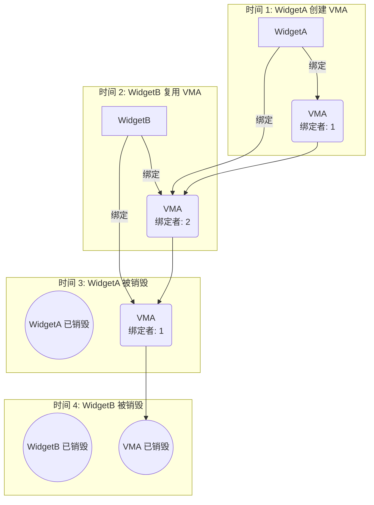
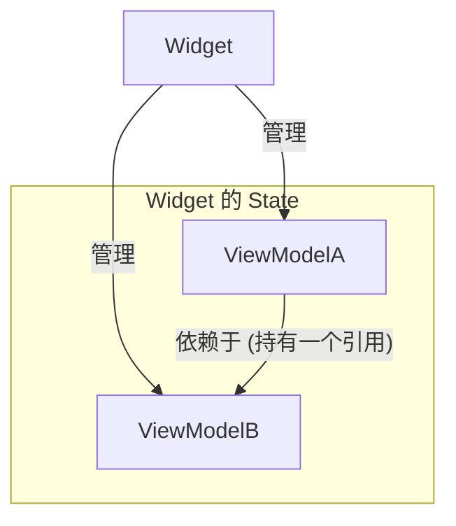

<p align="center">
  
</p>

# view_model

> Flutter 中缺失的 ViewModel

[](https://pub.dev/packages/view_model) [](https://app.codecov.io/gh/lwj1994/flutter_view_model/tree/main)

[更新日志](CHANGELOG.md)

[English Doc](README.md) | [中文文档](README_ZH.md)

> 感谢 [Miolin](https://github.com/Miolin) 将
> [view_model](https://pub.dev/packages/view_model) 包的权限转移给我。

---

## 目录

- [设计理念](#设计理念)
- [快速开始](#快速开始)
- [复用实例](#复用实例)
- [基本用法](#基本用法)
  - [添加依赖](#添加依赖)
  - [创建 ViewModel](#创建-viewmodel)
  - [创建 ViewModelFactory](#创建-viewmodelfactory)
    - [自定义 ViewModelFactory](#自定义-viewmodelfactory)
    - [DefaultViewModelFactory 快速工厂](#defaultviewmodelfactory-快速工厂)
  - [在 Widget 中使用 ViewModel](#在-widget-中使用-viewmodel)
    - [替代方案: ViewModelBuilder (无需 mixin)](#替代方案-viewmodelbuilder-无需-mixin)
    - [监听缓存实例: CachedViewModelBuilder](#监听缓存实例-cachedviewmodelbuilder)
  - [使用监听器处理副作用](#使用监听器处理副作用)
- [ViewModel 生命周期](#viewmodel-生命周期)
- [初始化](#初始化)
- [有状态的 ViewModel (`StateViewModel<S>`)](#有状态的-viewmodel-stateviewmodels)
  - [定义 State 类](#定义-state-类)
  - [创建有状态的 ViewModel](#创建有状态的-viewmodel)
  - [创建 ViewModelFactory](#创建-viewmodelfactory-1)
  - [在 Widget 中使用有状态的 ViewModel](#在-widget-中使用有状态的-viewmodel)
  - [副作用监听器](#副作用监听器)
  - [使用 `StateViewModelValueWatcher` 实现细粒度重建](#使用-stateviewmodelvaluewatcher-实现细粒度重建)
- [ViewModel → ViewModel 依赖](#viewmodel--viewmodel-依赖)
- [暂停/恢复生命周期](#暂停恢复生命周期)
- [值级别重建](#值级别重建)
  - [ValueListenableBuilder](#valueListenableBuilder)
  - [ObserverBuilder](#observerBuilder)
  - [StateViewModelValueWatcher](#stateViewModelValueWatcher)
- [DevTools 扩展](#devtools-扩展)

---

## 设计理念

`view_model` 的目标是 **简单**。它专为服务 `Widget` (视图) 而设计，并避免了其他复杂功能。

在清晰架构 (Clean Architecture) 中，ViewModel 作为 **表现层 (Presentation Layer)**，连接数据层和 UI 层。它的作用是持有 UI 状态和处理 UI 逻辑，而不是执行复杂的数据操作。

- **为 UI 层服务**: 它管理 `Widget` 的生命周期 (包括自动的暂停/恢复)，处理用户交互，持有 UI 可直接消费的状态，并提供便捷的复用机制。
- **不为数据层服务**: 复杂的数据缓存、组合和转换应由 **仓库/数据层 (Repository/Data Layer)** 处理。这正是像 **Riverpod** 或 **Signals** 这类工具发挥作用的地方。例如，您可以在数据层中使用 Signals 进行高效的数据处理，而 ViewModel 将消费最终的、为 UI 准备好的数据。

---

## 快速开始

- 监听 (Watch): `watchViewModel<T>()` / `watchCachedViewModel<T>()`
- 读取 (Read): `readViewModel<T>()` / `readCachedViewModel<T>()`
- 全局 (Global): `ViewModel.readCached<T>() / maybeReadCached<T>()`
- 回收 (Recycle): `recycleViewModel(vm)`
- 副作用 (Effects): `listen(onChanged)` / `listenState` / `listenStateSelect`

## 复用实例

- Key: 在 factory 中设置 `key()` → 所有 widget 共享同一个实例
- Tag: 设置 `tag()` → 通过 `watchCachedViewModel(tag)` 绑定最新实例
- 任意参数: 传递任意 `Object` 作为 key/tag (例如 `'user:$id'`)

> [!IMPORTANT]
> 当使用自定义对象作为 `key` 或 `tag` 时，请确保正确实现 `==` 运算符和 
> `hashCode` 方法，以保证缓存查找的准确性。可以使用第三方库如 
> [equatable](https://pub.dev/packages/equatable) 或 
> [freezed](https://pub.dev/packages/freezed) 来简化实现。

```dart
final f = DefaultViewModelFactory<UserViewModel>(
  builder: () => UserViewModel(userId: id),
  key: 'user:$id',
);
final vm1 = watchViewModel(factory: f);
final vm2 = watchCachedViewModel<UserViewModel>(key: 'user:$id'); // 相同
```

## 基本用法

### 添加依赖

首先，将 `view_model` 添加到你的 `pubspec.yaml` 文件中：

```yaml
dependencies:
  flutter:
    sdk: flutter
  view_model: ^0.8.1 # 请使用最新版本
```

### 创建 ViewModel

继承或混入 `ViewModel` 来定义业务逻辑。将字段视为状态，并调用 `notifyListeners()` 或 `update(block)` 来触发 UI 更新。推荐使用 `update(block)` 以避免忘记调用 `notifyListeners()`。

```dart
import 'package:view_model/view_model.dart';
import 'package:flutter/foundation.dart'; // 用于 debugPrint

class MySimpleViewModel extends ViewModel {
  String _message = "Initial Message";
  int _counter = 0;

  String get message => _message;

  int get counter => _counter;

  void updateMessage(String newMessage) {
    update(() {
      _message = newMessage;
    });
  }

  void incrementCounter() {
    update(() {
      _counter++;
    });
  }

  @override
  void dispose() {
    // 在此清理资源，例如关闭 StreamControllers 等。
    debugPrint('MySimpleViewModel disposed');
    super.dispose();
  }
}
```

### 创建 ViewModelFactory

`ViewModelFactory` 负责实例化 `ViewModel`。每个 `ViewModel` 类型通常需要一个对应的 `Factory`。

```dart
import 'package:view_model/view_model.dart';
// 假设 MySimpleViewModel 已如上定义

class MySimpleViewModelFactory with ViewModelFactory<MySimpleViewModel> {
  @override
  MySimpleViewModel build() {
    // 返回一个新的 MySimpleViewModel 实例
    return MySimpleViewModel();
  }
}
```

#### 自定义 ViewModelFactory
Factory 用于创建和识别实例。使用 `key()` 共享一个实例，使用 `tag()` 进行分组/发现。

| 方法/属性 | 类型      | 可选          | 描述                                                                                                                                            |
| --------------- | --------- | ----------------- | ------------------------------------------------------------------------------------------------------------------------------------------------------ |
| `build()`       | `T`       | ❌ 必须实现 | 创建 ViewModel 实例的工厂方法。通常在这里传递构造函数参数。                                                  |
| `key()`         | `Object?` | ✅ 可选       | 为 ViewModel 提供唯一的标识符。具有相同 key 的 ViewModel 将自动共享（推荐用于跨小部件/页面共享）。 |
| `tag()`      | `Object?` | ✅                | 为 ViewModel 实例添加一个标签。通过 `viewModel.tag` 获取标签。它用于通过 `watchViewModel(tag:tag)` 查找 ViewModel。                            |

> **注意**：如果使用自定义 key 对象，请实现 `==` 和 `hashCode` 以确保正确的缓存查找。

```dart
class MyViewModelFactory with ViewModelFactory<MyViewModel> {
  // 你的自定义参数，通常传递给 MyViewModel
  final String initialName;

  MyViewModelFactory({required this.initialName});

  @override
  MyViewModel build() {
    return MyViewModel(name: initialName);
  }

  /// 用于共享 ViewModel 的 key。key 是唯一的，对于同一个 key 只会创建一个 ViewModel 实例。
  /// 如果 key 为 null，则不会发生共享。
  @override
  Object? key() => "user-profile";
}
```

#### DefaultViewModelFactory 快速工厂

对于简单场景，使用 `DefaultViewModelFactory<T>` 以避免编写自定义工厂。

```dart
final factory = DefaultViewModelFactory<MyViewModel>(
  builder: () => MyViewModel(),
  isSingleton: true, // 可选
);
```

- `builder`: 创建 ViewModel 实例的函数。
- `key`: 用于单例实例共享的自定义 key。
- `tag`: 用于识别 ViewModel 的自定义 tag。
- `isSingleton`: 是否使用单例模式。这只是一种为你设置唯一 key 的便捷方式。注意其优先级低于 key 参数。

```dart
final factory = DefaultViewModelFactory<CounterViewModel>(
  builder: () => CounterViewModel(),
);
final sharedFactory = DefaultViewModelFactory<CounterViewModel>(
  builder: () => CounterViewModel(),
  key: 'global-counter',
);
```

---

### 在 Widget 中使用 ViewModel

将 `ViewModelStateMixin` 混入你的 `State` 并调用 `watchViewModel` 来绑定并在 `notifyListeners()` 被调用时重建。生命周期会自动为你处理。

> **注意**: 虽然 `StatelessWidget` 也支持 `ViewModelStatelessMixin`，但我们并不推荐这样做。最好避免在 `build` 方法中放置与 UI 无关的逻辑，以保持其整洁并专注于渲染。


```dart
import 'package:flutter/material.dart';
import 'package:view_model/view_model.dart';

// 假设 MySimpleViewModel 和 MySimpleViewModelFactory 已定义

class MyPage extends StatefulWidget {
  const MyPage({super.key});

  @override
  State<MyPage> createState() => _MyPageState();
}

class _MyPageState extends State<MyPage>
    with ViewModelStateMixin<MyPage> {
  // 1. 混入 Mixin
  late final MySimpleViewModel simpleVM;

  @override
  void initState() {
    super.initState();
    // 2. 使用 watchViewModel 创建并获取 ViewModel
    // 当 MyPage 第一次构建时，将调用 MySimpleViewModelFactory 的 build() 方法来创建实例。
    // 当 MyPage 被销毁时，如果此 viewModel 没有其他监听者，它也将被销毁。
    simpleVM =
        watchViewModel<MySimpleViewModel>(factory: MySimpleViewModelFactory());
  }

  @override
  Widget build(BuildContext context) {
    return Scaffold(
      appBar: AppBar(title: Text(simpleVM.message)), // 直接访问 ViewModel 的属性
      body: Center(
        child: Column(
          mainAxisAlignment: MainAxisAlignment.center,
          children: <Widget>[
            Text('按钮按下了: ${simpleVM.counter} 次'), // 访问 ViewModel 的属性
            const SizedBox(height: 20),
            ElevatedButton(
              onPressed: () {
                simpleVM.updateMessage("消息已更新!"); // 调用 ViewModel 的方法
              },
              child: const Text('更新消息'),
            ),
          ],
        ),
      ),
      floatingActionButton: FloatingActionButton(
        onPressed: () => simpleVM.incrementCounter(), // 调用 ViewModel 的方法
        tooltip: 'Increment',
        child: const Icon(Icons.add),
      ),
    );
  }
}
```

#### 替代方案: ViewModelBuilder (无需 mixin)

```dart
// 示例: 使用 ViewModelBuilder 而不混入 ViewModelStateMixin
ViewModelBuilder<MySimpleViewModel>(
  factory: MySimpleViewModelFactory(),
  builder: (vm) {
    return Column(
      mainAxisSize: MainAxisSize.min,
      children: [
        Text(vm.message),
        const SizedBox(height: 8),
        ElevatedButton(
          onPressed: () => vm.updateMessage("消息已更新!"),
          child: const Text('更新消息'),
        ),
      ],
    );
  },
)
```

#### 监听缓存实例: CachedViewModelBuilder

```dart
// 示例: 使用 CachedViewModelBuilder 绑定到已存在的实例
CachedViewModelBuilder<MySimpleViewModel>(
  shareKey: "shared-key", // 或: tag: "shared-tag"
  builder: (vm) {
    return Row(
      children: [
        Expanded(child: Text(vm.message)),
        IconButton(
          onPressed: () => vm.incrementCounter(),
          icon: const Icon(Icons.add),
        ),
      ],
    );
  },
)
```

### 使用监听器处理副作用

```dart
// 在 State 的 initState 或其他合适的方法中
late VoidCallback _disposeViewModelListener;

@override
void initState() {
  super.initState();

  // 获取 ViewModel 实例 (通常在 initState 中获取一次或通过 getter)
  final myVm = watchViewModel<MySimpleViewModel>(factory: MySimpleViewModelFactory());

  _disposeViewModelListener = myVm.listen(onChanged: () {
    print('MySimpleViewModel 调用了 notifyListeners！当前计数：${myVm.counter}');
    // 例如：ScaffoldMessenger.of(context).showSnackBar(SnackBar(content: Text('操作已执行！')));
  });
}

@override
void dispose() {
  _disposeViewModelListener(); // 清理监听器以防内存泄漏
  super.dispose();
}
```

## ViewModel 生命周期

> [!IMPORTANT]
> `watch` (例如 `watchViewModel`) 和 `read` (例如 `readViewModel`) API 都会创建一个绑定并增加引用计数。只有当所有绑定都被移除时，`ViewModel` 才会被销毁。

`ViewModel` 的生命周期是基于 **引用计数** 机制自动管理的。这确保了只要至少有一个 widget 在使用 `ViewModel` 实例，它就会保持活动状态，并且在不再需要时自动销毁，从而防止内存泄漏。

#### 工作原理: 绑定者计数

系统会跟踪有多少个 widget “绑定”了一个 `ViewModel` 实例。

1.  **创建与第一个绑定者**: 当 `WidgetA` 第一次创建或绑定一个 `ViewModel` (`VMA`) 时 (例如，使用 `watchViewModel`)，`VMA` 的绑定者计数变为 1。
2.  **复用与更多绑定者**: 如果 `WidgetB` 复用同一个 `VMA` 实例 (例如，通过使用具有相同 key 的 `watchCachedViewModel`)，`VMA` 的绑定者计数增加到 2。
3.  **销毁一个绑定者**: 当 `WidgetA` 被销毁时，它停止监听 `VMA`，绑定者计数递减为 1。此时，`VMA` **不会**被销毁，因为 `WidgetB` 仍在使用它。
4.  **最终销毁**: 只有当 `WidgetB` 也被销毁时，`VMA` 的绑定者计数才会降至 0。此时，`ViewModel` 被认为是未使用的，其 `dispose()` 方法会自动被调用。

这个机制对于在你的 widget 树的不同部分共享 `ViewModel` 至关重要，确保只要状态与 UI 相关，它就会持久存在。



## 初始化

在使用 `view_model` 包之前，建议在你的 `main` 函数中执行一次性初始化。这允许你为整个应用程序配置全局设置。

```dart
void main() {
  // 配置 ViewModel 全局设置
  ViewModel.initialize(
    config: ViewModelConfig(
      // 为所有 ViewModel 启用或禁用日志记录。
      // 这对于调试状态变化和生命周期事件很有用。
      // 默认为 false。
      isLoggingEnabled: true,
      
      // 提供一个自定义的全局函数来确定两个状态是否相等。
      // `StateViewModel` 和带有选择器的 `listenStateSelect` 使用它来决定
      // 是否触发重建。
      // 如果未设置，`StateViewModel` 使用 `identical()`，`listenStateSelect` 使用 `==`。
      equals: (previous, current) {
        // 示例: 使用自定义的 `isEqual` 方法进行深度比较
        return identical(previous, current);
      },
    ),
    // 你也可以在这里注册全局生命周期观察者
    lifecycles: [
      GlobalLifecycleObserver(),
    ],
  );
  
  runApp(const MyApp());
}
```

**配置选项:**

- `isLoggingEnabled`: 一个 `bool` 值，用于切换所有 ViewModel 实例的日志记录。启用后，你将看到状态更改、创建和销毁的输出，这在开发过程中很有帮助。
- `equals`: 一个函数 `bool Function(dynamic previous, dynamic current)`，提供全局的状态比较策略。它影响：
    - `StateViewModel`: 确定新状态是否与旧状态相同。
    - `ViewModel.listen`: 决定所选值是否已更改。
- `lifecycles`: 一个 `ViewModelLifecycle` 观察者列表，用于监听所有 ViewModel 的生命周期事件 (例如 `onCreate`, `onDispose`)。这对于全局日志记录、分析或其他横切关注点很有用。

### 全局 ViewModel 生命周期
```dart
/// 用于观察 ViewModel 生命周期事件的抽象接口。
///
/// 实现此接口以接收 ViewModel 创建、
/// 监听、取消监听或销毁时的回调。这对于日志记录、分析、
/// 调试或其他横切关注点很有用。
///
/// 示例:
/// ```dart
/// class LoggingLifecycle extends ViewModelLifecycle {
///   @override
///   void onCreate(ViewModel viewModel, InstanceArg arg) {
///     print('ViewModel created: ${viewModel.runtimeType}');
///   }
///
///   @override
///   void onDispose(ViewModel viewModel, InstanceArg arg) {
///     print('ViewModel disposed: ${viewModel.runtimeType}');
///   }
/// }
/// ```
abstract class ViewModelLifecycle {
  /// 当 ViewModel 实例被创建时调用。
  ///
  /// 参数:
  /// - [viewModel]: 新创建的 ViewModel
  /// - [arg]: 创建参数，包括 key、tag 和其他元数据
  void onCreate(ViewModel viewModel, InstanceArg arg) {}

  /// 当一个新的绑定者被添加到 ViewModel 时调用。
  ///
  /// 参数:
  /// - [viewModel]: 被监听的 ViewModel
  /// - [arg]: 实例参数
  /// - [newBinderId]: 新绑定者的唯一标识符
  void onAddBinder(ViewModel viewModel, InstanceArg arg, String newBinderId) {}

  /// 当一个绑定者从 ViewModel 中移除时调用。
  ///
  /// 参数:
  /// - [viewModel]: 被取消监听的 ViewModel
  /// - [arg]: 实例参数
  /// - [removedBinderId]: 被移除的绑定者的唯一标识符
  void onRemoveBinder(
      ViewModel viewModel, InstanceArg arg, String removedBinderId) {}

  /// 当 ViewModel 被销毁时调用。
  ///
  /// 参数:
  - [viewModel]: 被销毁的 ViewModel
  - [arg]: 实例参数
  void onDispose(ViewModel viewModel, InstanceArg arg) {}
}
```

## 有状态的 ViewModel (`StateViewModel<S>`)

当你更喜欢使用不可变的 `state` 对象并通过 `setState(newState)` 进行更新时，请使用 `StateViewModel<S>`。

> [!NOTE]
> 默认情况下，`StateViewModel` 使用 `identical()` 来比较 state 实例 
> (比较对象引用，而非内容)。这意味着 `setState()` 只有在你提供一个新的 state 实例时才会触发重建。
> 你可以通过在 `ViewModel.initialize()` 中配置 `equals` 函数来全局自定义这种比较
> 行为 (参见[初始化](#初始化)部分)。

### 定义 State 类

首先，你需要定义一个 state 类。强烈建议该类是不可变的，通常通过提供 `copyWith` 方法来实现。

```dart
// 示例: lib/my_counter_state.dart
import 'package:flutter/foundation.dart';

@immutable // 推荐标记为不可变
class MyCounterState {
  final int count;
  final String statusMessage;

  const MyCounterState({this.count = 0, this.statusMessage = "Ready"});

  MyCounterState copyWith({int? count, String? statusMessage}) {
    return MyCounterState(
      count: count ?? this.count,
      statusMessage: statusMessage ?? this.statusMessage,
    );
  }

  @override
  bool operator ==(Object other) =>
      identical(this, other) ||
          other is MyCounterState &&
              runtimeType == other.runtimeType &&
              count == other.count &&
              statusMessage == other.statusMessage;

  @override
  int get hashCode => count.hashCode ^ statusMessage.hashCode;

  @override
  String toString() => 'MyCounterState{count: $count, statusMessage: $statusMessage}';
}
```

### 创建有状态的 ViewModel

在 `StateViewModel` 中，你通过调用 `setState(newState)` 来更新状态。此方法会用新状态替换旧状态，并自动通知所有监听器。

```dart
// 示例: lib/my_counter_view_model.dart
import 'package:view_model/view_model.dart';
import 'package:flutter/foundation.dart';
import 'my_counter_state.dart'; // 导入 state 类

class MyCounterViewModel extends StateViewModel<MyCounterState> {
  // 构造函数必须通过 super 初始化 state
  MyCounterViewModel({required MyCounterState initialState}) : super(state: initialState);

  void increment() {
    // 使用 setState 更新状态，它会自动处理 notifyListeners
    setState(state.copyWith(count: state.count + 1, statusMessage: "Incremented"));
  }

  void decrement() {
    if (state.count > 0) {
      setState(state.copyWith(count: state.count - 1, statusMessage: "Decremented"));
    } else {
      setState(state.copyWith(statusMessage: "Cannot decrement below zero"));
    }
  }

  void reset() {
    // 你可以直接用一个新的 State 实例替换旧的状态
    setState(const MyCounterState(count: 0, statusMessage: "Reset"));
  }

  @override
  void dispose() {
    debugPrint('Disposed MyCounterViewModel with state: $state');
    super.dispose();
  }
}
```

### 为有状态的 ViewModel 创建 ViewModelFactory

为你的 `StateViewModel` 创建一个对应的 `Factory`。

```dart
// 示例: lib/my_counter_view_model_factory.dart
import 'package:view_model/view_model.dart';
import 'my_counter_state.dart';
import 'my_counter_view_model.dart';

class MyCounterViewModelFactory with ViewModelFactory<MyCounterViewModel> {
  final int initialCount;

  MyCounterViewModelFactory({this.initialCount = 0});

  @override
  MyCounterViewModel build() {
    // 在 build 方法中创建并返回 ViewModel 实例，传入初始状态
    return MyCounterViewModel(
        initialState: MyCounterState(count: initialCount, statusMessage: "Initialized"));
  }
}
```

### 在 Widget 中使用有状态的 ViewModel

在 `StatefulWidget` 中使用有状态的 `ViewModel` 与使用无状态的 `ViewModel` 非常相似，主要区别在于你可以直接访问 `viewModel.state` 来获取当前的状态对象。

```dart
// 示例: lib/my_counter_page.dart
import 'package:flutter/material.dart';
import 'package:view_model/view_model.dart';
import 'my_counter_view_model.dart';
import 'my_counter_view_model_factory.dart';
// MyCounterState 将被 MyCounterViewModel 内部引用

class MyCounterPage extends StatefulWidget {
  const MyCounterPage({super.key});

  @override
  State<MyCounterPage> createState() => _MyCounterPageState();
}

class _MyCounterPageState extends State<MyCounterPage>
    with ViewModelStateMixin<MyCounterPage> {
  late final MyCounterViewModel counterVM;

  @override
  void initState() {
    super.initState();
    counterVM = watchViewModel<MyCounterViewModel>(
        factory: MyCounterViewModelFactory(initialCount: 10)); // 你可以传递一个初始值
  }

  @override
  Widget build(BuildContext context) {
    return Scaffold(
      appBar: AppBar(title: const Text('有状态的 ViewModel 计数器')),
      body: Center(
        child: Column(
          mainAxisAlignment: MainAxisAlignment.center,
          children: <Widget>[
            Text(
              '计数值: ${counterVM.state.count}', // 直接访问 state 的属性
              style: Theme
                  .of(context)
                  .textTheme
                  .headlineMedium,
            ),
            const SizedBox(height: 8),
            Text(
              '状态: ${counterVM.state.statusMessage}', // 访问 state 的其他属性
              style: Theme
                  .of(context)
                  .textTheme
                  .titleMedium,
            ),
          ],
        ),
      ),
      floatingActionButton: Column(
        mainAxisAlignment: MainAxisAlignment.end,
        crossAxisAlignment: CrossAxisAlignment.end,
        children: [
          FloatingActionButton(
            onPressed: () => counterVM.increment(),
            tooltip: 'Increment',
            child: const Icon(Icons.add),
          ),
          const SizedBox(height: 8),
          FloatingActionButton(
            onPressed: () => counterVM.decrement(),
            tooltip: 'Decrement',
            child: const Icon(Icons.remove),
          ),
          const SizedBox(height: 8),
          FloatingActionButton.extended(
            onPressed: () => counterVM.reset(),
            tooltip: 'Reset',
            icon: const Icon(Icons.refresh),
            label: const Text("Reset"),
          ),
        ],
      ),
    );
  }
}
```

### 副作用监听器

除了从 `ViewModel` 继承的标准 `listen()` 方法外，`StateViewModel` 还提供了两个专门的监听器，用于在不重建 widget 的情况下对状态变化做出反应：

- **`listenState((previous, current) { ... })`**: 每当 `state` 对象发生变化时触发回调。它同时提供前一个和当前的状态，这对于比较或依赖于状态转换的逻辑很有用。

- **`listenStateSelect<T>((state) => state.someValue, (previous, current) { ... })`**: 一个更优化的监听器，仅当状态中特定选定值发生变化时才触发回调。这避免了当状态的其他部分更新时不必要地触发反应。

```dart
// 在 initState 中
final myVm = watchViewModel<MyCounterViewModel>(/* ... */);

// 监听整个 state 对象
final dispose1 = myVm.listenState((previous, current) {
  if (previous.count != current.count) {
    print('计数值从 ${previous.count} 变为 ${current.count}');
  }
});

// 仅监听 statusMessage 的变化
final dispose2 = myVm.listenStateSelect(
  (state) => state.statusMessage,
  (previous, current) {
    print('状态消息已更改: $current');
    // 例如：ScaffoldMessenger.of(context).showSnackBar(SnackBar(content: Text(current)));
  },
);

// 记得在 widget 的 dispose 方法中调用 dispose1() 和 dispose2()。
```

### 使用 `StateViewModelValueWatcher` 实现细粒度重建

为了实现高度优化的性能，`StateViewModelValueWatcher` 允许你根据状态中一个或多个特定值的变化来重建 widget。当你的 widget 仅依赖于一个大型状态对象的一小部分时，这尤其有用。

它需要一个 `viewModel`、一个 `selectors` 列表和一个 `builder`。只有当任何选择器函数的结果发生变化时，widget 才会重建。

**工作原理:**

1.  **`viewModel`**: 要监听的 `StateViewModel` 实例。
2.  **`selectors`**: 一个函数列表，每个函数从状态中提取一个特定的值 (例如 `(state) => state.userName`)。
3.  **`builder`**: 构建 widget 的函数，仅在任何选定值发生变化时才被调用。

**示例:**

假设有一个 `UserProfileViewModel`，其状态包含 `userName`、`age` 和 `lastLogin`。如果一个 widget 只需要显示用户的姓名和年龄，你可以使用 `StateViewModelValueWatcher` 来确保它只在 `userName` 或 `age` 发生变化时重建，而忽略对 `lastLogin` 的更新。

```dart
// 假设你有一个 MyCounterViewModel 和它的状态 MyCounterState { count, statusMessage }

// 获取 ViewModel 实例 (如果你不需要整个 widget 重建，通常使用 readCachedViewModel)
final myVm = readCachedViewModel<MyCounterViewModel>();

// 这个 widget 将只在 `state.count` 或 `state.statusMessage` 变化时重建。
StateViewModelValueWatcher<MyCounterState>(
  viewModel: myVm,
  selectors: [
    (state) => state.count, 
    (state) => state.statusMessage
  ],
  builder: (state) {
    // 这个 Text widget 仅在 count 或 statusMessage 变化时重建。
    return Text('计数值: ${state.count}, 状态: ${state.statusMessage}');
  },
)
```

这种方法提供了一种强大的方式来实现对 UI 更新的细粒度控制，从而带来更好的性能。

## ViewModel → ViewModel 依赖

`view_model` 包提供了一个智能的依赖机制，允许 ViewModel 相互依赖。在 `ViewModel` 中使用 `readViewModel/readCachedViewModel`。API 与 `ViewModelStateMixin` 中的相同。

#### 依赖机制

一个 `ViewModel` 可以依赖于其他 `ViewModel`。例如，`ViewModelA` 可能需要访问 `ViewModelB` 的数据或逻辑。

即使一个 `ViewModel` 依赖于另一个，所有 `ViewModel` 实例都由 `Widget` 的 `State` 直接管理。依赖结构是 **扁平的**，而不是嵌套的。

当 `ViewModelA` (由一个 `Widget` 管理) 请求 `ViewModelB` 作为依赖时，`ViewModelB` 并不会在 `ViewModelA` “内部”创建。相反，`ViewModelB` 也直接附加到同一个 `Widget` 上。

这意味着：
- **生命周期**: `ViewModelA` 和 `ViewModelB` 的生命周期都与 `Widget` 绑定。
- **管理**: `Widget` 负责创建和销毁其所有关联的 `ViewModel`。
- **关系**: `ViewModelA` 只是持有一个对 `ViewModelB` 的引用。

本质上，从 `ViewModel` 内部调用 `readViewModel` 或 `watchViewModel` 与从 `Widget` 调用它们是相同的。两者都访问同一个中央管理系统。

这种扁平化的方法简化了生命周期管理，并避免了复杂的嵌套依赖链。

以下是这种关系的可视化表示：



#### 示例

假设你有一个依赖于 `ViewModelB` 的 `ViewModelA`。

```dart
// ViewModelB
class ViewModelB extends ViewModel {
  // ...
}

// ViewModelA
class ViewModelA extends ViewModel {
  late final ViewModelB viewModelB;

  ViewModelA() {
    viewModelB = readCachedViewModel<ViewModelB>();
  }
}
```

当你在你的 widget 中创建 `ViewModelA` 时，依赖机制将自动创建并提供 `ViewModelB`。

```dart
// 在你的 widget 中
class _MyWidgetState extends State<MyWidget> with ViewModelStateMixin {
  late final ViewModelA viewModelA;

  @override
  void initState() {
    super.initState();
    viewModelA = watchViewModel<ViewModelA>(factory: ...);
  }

  // ...
}
```

这个系统允许一个清晰和解耦的架构，其中 ViewModel 可以独立开发和测试。

## 暂停/恢复生命周期

[文档](https://github.com/lwj1994/flutter_view_model/blob/main/docs/PAUSE_RESUME_LIFECYCLE.md)

暂停/恢复生命周期由 `ViewModelPauseProvider` 管理。默认情况下，`PageRoutePauseProvider`、`TickerModePauseProvider` 和 `AppPauseProvider` 分别根据路由可见性和应用生命周期事件处理暂停/恢复。

## 值级别重建
由于 ViewModel 更新整个 widget (粗粒度)，如果你需要更细粒度的更新，这里有三种方法可供参考。

### ValueListenableBuilder
- 对于细粒度的 UI 更新，使用 `ValueNotifier` 和 `ValueListenableBuilder`。
```dart
final title = ValueNotifier('Hello');
ValueListenableBuilder(
  valueListenable: title,
  builder: (_, v, __) => Text(v),
);
```

### ObserverBuilder

[文档](https://github.com/lwj1994/flutter_view_model/blob/main/docs/value_observer_doc.md)

- 对于更动态的场景，`ObservableValue` 和 `ObserverBuilder` 提供了更大的灵活性。

```dart
// shareKey 用于在任何 widget 之间共享值
final observable = ObservableValue<int>(0, shareKey: share);
observable.value = 20;

ObserverBuilder<int>(observable: observable, 
        builder: (v) {
          return Text(v.toString());
        },
      )
```

### StateViewModelValueWatcher

- 要仅在 `StateViewModel` 中的特定值发生变化时重建，请使用 [`StateViewModelValueWatcher`](#使用-stateviewmodelvaluewatcher-实现细粒度重建)。

```dart
class MyWidget extends State with ViewModelStateMixin {
  const MyWidget({super.key});

  late final MyViewModel stateViewModel;

  @override
  void initState() {
    super.initState();
    stateViewModel = readViewModel<MyViewModel>(
      factory: MyViewModelFactory(),
    );
  }

  @override
  Widget build(BuildContext context) {
    // 监听 `stateViewModel` 上的值变化，并且仅在 `name` 或 `age` 变化时重建。
    return StateViewModelValueWatcher<MyViewModel>(
      stateViewModel: stateViewModel,
      selectors: [(state) => state.name, (state) => state.age],
      builder: (state) {
        return Text('姓名: \${state.name}, 年龄: \${state.age}');
      },
    );
  }
}
```

## DevTools 扩展

启用 DevTools 扩展以进行实时 ViewModel 监控。

在项目的根目录中创建 `devtools_options.yaml`。

```yaml
description: This file stores settings for Dart & Flutter DevTools.
documentation: https://docs.flutter.dev/tools/devtools/extensions#configure-extension-enablement-states
extensions:
  - view_model: true
```


