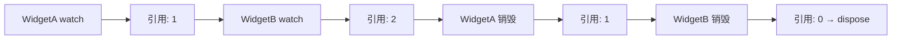

<p align="center">
  
</p>

# view_model

> Flutter 缺失的 ViewModel 方案 — 一切皆 ViewModel

[](https://pub.dev/packages/view_model) [](https://app.codecov.io/gh/lwj1994/flutter_view_model/tree/main)

[更新日志](https://github.com/lwj1994/flutter_view_model/blob/main/packages/view_model/CHANGELOG.md) | [English Doc](https://github.com/lwj1994/flutter_view_model/blob/main/README.md)

> 感谢 [Miolin](https://github.com/Miolin) 转让 `view_model` 包。

---

## ✨ 特性

- **零样板代码** — 无需手动注册，没有复杂的 Provider 图谱
- **自动生命周期** — ViewModel 自动创建、缓存、销毁
- **实例共享** — 通过 key 在多个 Widget 间共享同一 ViewModel
- **与 Widget 解耦** — ViewModel 不持有 `BuildContext`
- **精准刷新** — 仅重建变化的部分
- **暂停/恢复** — Widget 不可见时自动暂停更新
- **代码生成** — 可选的 `@genProvider` 注解进一步减少样板代码

---

## 📦 安装

```yaml
dependencies:
  view_model: ^latest

dev_dependencies:
  build_runner: ^latest
  view_model_generator: ^latest  # 可选：代码生成
```

---

## 🚀 快速开始

```dart
// 1. 定义 ViewModel
class CounterViewModel extends ViewModel {
  int count = 0;
  void increment() => update(() => count++);
}

// 2. 创建 Provider
final counterProvider = ViewModelProvider<CounterViewModel>(
  builder: () => CounterViewModel(),
);

// 3. 在 Widget 中使用
class CounterPage extends StatefulWidget {
  @override
  State<CounterPage> createState() => _CounterPageState();
}

class _CounterPageState extends State<CounterPage> with ViewModelStateMixin {
  @override
  Widget build(BuildContext context) {
    final vm = vef.watch(counterProvider);  // 变化时重建
    return ElevatedButton(
      onPressed: vm.increment,
      child: Text('计数: ${vm.count}'),
    );
  }
}
```

---

## 📖 核心概念

### ViewModel

带生命周期的业务逻辑容器。使用 `update()` 通知监听者：

```dart
class UserViewModel extends ViewModel {
  String name = '';
  
  Future<void> fetchUser() async {
    final user = await api.getUser();
    update(() => name = user.name);  // 触发重建
  }
  
  @override
  void dispose() {
    // 清理资源
    super.dispose();
  }
}
```

### StateViewModel

不可变状态模式，配合 `copyWith` 使用：

```dart
class CounterState {
  final int count;
  final String message;
  const CounterState({this.count = 0, this.message = ''});
  
  CounterState copyWith({int? count, String? message}) => CounterState(
    count: count ?? this.count,
    message: message ?? this.message,
  );
}

class CounterViewModel extends StateViewModel<CounterState> {
  CounterViewModel() : super(state: const CounterState());
  
  void increment() => setState(state.copyWith(
    count: state.count + 1,
    message: '已增加!',
  ));
}
```

### ViewModelProvider

定义如何构建和缓存 ViewModel：

```dart
// 简单 Provider
final counterProvider = ViewModelProvider<CounterViewModel>(
  builder: () => CounterViewModel(),
  key: 'counter',      // 可选：实例共享
  isSingleton: true,   // 可选：全局单例
);

// 带参数的 Provider
final userProvider = ViewModelProvider.arg<UserViewModel, String>(
  builder: (userId) => UserViewModel(userId),
  key: (userId) => 'user:$userId',  // 从参数生成 key
);
```

### `vef` 访问器

通过 `vef` 对象访问 ViewModel：

| 方法 | 说明 |
|------|------|
| `vef.watch(provider)` | 获取 VM 并监听变化 |
| `vef.read(provider)` | 获取 VM 不监听变化 |
| `vef.watchCached<T>(key:)` | 按 key 获取缓存实例并监听 |
| `vef.readCached<T>(key:)` | 按 key 获取缓存实例不监听 |
| `vef.listen(provider, onChanged:)` | 副作用监听，自动释放 |
| `vef.recycle(vm)` | 强制销毁并重建 |

---

## 🔌 Widget 集成

### ViewModelStateMixin（推荐）

用于 StatefulWidget 的标准模式：

```dart
class MyPage extends StatefulWidget {
  @override
  State<MyPage> createState() => _MyPageState();
}

class _MyPageState extends State<MyPage> with ViewModelStateMixin {
  CounterViewModel get vm => vef.watch(counterProvider);
  
  @override
  void initState() {
    super.initState();
    // 监听副作用（自动释放）
    vef.listen(counterProvider, onChanged: (vm) {
      print('计数变化: ${vm.count}');
    });
  }
  
  @override
  Widget build(BuildContext context) {
    return Text('计数: ${vm.count}');
  }
}
```

### ViewModelBuilder（替代方案）

无需 mixin：

```dart
ViewModelBuilder<CounterViewModel>(
  counterProvider,
  builder: (vm) => Text('计数: ${vm.count}'),
)
```

### ViewModelStatelessMixin

> ⚠️ **警告**：通过拦截 Element 生命周期实现，可能与其他 mixin 冲突。推荐使用 StatefulWidget。

```dart
class CounterWidget extends StatelessWidget with ViewModelStatelessMixin {
  @override
  Widget build(BuildContext context) {
    final vm = vef.watch(counterProvider);
    return Text('计数: ${vm.count}');
  }
}
```

---

## 🔗 实例共享

在不同 Widget 间共享同一 ViewModel：

### 使用 Provider + Key

```dart
final userProvider = ViewModelProvider<UserViewModel>(
  builder: () => UserViewModel(userId: currentUserId),
  key: 'user:$currentUserId',
);

// WidgetA 和 WidgetB 获取的是同一个实例
class _WidgetAState extends State<WidgetA> with ViewModelStateMixin {
  UserViewModel get vm => vef.watch(userProvider);
}

class _WidgetBState extends State<WidgetB> with ViewModelStateMixin {
  UserViewModel get vm => vef.watch(userProvider);  // 同一实例！
}
```

### 按 Key 直接获取

适用于深层嵌套或跨模块场景：

```dart
// 当拿不到 provider 时按 key 获取
final vm = vef.watchCached<UserViewModel>(key: 'user:123');
```

> **注意**：实例不存在时会报错。使用 `vef.maybeWatchCached()` 可返回 null。

---

## ♻️ 生命周期管理

ViewModel 使用 **引用计数**：



- 首次 `watch()` → 创建实例
- 再次 `watch()` → 复用实例，引用 +1
- Widget 销毁 → 引用 -1
- 引用归零 → 调用 `ViewModel.dispose()`

---

## ⏸️ 暂停/恢复

Widget 不可见时自动暂停：

- **导航**：Route 压入/弹出
- **App 生命周期**：应用进入后台
- **标签页**：TabBarView/PageView 切换

配置：
```dart
MaterialApp(
  navigatorObservers: [ViewModel.routeObserver],
  // ...
)
```

详见 [暂停/恢复生命周期](./docs/PAUSE_RESUME_LIFECYCLE.md)。

---

## 🎯 精准刷新

### StateViewModel 选择器

监听特定 state 字段：

```dart
// 监听整个 state
vef.listenState(counterProvider, (prev, curr) {
  print('State 变化了');
});

// 监听特定字段
vef.listenStateSelect(
  counterProvider,
  (state) => state.count,
  (prev, curr) => print('计数: $prev → $curr'),
);
```

### StateViewModelValueWatcher

仅在选定值变化时重建：

```dart
StateViewModelValueWatcher<CounterState>(
  viewModel: vm,
  selectors: [(s) => s.count],
  builder: (state) => Text('${state.count}'),
)
```

### ObservableValue

轻量级共享值：

```dart
final counter = ObservableValue<int>(0, shareKey: 'counter');

ObserverBuilder<int>(
  observable: counter,
  builder: (value) => Text('$value'),
)

// 任意位置更新
counter.value++;
```

---

## ⚙️ 代码生成

使用 `@genProvider` 自动生成 Provider：

```dart
import 'package:view_model/view_model.dart';
part 'counter_view_model.vm.dart';

@genProvider
class CounterViewModel extends ViewModel {
  int count = 0;
  void increment() => update(() => count++);
}
// 生成: counterProvider
```

带参数：
```dart
@genProvider
class UserViewModel extends ViewModel {
  final String userId;
  UserViewModel(this.userId);
}
// 生成: userViewModelProvider (ViewModelProvider.arg)
```

带 key/tag：
```dart
@GenProvider(key: r'user-$id', tag: r'user-$id')
class UserViewModel extends ViewModel {
  final String id;
  UserViewModel(this.id);
}
```

运行：`dart run build_runner build`

详见 [Generator README](./packages/view_model_generator/README_ZH.md)

---

## 🧪 测试

使用 `setProxy` mock ViewModel：

```dart
class MockAuthViewModel extends AuthViewModel {
  @override
  bool get isLoggedIn => false;
}

testWidgets('显示登录提示', (tester) async {
  // 覆盖
  authProvider.setProxy(
    ViewModelProvider(builder: () => MockAuthViewModel()),
  );
  
  await tester.pumpWidget(MyApp());
  expect(find.text('请登录'), findsOneWidget);
  
  // 清理
  authProvider.clearProxy();
});
```

---

## 🔧 全局配置

在 `main()` 中配置：

```dart
void main() {
  ViewModel.initialize(
    config: ViewModelConfig(
      isLoggingEnabled: true,
      equals: (a, b) => identical(a, b),  // State 相等性判断
    ),
    lifecycles: [MyLifecycleObserver()],
  );
  runApp(MyApp());
}
```

---

## 📚 相关包

| 包 | 说明 |
|---|------|
| [view_model](https://pub.dev/packages/view_model) | 核心库 |
| [view_model_generator](https://pub.dev/packages/view_model_generator) | 代码生成器 |
| [view_model_annotation](https://pub.dev/packages/view_model_annotation) | 注解 |

---

## 📄 License

MIT License - 见 [LICENSE](./LICENSE) 文件
